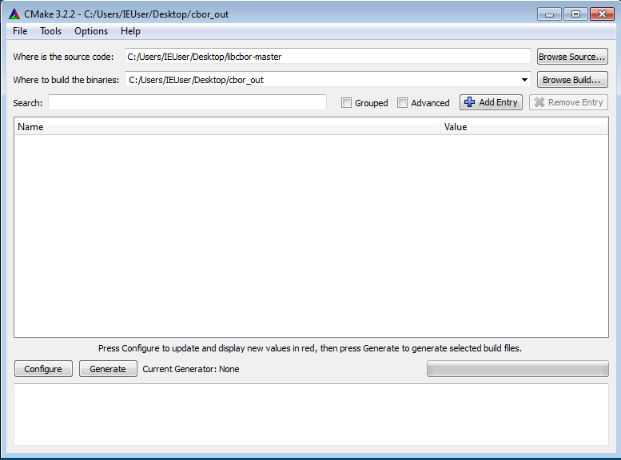
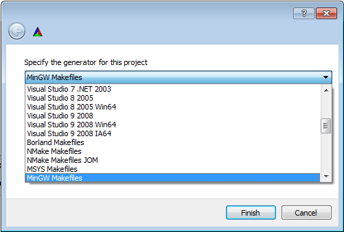
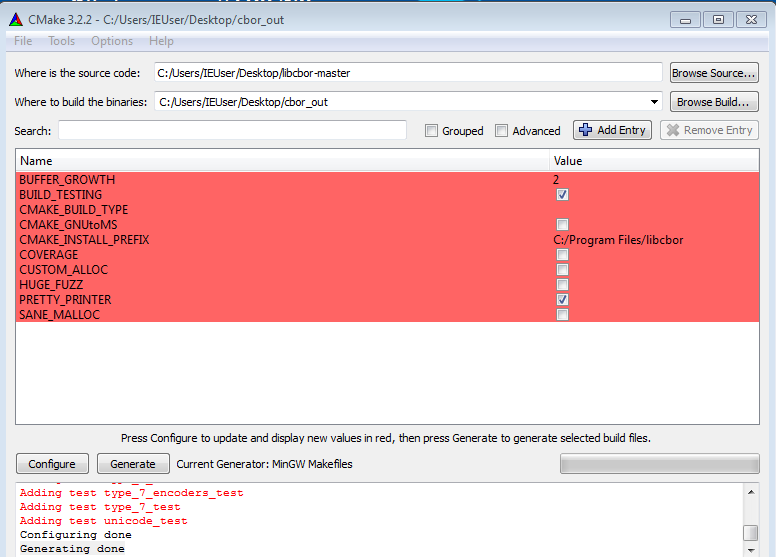
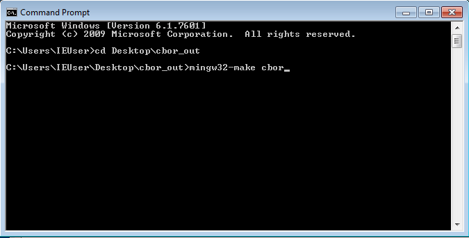
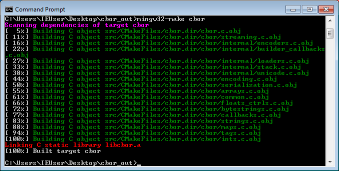
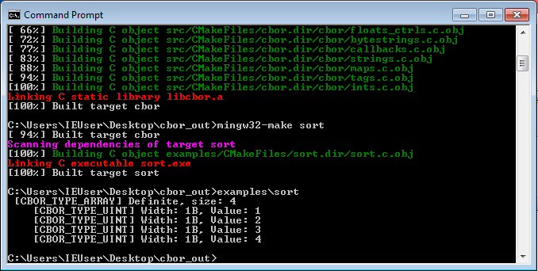

Getting started
==========================

Pre-built Linux packages are distributed from `the libcbor website <http://libcbor.org/>`_. 

OS X users can use `Homebrew <http://brew.sh/>`_:

.. code-block:: bash

    brew tap pjk/libcbor
    brew install libcbor

For other platforms, you will need to compile it from source.

Building & installing libcbor
------------------------------

Prerequisites:
 - C99 compiler
 - CMake_ 2.8 or newer (might also be called ``cmakesetup``, ``cmake-gui`` or ``ccmake`` depending on the installed version and system)
 - C build system CMake can target (make, Apple Xcode, MinGW, ...)
 .. _CMake: http://cmake.org/

.. note:: As of May 2015, not even the 2015 release candidate of Visual Studio supports C99. While CMake will be happy to generate a VS solution that you can play with, libcbor currently cannot be compiled using the MSVC toolchain. `ICC <https://software.intel.com/en-us/c-compilers>`_, GCC under `Cygwin <https://www.cygwin.com/>`_, and `MinGW's <http://www.mingw.org/>`_ GCC will all work. The MinGW build process is described below.

**Configuration options**

A handful of configuration flags can be passed to `cmake`. The following table lists libcbor compile-time directives and several important generic flags.

========================  =======================================================   ======================  =====================================================================================================================
Option                    Meaning                                                   Default                 Possible values
------------------------  -------------------------------------------------------   ----------------------  ---------------------------------------------------------------------------------------------------------------------
``CMAKE_C_COMPILER``      C compiler to use                                         ``cc``                   ``gcc``, ``clang``, ``clang-3.5``, ...
``CMAKE_INSTALL_PREFIX``  Installation prefix                                       System-dependent         ``/usr/local/lib``, ...
``HUGE_FUZZ``             :doc:`Fuzz test </tests>` with 8GB of data                ``OFF``                   ``ON``, ``OFF``
``SANE_MALLOC``           Assume ``malloc`` will refuse unreasonable allocations    ``OFF``                   ``ON``, ``OFF``
``COVERAGE``              Generate test coverage instrumentation                    ``OFF``                   ``ON``, ``OFF``
``WITH_TESTS``            Build unit tests (see :doc:`development`)                 ``OFF``                   ``ON``, ``OFF``
========================  =======================================================   ======================  =====================================================================================================================

The following configuration options will also be defined as macros[#]_ in ``<cbor/common.h>`` and can therefore be used in client code:

========================  =======================================================   ======================  =====================================================================================================================
Option                    Meaning                                                   Default                 Possible values
------------------------  -------------------------------------------------------   ----------------------  ---------------------------------------------------------------------------------------------------------------------
``CBOR_CUSTOM_ALLOC``     Enable custom allocator support                           ``OFF``                  ``ON``, ``OFF``
``CBOR_PRETTY_PRINTER``   Include a pretty-printing routine                         ``ON``                  ``ON``, ``OFF``
``CBOR_BUFFER_GROWTH``    Factor for buffer growth & shrinking                       ``2``                    Decimals > 1
========================  =======================================================   ======================  =====================================================================================================================

.. [#] ``ON`` & ``OFF`` will be translated to ``1`` and ``0`` using `cmakedefine <https://cmake.org/cmake/help/v3.2/command/configure_file.html?highlight=cmakedefine>`_.

If you want to pass other custom configuration options, please refer to `<http://www.cmake.org/Wiki/CMake_Useful_Variables>`_.

**Building using make**

CMake will generate a Makefile and other configuration files for the build. As a rule of thumb, you should configure the
build *outside of the source tree* in order to keep different configurations isolated. If you are unsure where to
execute the build, just use a temporary directory:

.. code-block:: bash

  cd $(mktemp -d /tmp/cbor_build.XXXX)

Now, assuming you are in the directory where you want to build, execute the following to configure the build and run make

.. code-block:: bash

  cmake -DCMAKE_BUILD_TYPE=Release path_to_libcbor_dir
  make cbor cbor_shared

Both the shared (``libcbor.so``) and the static (``libcbor.a``) libraries should now be in the ``src`` subdirectory.

In order to install the libcbor headers and libraries, the usual

.. code-block:: bash

  make install

is what your're looking for. Root permissions are required on most systems when using the default installation prefix.

**Portability**

libcbor is highly portable and works on both little- and big-endian systems regardless of the operating system. After building
on an exotic platform, you might wish to verify the result by running the :doc:`test suite </tests>`. If you encounter any problems, please
report them to the `issue tracker <https://github.com/PJK/libcbor/issues>`_.

libcbor is known to successfully work on ARM Android devices. Cross-compilation is possible with ``arm-linux-gnueabi-gcc``.

Linking with libcbor
---------------------

If you include and linker paths include the directories to which libcbor has been installed, compiling programs that uses libcbor requires
no extra considerations.

You can verify that everything has been set up properly by creating a file with the following contents

.. code-block:: c

    #include <cbor.h>
    #include <stdio.h>

    int main(int argc, char * argv[])
    {
        printf("Hello from libcbor %s\n", CBOR_VERSION);
    }

and compiling it

.. code-block:: bash

    cc hello_cbor.c -lcbor -o hello_cbor

libcbor also comes with `pkg-config <https://wiki.freedesktop.org/www/Software/pkg-config/>`_ support. If you install libcbor with a custom prefix, you can use pkg-config to resolve the headers and objects:

.. code-block:: bash

    cc $(pkg-config --cflags libcbor) hello_cbor.c $(pkg-config --libs libcbor) -o hello_cbor

MinGW build instructions
---------------------------
Prerequisites:
 - MinGW
 - CMake GUI

First of all, create a folder that will be used for the output. For this demonstration, we will use ``cbor_out``. Start CMake and select the source path and the destination folder.

Then hit the 'Configure' button. You will be prompted to select the build system:

Choose MinGW and confirm.

.. note:: If you select Visual Studio at this point, a MSVC project will be generated for you. This is useful if you just want to browse through the source code.

You can then adjust the build options. The defaults will work just fine. Hit 'Generate' when you are done.

You can then adjust the build options. The defaults will work just fine. Hit 'Generate' when you are done.

Open the shell, navigate to the output directory, and run ``mingw32-make cbor cbor_shared``.

*libcbor* will be built and your ``.dll`` should be ready at this point

Feel free to also try building and running some of the examples, e.g. ``mingw32-make sort``

Troubleshooting
---------------------

**cbor.h not found**: The headers directory is probably not in your include path. First, verify the installation
location by checking the installation log. If you used make, it will look something like

.. code-block:: text

    ...
    -- Installing: /usr/local/include/cbor
    -- Installing: /usr/local/include/cbor/callbacks.h
    -- Installing: /usr/local/include/cbor/encoding.h
    ...

Make sure that ``CMAKE_INSTALL_PREFIX`` (if you provided it) was correct. Including the path path during compilation should suffice, e.g.:

.. code-block:: bash

    cc -I/usr/local/include hello_cbor.c -lcbor -o hello_cbor

**cannot find -lcbor during linking**: Most likely the same problem as before. Include the installation directory in the
linker shared path using ``-R``, e.g.:

.. code-block:: bash

    cc -Wl,-rpath,/usr/local/lib -lcbor -o hello_cbor

**shared library missing during execution**: Verify the linkage using ``ldd``, ``otool``, or similar and adjust the compilation directives accordingly:

.. code-block:: text

    ⇒  ldd hello_cbor
        linux-vdso.so.1 =>  (0x00007ffe85585000)
        libcbor.so => /usr/local/lib/libcbor.so (0x00007f9af69da000)
        libc.so.6 => /lib/x86_64-linux-gnu/libc.so.6 (0x00007f9af65eb000)
        /lib64/ld-linux-x86-64.so.2 (0x00007f9af6be9000)

**compilation failed**: If your compiler supports C99 yet the compilation has failed, please report the issue to the `issue tracker <https://github.com/PJK/libcbor/issues>`_.
