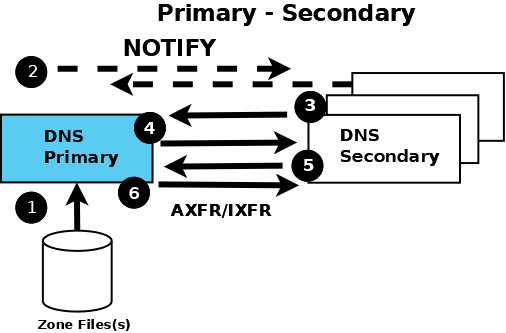

.. Copyright (C) Internet Systems Consortium, Inc. ("ISC")
..
.. SPDX-License-Identifier: MPL-2.0
..
.. This Source Code Form is subject to the terms of the Mozilla Public
.. License, v. 2.0.  If a copy of the MPL was not distributed with this
.. file, you can obtain one at https://mozilla.org/MPL/2.0/.
..
.. See the COPYRIGHT file distributed with this work for additional
.. information regarding copyright ownership.

.. _config_auth_samples:

Authoritative Name Servers
--------------------------

These provide authoritative answers to user queries for the zones
they support: for instance, the zone data describing the domain name **example.com**. An
authoritative name server may support one or many zones.

Each zone may be defined as either a **primary** or a **secondary**. A primary zone
reads its zone data directly from a file system. A secondary zone obtains its zone
data from the primary zone using a process called **zone transfer**. Both the primary
and the secondary zones provide authoritative data for their zone; there is no difference
in the answer to a query from a primary or a secondary zone. An authoritative name server
may support any combination of primary and secondary zones.

.. Note:: The terms **primary** and **secondary** do not imply any access
   priority. Resolvers (name servers that provide the complete answers to user
   queries) are not aware of (and cannot find out) whether an authoritative
   answer comes from the primary or secondary name server. Instead, the
   resolver uses the list of authoritative servers for the zone (there must be
   at least two) and maintains a Round Trip Time (RTT) - the time taken to
   respond to the query - for each server in the list.  The resolver uses the
   lowest-value server (the fastest) as its preferred server for the zone and
   continues to do so until its RTT becomes higher than the next slowest in its
   list, at which time that one becomes the preferred server.

   For reasons of backward compatibility BIND 9 treats "primary" and "master" as
   synonyms, as well as "secondary" and "slave."

The following diagram shows the relationship between the primary and secondary
name servers. The text below explains the process in detail.

   Authoritative Primary and Secondary Name Servers

The numbers in parentheses in the following text refer to the numbered items in the diagram above.

1. The authoritative primary name server always loads (or reloads) its zone
   files from (1) a local or networked filestore.

2. The authoritative secondary name server always loads its zone data from a
   primary via a **zone transfer** operation.  Zone transfer may use **AXFR**
   (complete zone transfer) or **IXFR** (incremental zone transfer), but only
   if both primary and secondary name servers support the service. The zone
   transfer process (either AXFR or IXFR) works as follows:

   a) The secondary name server for the zone reads (3 and 4) the
      :ref:`SOA RR<soa_rr>` periodically. The interval is defined by the **refresh**
      parameter of the Start of Authority (SOA) RR.

   b) The secondary compares the **serial number** parameter of the SOA RR
      received from the primary with the serial number in the SOA RR of its
      current zone data.

   c) If the received serial number is arithmetically greater (higher) than the
      current one, the secondary initiates a zone transfer (5) using AXFR or IXFR
      (depending on the primary and secondary configuration), using TCP over
      port 53 (6).

3. The typically recommended zone refresh times for the SOA RR (the time
   interval when the secondary reads or polls the primary for the zone SOA RR)
   are multiples of hours to reduce traffic loads. Worst-case zone change
   propagation can therefore take extended periods.

4. The optional NOTIFY (:rfc:`1996`) feature (2) is automatically configured;
   use the :namedconf:ref:`notify` statement to turn off the feature.
   Whenever the primary loads or reloads a zone, it sends a NOTIFY message to
   the configured secondary (or secondaries) and may optionally be configured
   to send the NOTIFY message to other hosts using the
   :any:`also-notify` statement.  The NOTIFY message simply
   indicates to the secondary that the primary has loaded or reloaded the zone.
   On receipt of the NOTIFY message, the secondary respons to indicate it has received the NOTIFY and immediately reads the SOA RR
   from the primary (as described in section 2 a. above). If the zone file has
   changed, propagation is practically immediate.

The authoritative samples all use NOTIFY but identify the statements used, so
that they can be removed if not required.

.. _sample_primary:

Primary Authoritative Name Server
~~~~~~~~~~~~~~~~~~~~~~~~~~~~~~~~~

The zone files are unmodified :ref:`from the base samples<base_zone_file>` but
the :iscman:`named.conf` file has been modified as shown:

.. code-block:: c

        // authoritative primary named.conf file
        // options clause defining the server-wide properties
        options {
          // all relative paths use this directory as a base
          directory "/var";
          // version statement for security to avoid hacking known weaknesses
          // if the real version number is revealed
          version "not currently available";
          // This is the default - allows user queries from any IP
          allow-query { any; };
          // normal server operations may place items in the cache
          // this prevents any user query from accessing these items
          // only authoritative zone data will be returned
          allow-query-cache { none; };
          // Do not provide recursive service to user queries
          recursion no;
        };
        // logging clause
        // log to /var/log/named/example.log all events from info UP in severity (no debug)
        // uses 3 files in rotation swaps files when size reaches 250K
        // failure messages that occur before logging is established are
        // in syslog (/var/log/messages)
        //
        logging {
          channel example_log {
            // uses a relative path name and the directory statement to
            // expand to /var/log/named/example.log
            file "log/named/example.log" versions 3 size 250k;
            // only log info and up messages - all others discarded
            severity info;
          };
          category default {
            example_log;
          };
        };
        // Provide forward mapping zone for localhost
        // (optional)
        zone "localhost" {
          type primary;
          file "master/localhost-forward.db";
          notify no;
        };
        // Provide reverse mapping zone for the loopback
        // address 127.0.0.1
        zone "0.0.127.in-addr.arpa" {
          type primary;
          file "localhost.rev";
          notify no;
        };
        // We are the primary server for example.com
        zone "example.com" {
          // this is the primary name server for the zone
          type primary;
          file "example.com";
          // this is the default
          notify yes;
          // IP addresses of secondary servers allowed to
          // transfer example.com from this server
          allow-transfer {
            192.168.4.14;
            192.168.5.53;
          };
        };

The added statements and blocks are commented in the above file.

The :any:`zone` block, and :any:`allow-query`,
:any:`allow-query-cache`,
:any:`allow-transfer`, :any:`file`,
:namedconf:ref:`notify`, :any:`recursion`, and :any:`type`
statements are described in detail in the appropriate sections.

.. _sample_secondary:

Secondary Authoritative Name Server
~~~~~~~~~~~~~~~~~~~~~~~~~~~~~~~~~~~

The zone files ``local-host-forward.db`` and ``localhost.rev`` are unmodified
:ref:`from the base samples<base_zone_file>`. The **example.com** zone file is
not required (the zone file is obtained from the primary via zone transfer).
The :ref:`named.conf<named_conf>` file has been modified as shown:

.. code-block:: c

        // authoritative secondary named.conf file
        // options clause defining the server-wide properties
        options {
          // all relative paths use this directory as a base
          directory "/var";
          // version statement for security to avoid hacking known weaknesses
          // if the real version number is revealed
          version "not currently available";
          // This is the default - allows user queries from any IP
          allow-query { any; };
          // normal server operations may place items in the cache
          // this prevents any user query from accessing these items
          // only authoritative zone data will be returned
          allow-query-cache { none; };
          // Do not provide recursive service to user queries
          recursion no;
        };
        // logging clause
        // log to /var/log/named/example.log all events from info UP in severity (no debug)
        // uses 3 files in rotation swaps files when size reaches 250K
        // failure messages that occur before logging is established are
        // in syslog (/var/log/messages)
        //
        logging {
          channel example_log {
            // uses a relative path name and the directory statement to
            // expand to /var/log/named/example.log
            file "log/named/example.log" versions 3 size 250k;
            // only log info and up messages - all others discarded
            severity info;
           };
           category default {
             example_log;
          };
        };
        // Provide forward mapping zone for localhost
        // (optional)
        zone "localhost" {
          type primary;
          file "master/localhost-forward.db";
          notify no;
        };
        // Provide reverse mapping zone for the loopback
        // address 127.0.0.1
        zone "0.0.127.in-addr.arpa" {
          type primary;
          file "localhost.rev";
          notify no;
        };
        // We are the secondary server for example.com
        zone "example.com" {
          // this is a secondary server for the zone
          type secondary;
          // the file statement here allows the secondary to save
          // each zone transfer so that in the event of a program restart
          // the zone can be loaded immediately and the server can start
          // to respond to queries without waiting for a zone transfer
          file "example.com.saved";
          // IP address of example.com primary server
          primaries { 192.168.254.2; };
        };

The statements and blocks added are all commented in the above file.

The :any:`zone` block, and :any:`allow-query`,
:any:`allow-query-cache`,
:any:`allow-transfer`, :any:`file`,
:namedconf:ref:`primaries`,
:any:`recursion`, and :any:`type` statements are described in
detail in the appropriate sections.

If NOTIFY is not being used, no changes are required in this
:ref:`named.conf<named_conf>` file, since it is the primary that initiates the NOTIFY
message.

.. note::
   Just when the reader thought they understood primary and secondary, things
   can get more complicated.  A secondary zone can also be a primary to other
   secondaries: :iscman:`named`, by default, sends NOTIFY messages for every
   zone it loads.  Specifying :ref:`notify primary-only;<notify>` in the
   :any:`zone` block for the secondary causes :iscman:`named` to
   only send NOTIFY messages for primary zones that it loads.
