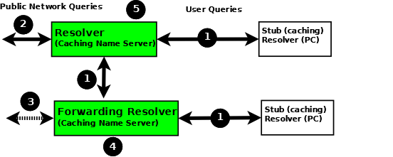

.. Copyright (C) Internet Systems Consortium, Inc. ("ISC")
..
.. SPDX-License-Identifier: MPL-2.0
..
.. This Source Code Form is subject to the terms of the Mozilla Public
.. License, v. 2.0.  If a copy of the MPL was not distributed with this
.. file, you can obtain one at https://mozilla.org/MPL/2.0/.
..
.. See the COPYRIGHT file distributed with this work for additional
.. information regarding copyright ownership.

.. _config_resolver_samples:

Resolver (Caching Name Servers)
-------------------------------

Resolvers handle :ref:`recursive user queries <recursive_query>` and provide
complete answers; that is, they issue one or more :ref:`iterative queries
<iterative_query>` to the DNS hierarchy.  Having obtained a complete answer (or
an error), a resolver passes the answer to the user and places it in its cache.
Subsequent user requests for the same query will be answered from the
resolver's cache until the :term:`TTL` of the cached answer has expired, when
it will be flushed from the cache; the next user query that requests the same
information results in a new series of queries to the DNS hierarchy.

Resolvers are frequently referred to by a bewildering variety of names,
including caching name servers, recursive name servers, forwarding resolvers,
area resolvers, and full-service resolvers.

The following diagram shows how resolvers can function in a typical networked
environment:

Resolver and Forwarding Resolver

1. End-user systems are all distributed with a local **stub resolver** as a
   standard feature. Today, the majority of stub resolvers also provide a local
   cache service to speed up user response times.

2. A stub resolver has limited functionality; specifically, it cannot follow
   :ref:`referrals<referral>`. When a stub resolver receives a request for a
   name from a local program, such as a browser, and the answer is not in its
   local cache, it sends a :ref:`recursive user query<recursive_query>` (1) to
   a locally configured resolver (5), which may have the answer available in
   its cache. If it does not, it issues :ref:`iterative
   queries<iterative_query>` (2) to the DNS hierarchy to obtain the answer. The
   resolver to which the local system sends the user query is configured, for
   Linux and Unix hosts, in ``/etc/resolv.conf``; for Windows users it is
   configured or changed via the Control Panel or Settings interface.

3. Alternatively, the user query can be sent to a **forwarding resolver** (4).
   Forwarding resolvers on first glance look fairly pointless, since they
   appear to be acting as a simple pass-though and, like the stub resolver,
   require a full-service resolver (5). However, forwarding resolvers can be
   very powerful additions to a network for the following reasons:

   a) Cost and Performance. Each **recursive user query** (1) at the forwarding
      resolver (4) results in two messages - the query and its answer. The resolver
      (5) may have to issue three, four, or more query pairs (2) to get the required
      answer. Traffic is reduced dramatically, increasing performance or reducing
      cost (if the link is tariffed). Additionally, since the forwarding resolver is
      typically shared across multiple hosts, its cache is more likely to contain
      answers, again improving user performance.

   b) Network Maintenance. Forwarding resolvers (4) can be used to ease the burden
      of local administration by providing a single point at which changes to remote
      name servers can be managed, rather than having to update all hosts. Thus, all
      hosts in a particular network section or area can be configured to point to a
      forwarding resolver, which can be configured to stream DNS traffic as desired
      and changed over time with minimal effort.

   c) Sanitizing Traffic. Especially in larger private networks it may be sensible
      to stream DNS traffic using a forwarding resolver structure.  The forwarding
      resolver (4) may be configured, for example, to handle all in-domain traffic
      (relatively safe) and forward all external traffic to a **hardened** resolver
      (5).

   d) Stealth Networks. Forwarding resolvers are extensively used in :ref:`stealth
      or split networks<split_dns_sample>`.

4. Forwarding resolvers (4) can be configured to forward all traffic to a
   resolver (5), or to only forward selective traffic (5) while directly
   resolving other traffic (3).

.. Attention:: While the diagram above shows **recursive user queries**
   arriving via interface (1), there is nothing to stop them from arriving via
   interface (2) via the public network. If no limits are placed on the source
   IPs that can send such queries, the resolver is termed an **open resolver**.
   Indeed, when the world was young this was the way things worked on the
   Internet. Much has changed and what seems to be a friendly, generous action
   can be used by rogue actors to cause all kinds of problems including
   **Denial of Service (DoS)** attacks. Resolvers should always be configured
   to limit the IP addresses that can use their services. BIND 9 provides a
   number of statements and blocks to simplify defining these IP limits and
   configuring a **closed resolver**. The resolver samples given here all
   configure closed resolvers using a variety of techniques.

Additional Zone Files
~~~~~~~~~~~~~~~~~~~~~

Root Servers (Hint) Zone File
^^^^^^^^^^^^^^^^^^^^^^^^^^^^^^

Resolvers (although not necessarily forwarding resolvers) need to access the
DNS hierarchy. To do this, they need to know the addresses (IPv4 and/or IPv6)
of the 13 :ref:`root servers<root_servers>`. This is done by the provision of a
root server zone file, which is contained in the standard BIND 9 distribution
as the file ``named.root`` (normally found in /etc/namedb or
/usr/local/namedb). This file may also be obtained from the IANA website
(https://www.iana.org/domains/root/files).

   .. Note:: Many distributions rename this file for historical reasons.
      Consult the appropriate distribution documentation for the actual file name.

The hint zone file is referenced using the :any:`type hint` statement and
a zone (domain) name of "." (the generally silent dot).

   .. Note:: The root server IP addresses have been stable for a number of
      years and are likely to remain stable for the near future. BIND 9 has a
      root-server list in its executable such that even if this file is omitted,
      out-of-date, or corrupt BIND 9 can still function. For this reason, many
      sample configurations omit the hints file. All the samples given here
      include the hints file primarily as a reminder of the functionality of the
      configuration, rather than as an absolute necessity.

Private IP Reverse Map Zone Files
^^^^^^^^^^^^^^^^^^^^^^^^^^^^^^^^^

Resolvers are configured to send :ref:`iterative queries<iterative_query>` to
the public DNS hierarchy when the information requested is not in their cache
or not defined in any local zone file. Many networks make extensive use of
private IP addresses (defined by :rfc:`1918`, :rfc:`2193`, :rfc:`5737`, and
:rfc:`6598`).  By their nature these IP addresses are forward-mapped in various
user zone files. However, certain applications may issue **reverse map**
queries (mapping an IP address to a name). If the private IP addresses are not
defined in one or more reverse-mapped zone file(s), the resolver sends them to
the DNS hierarchy where they are simply useless traffic, slowing down DNS
responses for all users.

Private IP addresses may be defined using standard :ref:`reverse-mapping
techniques<ipv4_reverse>` or using the
:any:`empty-zones-enable` statement. By
default this statement is set to ``empty-zones-enable yes;`` and thus automatically prevents
unnecessary DNS traffic by sending an NXDOMAIN error response (indicating the
name does not exist) to any request.  However, some applications may require a
genuine answer to such reverse-mapped requests or they will fail to function.
Mail systems in particular perform reverse DNS queries as a first-line spam
check; in this case a reverse-mapped zone file is essential.  The sample
configuration files given here for both the resolver and the forwarding
resolver provide a reverse-mapping zone file for the private IP address
192.168.254.4, which is the mail server address in the :ref:`base zone
file<base_zone_file>`, as an illustration of the reverse-map technique. The
file is named ``192.168.254.rev`` and has a zone name of
**254.168.192.in-addr.arpa**.

.. code-block::

	; reverse map zone file for 192.168.254.4 only
	$TTL 2d  ; 172800 seconds
	$ORIGIN 254.168.192.IN-ADDR.ARPA.
	@     IN      SOA   ns1.example.com. hostmaster.example.com. (
						2003080800 ; serial number
						3h         ; refresh
						15m        ; update retry
						3w         ; expiry
						3h         ; nx = nxdomain ttl
						)
	; only one NS is required for this local file
	; and is an out of zone name
	      IN      NS      ns1.example.com.
	; other IP addresses can be added as required
	; this maps 192.168.254.4 as shown
	4     IN      PTR     mail.example.com. ; fully qualified domain name (FQDN)

.. _sample_resolver:

Resolver Configuration
~~~~~~~~~~~~~~~~~~~~~~

The resolver provides :ref:`recursive query support<recursive_query>` to a defined set of IP addresses.
It is therefore a **closed** resolver and cannot be used in wider network attacks.

.. code-block:: c

        // resolver named.conf file
        // Two corporate subnets we wish to allow queries from
        // defined in an acl clause
        acl corpnets {
          192.168.4.0/24;
          192.168.7.0/24;
        };

        // options clause defining the server-wide properties
        options {
          // all relative paths use this directory as a base
          directory "/var";
          // version statement for security to avoid hacking known weaknesses
          // if the real version number is revealed
          version "not currently available";
          // this is the default
          recursion yes;
          // recursive queries only allowed from these ips
          // and references the acl clause
          allow-query { corpnets; };
          // this ensures that any reverse map for private IPs
          // not defined in a zone file will *not* be passed to the public network
          // it is the default value
          empty-zones-enable yes;
        };

        // logging clause
        // log to /var/log/named/example.log all events from info UP in severity (no debug)
        // uses 3 files in rotation swaps files when size reaches 250K
        // failure messages that occur before logging is established are
        // in syslog (/var/log/messages)
        //
        logging {
          channel example_log {
            // uses a relative path name and the directory statement to
            // expand to /var/log/named/example.log
            file "log/named/example.log" versions 3 size 250k;
            // only log info and up messages - all others discarded
            severity info;
           };
           category default {
             example_log;
          };
        };

        // zone file for the root servers
        // discretionary zone (see root server discussion above)
        zone "." {
          type hint;
          file "named.root";
        };

        // zone file for the localhost forward map
        // discretionary zone depending on hosts file (see discussion)
        zone "localhost" {
          type primary;
          file "masters/localhost-forward.db";
          notify no;
        };

        // zone file for the loopback address
        // necessary zone
        zone "0.0.127.in-addr.arpa" {
          type primary;
          file "localhost.rev";
          notify no;
        };

        // zone file for local IP reverse map
        // discretionary file depending on requirements
        zone "254.168.192.in-addr.arpa" {
          type primary;
          file "192.168.254.rev";
          notify no;
        };

The :any:`zone` and :any:`acl` blocks, and the
:any:`allow-query`, :any:`empty-zones-enable`,
:any:`file`, :namedconf:ref:`notify`, :any:`recursion`, and
:any:`type` statements are described in detail in the appropriate
sections.

As a reminder, the configuration of this resolver does **not** access the DNS
hierarchy (does not use the public network) for any recursive query for which:

1. The answer is already in the cache.

2. The domain name is **localhost** (zone localhost).

3. Is a reverse-map query for 127.0.0.1 (zone 0.0.127.in-addr.arpa).

4. Is a reverse-map query for 192.168.254/24 (zone 254.168.192.in-addr.arpa).

5. Is a reverse-map query for any local IP (:any:`empty-zones-enable`
   statement).

All other recursive queries will result in access to the DNS hierarchy to
resolve the query.

.. _sample_forwarding:

Forwarding Resolver Configuration
~~~~~~~~~~~~~~~~~~~~~~~~~~~~~~~~~

This forwarding resolver configuration forwards all recursive queries, other
than those for the defined zones and those for which the answer is already in
its cache, to a full-service resolver at the IP address 192.168.250.3, with an
alternative at 192.168.230.27. The forwarding resolver will cache all responses
from these servers.  The configuration is closed, in that it defines those IPs
from which it will accept recursive queries.

A second configuration in which selective forwarding occurs :ref:`is also
provided<selective_forward_sample>`.

.. code-block:: c

        // forwarding named.conf file
        // Two corporate subnets we wish to allow queries from
        // defined in an acl clause
        acl corpnets {
          192.168.4.0/24;
          192.168.7.0/24;
        };

        // options clause defining the server-wide properties
        options {
          // all relative paths use this directory as a base
          directory "/var";
          // version statement for security to avoid hacking known weaknesses
          // if the real version number is revealed
          version "not currently available";
          // this is the default
          recursion yes;
          // recursive queries only allowed from these ips
          // and references the acl clause
          allow-query { corpnets; };
          // this ensures that any reverse map for private IPs
          // not defined in a zone file will *not* be passed to the public network
          // it is the default value
          empty-zones-enable yes;
          // this defines the addresses of the resolvers to which queries will be forwarded
          forwarders {
            192.168.250.3;
            192.168.230.27;
          };
          // indicates all queries will be forwarded other than for defined zones
          forward only;
        };

        // logging clause
        // log to /var/log/named/example.log all events from info UP in severity (no debug)
        // uses 3 files in rotation swaps files when size reaches 250K
        // failure messages that occur before logging is established are
        // in syslog (/var/log/messages)
        //
        logging {
          channel example_log {
            // uses a relative path name and the directory statement to
            // expand to /var/log/named/example.log
            file "log/named/example.log" versions 3 size 250k;
            // only log info and up messages - all others discarded
            severity info;
          };
          category default {
            example_log;
          };
        };

        // hints zone file is not required

        // zone file for the localhost forward map
        // discretionary zone depending on hosts file (see discussion)
        zone "localhost" {
          type primary;
          file "masters/localhost-forward.db";
          notify no;
        };

        // zone file for the loopback address
        // necessary zone
        zone "0.0.127.in-addr.arpa" {
          type primary;
          file "localhost.rev";
          notify no;
        };

        // zone file for local IP reverse map
        // discretionary file depending on requirements
        zone "254.168.192.in-addr.arpa" {
          type primary;
          file "192.168.254.rev";
          notify no;
        };

The :any:`zone` and :any:`acl` blocks, and the
:any:`allow-query`, :any:`empty-zones-enable`,
:any:`file`, :any:`forward`, :any:`forwarders`,
:namedconf:ref:`notify`, :any:`recursion`, and :any:`type`
statements are described in detail in the appropriate sections.

As a reminder, the configuration of this forwarding resolver does **not**
forward any recursive query for which:

1. The answer is already in the cache.

2. The domain name is **localhost** (zone localhost).

3. Is a reverse-map query for 127.0.0.1 (zone 0.0.127.in-addr.arpa).

4. Is a reverse-map query for 192.168.254/24 (zone 254.168.192.in-addr.arpa).

5. Is a reverse-map query for any local IP (:any:`empty-zones-enable` statement).

All other recursive queries will be forwarded to resolve the query.

.. _selective_forward_sample:

Selective Forwarding Resolver Configuration
~~~~~~~~~~~~~~~~~~~~~~~~~~~~~~~~~~~~~~~~~~~

This forwarding resolver configuration only forwards recursive queries for the
zone **example.com** to the resolvers at 192.168.250.3 and 192.168.230.27. All
other recursive queries, other than those for the defined zones and those for
which the answer is already in its cache, are handled by this resolver. The
forwarding resolver will cache all responses from both the public network and
from the forwarded resolvers.  The configuration is closed, in that it defines
those IPs from which it will accept recursive queries.

.. code-block:: c

        // selective forwarding named.conf file
        // Two corporate subnets we wish to allow queries from
        // defined in an acl clause
        acl corpnets {
          192.168.4.0/24;
          192.168.7.0/24;
        };

        // options clause defining the server-wide properties
        options {
          // all relative paths use this directory as a base
          directory "/var";
          // version statement for security to avoid hacking known weaknesses
          // if the real version number is revealed
          version "not currently available";
          // this is the default
          recursion yes;
          // recursive queries only allowed from these ips
          // and references the acl clause
          allow-query { corpnets; };
          // this ensures that any reverse map for private IPs
          // not defined in a zone file will *not* be passed to the public network
          // it is the default value
          empty-zones-enable yes;

          // forwarding is not global but selective by zone in this configuration
        };

        // logging clause
        // log to /var/log/named/example.log all events from info UP in severity (no debug)
        // uses 3 files in rotation swaps files when size reaches 250K
        // failure messages that occur before logging is established are
        // in syslog (/var/log/messages)
        //
        logging {
          channel example_log {
            // uses a relative path name and the directory statement to
            // expand to /var/log/named/example.log
            file "log/named/example.log" versions 3 size 250k;
            // only log info and up messages - all others discarded
            severity info;
           };
           category default {
             example_log;
          };
        };

        // zone file for the root servers
        // discretionary zone (see root server discussion above)
        zone "." {
          type hint;
          file "named.root";
        };

        // zone file for the localhost forward map
        // discretionary zone depending on hosts file (see discussion)
        zone "localhost" {
          type primary;
          file "masters/localhost-forward.db";
          notify no;
        };

        // zone file for the loopback address
        // necessary zone
        zone "0.0.127.in-addr.arpa" {
          type primary;
          file "localhost.rev";
          notify no;
        };

        // zone file for local IP reverse map
        // discretionary file depending on requirements
        zone "254.168.192.in-addr.arpa" {
          type primary;
          file "192.168.254.rev";
          notify no;
        };
        // zone file forwarded example.com
        zone "example.com" {
          type forward;
          // this defines the addresses of the resolvers to
          // which queries for this zone will be forwarded
          forwarders {
            192.168.250.3;
            192.168.230.27;
          };
          // indicates all queries for this zone will be forwarded
          forward only;
        };

The :any:`zone` and :any:`acl` blocks, and the
:any:`allow-query`, :any:`empty-zones-enable`,
:any:`file`, :any:`forward`, :any:`forwarders`,
:namedconf:ref:`notify`, :any:`recursion`, and :any:`type`
statements are described in detail in the appropriate sections.

As a reminder, the configuration of this resolver does **not** access the DNS
hierarchy (does not use the public network) for any recursive query for which:

1. The answer is already in the cache.

2. The domain name is **localhost** (zone localhost).

3. Is a reverse-map query for 127.0.0.1 (zone 0.0.127.in-addr.arpa).

4. Is a reverse-map query for 192.168.254/24 (zone 254.168.192.in-addr.arpa).

5. Is a reverse-map query for any local IP (empty-zones-enable statement).

6. Is a query for the domain name **example.com**, in which case it will be
   forwarded to either 192.168.250.3 or 192.168.230.27 (zone example.com).

All other recursive queries will result in access to the DNS hierarchy to
resolve the query.

.. _load_balancing:

Load Balancing
--------------

A primitive form of load balancing can be achieved in the DNS by using multiple
resource records (RRs) in a :ref:`zone file<zone_file>` (such as multiple A
records) for one name.

For example, assuming three HTTP servers with network addresses of
10.0.0.1, 10.0.0.2, and 10.0.0.3, a set of records such as the following
means that clients will connect to each machine one-third of the time:

+-----------+------+----------+----------+----------------------------+
| Name      | TTL  | CLASS    | TYPE     | Resource Record (RR) Data  |
+-----------+------+----------+----------+----------------------------+
| www       | 600  |   IN     |   A      |   10.0.0.1                 |
+-----------+------+----------+----------+----------------------------+
|           | 600  |   IN     |   A      |   10.0.0.2                 |
+-----------+------+----------+----------+----------------------------+
|           | 600  |   IN     |   A      |   10.0.0.3                 |
+-----------+------+----------+----------+----------------------------+

When a resolver queries for these records, BIND rotates them and
responds to the query with the records in a random order. In the
example above, clients randomly receive records in the order 1, 2,
3; 2, 3, 1; and 3, 1, 2. Most clients use the first record returned
and discard the rest.

For more detail on ordering responses, refer to the
:ref:`rrset-order<rrset_ordering>` statement in the
:namedconf:ref:`options` block.
