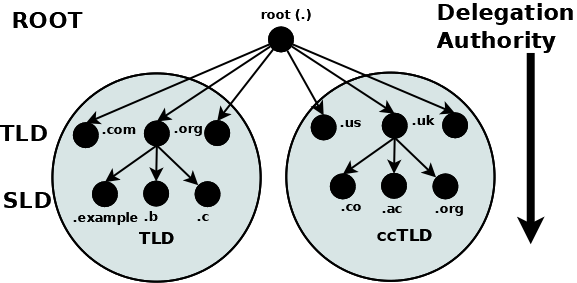
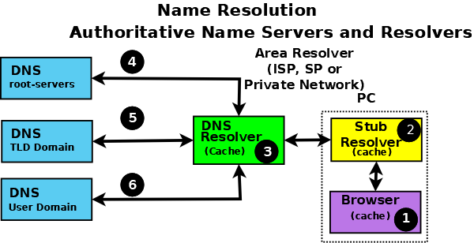
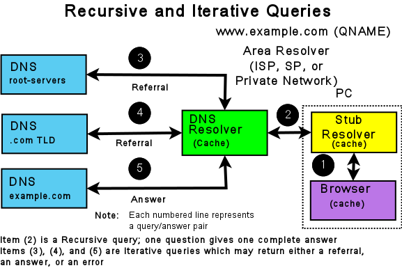

.. Copyright (C) Internet Systems Consortium, Inc. ("ISC")
..
.. SPDX-License-Identifier: MPL-2.0
..
.. This Source Code Form is subject to the terms of the Mozilla Public
.. License, v. 2.0.  If a copy of the MPL was not distributed with this
.. file, you can obtain one at https://mozilla.org/MPL/2.0/.
..
.. See the COPYRIGHT file distributed with this work for additional
.. information regarding copyright ownership.

.. _dns_overview:

The Domain Name System (DNS)
----------------------------

This is a brief description of the functionality and organization of the Domain Name System (DNS).
It is provided to familiarize users with the concepts involved, the (often confusing) terminology
used, and how all the parts fit together to form an operational system.

All network systems operate with network addresses, such as IPv4 and IPv6. The vast majority of
humans find it easier to work with names rather than seemingly endless strings of network address digits. The earliest ARPANET systems
(from which the Internet evolved) mapped names to addresses using a **hosts** file that was distributed to all entities
whenever changes occurred. Operationally, such a system became rapidly unsustainable once there were more
than 100 networked entities, which led to the specification and implementation of the Domain Name System that we use today.

.. _dns_fundamentals:

DNS Fundamentals
~~~~~~~~~~~~~~~~

The DNS naming system is organized as a tree structure comprised of multiple levels and
thus it naturally creates a distributed system. Each node
in the tree is given a label which defines its **Domain** (its area or zone) of **Authority**.
The topmost node in the tree is the **Root Domain**; it delegates to **Domains** at the next level which are generically
known as the **Top-Level Domains (TLDs)**. They in turn delegate to **Second-Level Domains (SLDs)**, and so on.
The Top-Level Domains (TLDs) include a special group of TLDs called the **Country Code Top-Level Domains (ccTLDs)**,
in which every country is assigned a unique two-character country code from ISO 3166 as its domain.

.. Note:: The Domain Name System is controlled by ICANN (https://www.icann.org) (a 501c non-profit entity); their current policy
	is that any new TLD, consisting of three or more characters, may be proposed by any group of commercial sponsors and
	if it meets ICANN's criteria will be added to the TLDs.

The concept of delegation and authority flows down the DNS tree (the DNS hierarchy) as shown:

   Delegation and Authority in the DNS Name Space

A domain is the label of a node in the tree. A **domain name** uniquely identifies any node in the DNS tree and is written, left to right,
by combining all the domain labels (each of which are unique within their parent's zone or domain of authority), with a dot
separating each component, up to the root domain. In the above diagram the following are all domain names:

.. code-block::

	example.com
	b.com
	ac.uk
	us
	org

The root has a unique label of "." (dot), which is normally omitted when it is written as
a domain name, but when it is written as a **Fully Qualified Domain Name (FQDN)** the dot must be present. Thus:

.. code-block::

	example.com     # domain name
	example.com.    # FQDN

Authority and Delegation
~~~~~~~~~~~~~~~~~~~~~~~~

Each domain (node) has been **delegated** the authority from its parent domain. The delegated authority includes
specific responsibilities to ensure that every domain it delegates has a unique name or label within its zone or domain of authority, and
that it maintains an **authoritative** list of its delegated domains. The responsibilities further include an operational requirement to
operate two (or more) name servers (which may be contracted to a third party) which will contain the authoritative data
for all the domain labels within its zone of authority in a :ref:`zone file<zone_file>`. Again, the
tree structure ensures that the DNS name space is naturally distributed.

The following diagram illustrates that **Authoritative Name Servers** exist for every level and every domain in the DNS name space:

.. figure:: dns-servers.png
   :align: center

   Authoritative Name Servers in the DNS Name Space

.. Note:: The difference between a domain and a zone can appear confusing. Practically, the terms are generally used synonymously in the DNS.
	If, however, you are into directed graphs and tree structure theory or similar exotica, a zone can be considered as
	an arc through any node (or domain) with the domain at its apex. The zone therefore encompasses all the name space below the domain.
	This can, however, lead to the concept of subzones and these were indeed defined in the original DNS specifications.
	Thankfully the term subzone has been lost in the mists of time.

.. _root_servers:

Root Servers
~~~~~~~~~~~~

The **root servers** are a critical part of the DNS authoritative infrastructure. There are 13 root servers (*a.root-servers.net*
to *m.root-servers.net*). The number 13 is historically based on the maximum amount of name and IPv4 data
that could be packed into a 512-byte UDP message, and not a perverse affinity for a number that certain
cultures treat as unlucky. The 512-byte UDP data limit
is no longer a limiting factor and all root servers now support both IPv4 and IPv6. In addition, almost all the
root servers use **anycast**, with well over
300 instances of the root servers now providing service worldwide (see further information at https://www.root-servers.org).
The root servers are the starting point for all **name resolution** within the DNS.

Name Resolution
~~~~~~~~~~~~~~~

So far all the emphasis has been on how the DNS stores its authoritative domain (zone) data. End-user systems
use names (an email address or a web address) and need to access this authoritative data to obtain an IP address, which
they use to contact the required network resources such as web, FTP, or mail servers. The process of converting a
domain name to a result (typically an IP address, though other types of data may be obtained) is generically called **name resolution**, and is handled by
**resolvers** (also known as **caching name servers** and many other terms). The following diagram shows the typical name resolution process:

   Authoritative Name Servers and Name Resolution

An end-user application, such as a browser (1), when needing to resolve a name such as **www.example.com**, makes an
internal system call to a minimal function resolution entity called a **stub resolver** (2). The stub resolver (using stored
IP addresses) contacts a resolver (a caching name server or full-service resolver) (3), which in turn contacts all the necessary
authoritative name servers (4, 5, and 6) to provide the answer that it then returns to the user (2, 1). To improve performance,
all resolvers (including most stub resolvers) cache (store) their results such that a subsequent request for the same data
is taken from the resolver's cache, removing the need to repeat the name resolution process and use time-consuming resources. All communication between
the stub resolver, the resolver, and the authoritative name servers uses the DNS protocol's query and response message pair.

.. _referral:

.. _recursive_query:

.. _iterative_query:

DNS Protocol and Queries
~~~~~~~~~~~~~~~~~~~~~~~~

DNS **queries** use the UDP protocol over the reserved port 53 (but both TCP and TLS can optionally be used in some parts of the network).

The following diagram shows the name resolution process expressed in terms of DNS queries and responses.

   Resolvers and Queries

The stub resolver sends a **recursive query** message (with the required domain name in the QUESTION section of the query) (2) to the resolver.
A **recursive** query simply requests the resolver to find the complete answer. A stub resolver only ever sends recursive queries
and always needs the service of a resolver. The response to a recursive query can be:

1. The answer to the user's QUESTION in the ANSWER section of the query response.

2. An error (such as NXDOMAIN - the name does not exist).

The resolver, on receipt of the user's recursive query, either responds immediately, if the ANSWER is in its cache, or accesses
the DNS hierarchy to obtain the answer. The resolver always starts with root servers and sends an **iterative query** (4, 5, and 6). The
response to an iterative query can be:

1. The answer to the resolver's QUESTION in the ANSWER section of the query response.

2. A **referral** (indicated by an empty ANSWER section but data in the AUTHORITY section,
and typically IP addresses in the ADDITIONAL section of the response).

3. An error (such as NXDOMAIN - the name does not exist).

If the response is either an answer or an error, these are returned immediately to the user (and cached for future use). If the response
is a referral, the resolver needs to take additional action to respond to the user's recursive query.

A referral, in essence, indicates that the queried server does not know the answer (the ANSWER section of the response is empty), but it
refers the resolver to the authoritative name servers (in the AUTHORITY section of the response) which it knows about in the
domain name supplied in the QUESTION section of the query. Thus, if the QUESTION is for the domain name **www.example.com**, the root
server to which the iterative query was sent adds a list of the **.com authoritative name servers** in the AUTHORITY section.
The resolver selects one of the servers from the AUTHORITY section and sends an
iterative query to it. Similarly, the .com authoritative name servers send a referral containing a list of the **example.com** authoritative name servers.
This process continues down the DNS hierarchy until either an ANSWER or an error is received, at which point the user's original recursive query
is sent a response.

.. Note:: The DNS hierarchy is always accessed starting at the root servers and working down; there is no concept of "up" in the DNS hierarchy. Clearly,
	if the resolver has already cached the list of .com authoritative name servers and the user's recursive query QUESTION contains a domain name
	ending in .com, it can omit access to the root servers. However, that is simply an artifact (in this case a performance benefit) of
	caching and does not change the concept of top-down access within the DNS hierarchy.

The insatiably curious may find reading :rfc:`1034` and :rfc:`1035` a useful starting point for further information.

DNS and BIND 9
~~~~~~~~~~~~~~

BIND 9 is a complete implementation of the DNS protocol. BIND 9 can be configured (using its ``named.conf`` file) as
an authoritative name server, a resolver, and, on supported hosts, a stub resolver. While large operators
usually dedicate DNS servers to a single function per system, smaller operators will find that
BIND 9's flexible configuration features support multiple functions, such as a single DNS server acting
as both an authoritative name server and a resolver.

Example configurations of basic :ref:`authoritative name servers<config_auth_samples>` and
:ref:`resolvers and forwarding resolvers<config_resolver_samples>`, as
well as :ref:`advanced configurations<Advanced>` and :ref:`secure configurations<Security>`, are provided.
