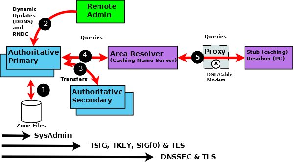

.. Copyright (C) Internet Systems Consortium, Inc. ("ISC")
..
.. SPDX-License-Identifier: MPL-2.0
..
.. This Source Code Form is subject to the terms of the Mozilla Public
.. License, v. 2.0.  If a copy of the MPL was not distributed with this
.. file, you can obtain one at https://mozilla.org/MPL/2.0/.
..
.. See the COPYRIGHT file distributed with this work for additional
.. information regarding copyright ownership.

.. _intro_dns_security:

DNS Security Overview
---------------------

DNS is a communications protocol. All communications protocols are potentially
vulnerable to both subversion and eavesdropping. It is important for
users to audit their exposure to the various threats within their operational environment and implement the
appropriate solutions. BIND 9, a specific implementation of the DNS protocol,
provides an extensive set of security features. The purpose of this section
is to help users to select from the range of available security features those
required for their specific user environment.

A generic DNS network is shown below, followed by text descriptions. In general,
the further one goes from the left-hand side of the diagram, the more complex
the implementation.

.. Note:: Historically, DNS data was regarded as public and security was
	concerned, primarily, with ensuring the integrity of DNS data. DNS data privacy
	is increasingly regarded as an important dimension of overall security, specifically :ref:`DNS over TLS<dns_over_tls>`.

   BIND 9 Security Overview

The following notes refer to the numbered elements in the above diagram.

1. A variety of system administration techniques and methods may be used to secure
BIND 9's local environment, including :ref:`file permissions <file_permissions>`, running
BIND 9 in a :ref:`jail <chroot_and_setuid>`, and the use of :ref:`Access_Control_Lists`.

2. The remote name daemon control (:ref:`rndc<ops_rndc>`) program allows the system
administrator to control the operation of a name server. The majority of BIND 9 packages
or ports come preconfigured with local (loopback address) security preconfigured.
If ``rndc`` is being invoked from a remote host, further configuration is required.
The ``nsupdate`` tool uses **Dynamic DNS (DDNS)** features and allows users to dynamically
change the contents of the zone file(s). ``nsupdate`` access and security may be controlled
using ``named.conf`` :ref:`statements or using TSIG or SIG(0) cryptographic methods <dynamic_update_security>`.
Clearly, if the remote hosts used for either ``rndc`` or DDNS lie within a network entirely
under the user's control, the security threat may be regarded as non-existent. Any implementation requirements,
therefore, depend on the site's security policy.

3. Zone transfer from a **primary** to one or more **secondary** authoritative name servers across a
public network carries risk. The zone transfer may be secured using
``named.conf`` :ref:`statements, TSIG cryptographic methods or TLS<sec_file_transfer>`.
Clearly, if the secondary authoritative name server(s) all lie within a network entirely
under the user's control, the security threat may be regarded as non-existent. Any implementation requirements
again depend on the site's security policy.

4. If the operator of an authoritative name server (primary or secondary) wishes to ensure that
DNS responses to user-initiated queries about the zone(s) for which they are responsible can only
have come from their server, that the data received by the user is the same as that sent, and that
non-existent names are genuine, then :ref:`DNSSEC` is the only solution. DNSSEC requires configuration
and operational changes both to the authoritative name servers and to any resolver which accesses
those servers.

5. The typical Internet-connected end-user device (PCs, laptops, and even mobile phones) either has
a stub resolver or operates via a DNS proxy. A stub resolver requires the services of an area
or full-service resolver to completely answer user queries. Stub resolvers on the majority of PCs and laptops
typically have a caching capability to increase performance. At this time there are no standard stub resolvers or proxy
DNS tools that implement DNSSEC. BIND 9 may be configured to provide such capability on supported Linux or Unix platforms.
:ref:`DNS over TLS <dns_over_tls>` may be configured to verify the integrity of the data between the stub resolver and
area (or full-service) resolver. However, unless the resolver and the Authoritative Name Server implements DNSSEC, end-to-end integrity (from
authoritative name server to stub resolver) cannot be guaranteed.
