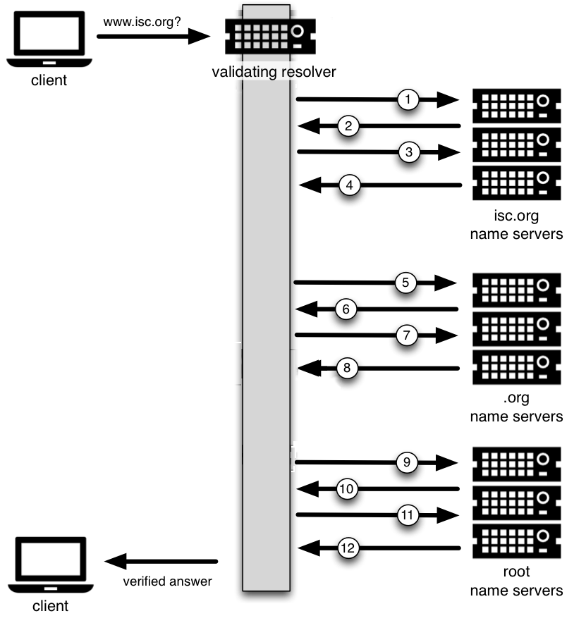

.. Copyright (C) Internet Systems Consortium, Inc. ("ISC")
..
.. SPDX-License-Identifier: MPL-2.0
..
.. This Source Code Form is subject to the terms of the Mozilla Public
.. License, v. 2.0.  If a copy of the MPL was not distributed with this
.. file, you can obtain one at https://mozilla.org/MPL/2.0/.
..
.. See the COPYRIGHT file distributed with this work for additional
.. information regarding copyright ownership.

.. _dnssec_guide_introduction:

Introduction
------------

.. _who_should_read:

Who Should Read this Guide?
~~~~~~~~~~~~~~~~~~~~~~~~~~~

This guide is intended as an introduction to DNSSEC for the DNS
administrator who is already comfortable working with the existing BIND and DNS
infrastructure. He or she might be curious about DNSSEC, but may not have had the
time to investigate DNSSEC, to learn whether DNSSEC should
be a part of his or her environment, and understand what it means to deploy it in the
field.

This guide provides basic information on how to configure DNSSEC using
BIND 9.16.9 or later. Most of the information and examples in this guide also
apply to versions of BIND later than 9.9.0, but some of the key features described here
were only introduced in version 9.16.9. Readers are assumed to have basic
working knowledge of the Domain Name System (DNS) and related network
infrastructure, such as concepts of TCP/IP. In-depth knowledge of DNS and
TCP/IP is not required. The guide assumes no prior knowledge of DNSSEC or
related technology such as public key cryptography.

.. _who_should_not_read:

Who May Not Want to Read this Guide?
~~~~~~~~~~~~~~~~~~~~~~~~~~~~~~~~~~~~

If you are already operating a DNSSEC-signed zone, you may not learn
much from the first half of this document, and you may want to start with 
:ref:`dnssec_advanced_discussions`. If you want to
learn about details of the protocol extension, such as data fields and flags,
or the new record types, this document can help you get started but it
does not include all the technical details.

If you are experienced in DNSSEC, you
may find some of the concepts in this document to be overly simplified for
your taste, and some details are intentionally omitted at times for ease of
illustration.

If you administer a large or complex BIND environment, this
guide may not provide enough information for you, as it is intended to provide
only basic, generic working examples.

If you are a top-level domain (TLD) operator, or
administer zones under signed TLDs, this guide can
help you get started, but it does not provide enough details to serve all of your
needs.

If your DNS environment uses DNS products other than (or in addition to)
BIND, this document may provide some background or overlapping information, but you
should check each product's vendor documentation for specifics.

Finally, deploying
DNSSEC on internal or private networks is not covered in this document, with the
exception of a brief discussion in :ref:`dnssec_on_private_networks`.

.. _what_is_dnssec:

What is DNSSEC?
~~~~~~~~~~~~~~~

The Domain Name System (DNS) was designed in a day and age when the
Internet was a friendly and trusting place. The protocol itself provides
little protection against malicious or forged answers. DNS Security
Extensions (DNSSEC) addresses this need, by adding digital signatures
into DNS data so that each DNS response can be verified for integrity
(the answer did not change during transit) and authenticity (the data
came from the true source, not an impostor). In the ideal world, when
DNSSEC is fully deployed, every single DNS answer can be validated and
trusted.

DNSSEC does not provide a secure tunnel; it does not encrypt or hide DNS
data. It operates independently of an existing Public Key Infrastructure
(PKI). It does not need SSL certificates or shared secrets. It was
designed with backwards compatibility in mind, and can be deployed
without impacting "old" unsecured domain names.

DNSSEC is deployed on the three major components of the DNS
infrastructure:

-  *Recursive Servers*: People use recursive servers to lookup external
   domain names such as ``www.example.com``. Operators of recursive servers
   need to enable DNSSEC validation. With validation enabled, recursive
   servers carry out additional tasks on each DNS response they
   receive to ensure its authenticity.

-  *Authoritative Servers*: People who publish DNS data on their name
   servers need to sign that data. This entails creating additional
   resource records, and publishing them to parent domains where
   necessary. With DNSSEC enabled, authoritative servers respond to
   queries with additional DNS data, such as digital signatures and
   keys, in addition to the standard answers.

-  *Applications*: This component lives on every client machine, from web
   servers to smart phones. This includes resolver libraries on different
   operating systems, and applications such as web browsers.

In this guide, we focus on the first two components, Recursive
Servers and Authoritative Servers, and only lightly touch on the third
component. We look at how DNSSEC works, how to configure a
validating resolver, how to sign DNS zone data, and other operational
tasks and considerations.

.. _what_does_dnssec_add_to_dns:

What Does DNSSEC Add to DNS?
~~~~~~~~~~~~~~~~~~~~~~~~~~~~

.. note::

   Public Key Cryptography works on the concept of a pair of keys: one
   made available to the world publicly, and one kept in secrecy
   privately. Not surprisingly, they are known as a public key and a private
   key. If you are not familiar with the concept, think of it as a
   cleverly designed lock, where one key locks and one key unlocks. In
   DNSSEC, we give out the unlocking public key to the rest of the
   world, while keeping the locking key private. To learn how this is
   used to secure DNS messages, see :ref:`how_are_answers_verified`.

DNSSEC introduces eight new resource record types:

-  RRSIG (digital resource record signature)

-  DNSKEY (public key)

-  DS (parent-child)

-  NSEC (proof of nonexistence)

-  NSEC3 (proof of nonexistence)

-  NSEC3PARAM (proof of nonexistence)

-  CDS (child-parent signaling)

-  CDNSKEY (child-parent signaling)

This guide does not go deep into the anatomy of each resource record
type; the details are left for the reader to research and explore.
Below is a short introduction on each of the new record types:

-  *RRSIG*: With DNSSEC enabled, just about every DNS answer (A, PTR,
   MX, SOA, DNSKEY, etc.) comes with at least one resource
   record signature, or RRSIG. These signatures are used by recursive name
   servers, also known as validating resolvers, to verify the answers
   received. To learn how digital signatures are generated and used, see
   :ref:`how_are_answers_verified`.

-  *DNSKEY*: DNSSEC relies on public-key cryptography for data
   authenticity and integrity. There are several keys used in DNSSEC,
   some private, some public. The public keys are published to the world
   as part of the zone data, and they are stored in the DNSKEY record
   type.

   In general, keys in DNSSEC are used for one or both of the following
   roles: as a Zone Signing Key (ZSK), used to protect all zone data; or
   as a Key Signing Key (KSK), used to protect the zone's keys. A key
   that is used for both roles is referred to as a Combined Signing Key
   (CSK). We talk about keys in more detail in
   :ref:`advanced_discussions_key_generation`.

-  *DS*: One of the critical components of DNSSEC is that the parent
   zone can "vouch" for its child zone. The DS record is verifiable
   information (generated from one of the child's public keys) that a
   parent zone publishes about its child as part of the chain of trust.
   To learn more about the Chain of Trust, see
   :ref:`chain_of_trust`.

-  *NSEC, NSEC3, NSEC3PARAM*: These resource records all deal with a
   very interesting problem: proving that something does not exist. We
   look at these record types in more detail in
   :ref:`advanced_discussions_proof_of_nonexistence`.

-  *CDS, CDNSKEY*: The CDS and CDNSKEY resource records apply to
   operational matters and are a way to signal to the parent zone that
   the DS records it holds for the child zone should be updated. This is
   covered in more detail in :ref:`cds_cdnskey`.

.. _how_does_dnssec_change_dns_lookup:

How Does DNSSEC Change DNS Lookup?
~~~~~~~~~~~~~~~~~~~~~~~~~~~~~~~~~~

Traditional (insecure) DNS lookup is simple: a recursive name server
receives a query from a client to lookup a name like ``www.isc.org``. The
recursive name server tracks down the authoritative name server(s)
responsible, sends the query to one of the authoritative name servers,
and waits for it to respond with the answer.

With DNSSEC validation enabled, a validating recursive name server
(a.k.a. a *validating resolver*) asks for additional resource
records in its query, hoping the remote authoritative name servers
respond with more than just the answer to the query, but some proof to
go along with the answer as well. If DNSSEC responses are received, the
validating resolver performs cryptographic computation to verify the
authenticity (the origin of the data) and integrity (that the data was not altered
during transit) of the answers, and even asks the parent zone as part of
the verification. It repeats this process of get-key, validate,
ask-parent, and its parent, and its parent, all the way until
the validating resolver reaches a key that it trusts. In the ideal,
fully deployed world of DNSSEC, all validating resolvers only need to
trust one key: the root key.

.. _dnssec_12_steps:

The 12-Step DNSSEC Validation Process (Simplified)
^^^^^^^^^^^^^^^^^^^^^^^^^^^^^^^^^^^^^^^^^^^^^^^^^^

The following example shows the 12 steps of the DNSSEC validating process 
at a very high level, looking up the name ``www.isc.org`` :

1.  Upon receiving a DNS query from a client to resolve ``www.isc.org``,
    the validating resolver follows standard DNS protocol to track down
    the name server for ``isc.org``, and sends it a DNS query to ask for the
    A record of ``www.isc.org``. But since this is a DNSSEC-enabled
    resolver, the outgoing query has a bit set indicating it wants
    DNSSEC answers, hoping the name server that receives it is DNSSEC-enabled
    and can honor this secure request.

2.  The ``isc.org`` name server is DNSSEC-enabled, so it responds with both
    the answer (in this case, an A record) and a digital signature for
    verification purposes.

3.  The validating resolver requires cryptographic keys to be able to verify the
    digital signature, so it asks the ``isc.org`` name server for those keys.

4.  The ``isc.org`` name server responds with the cryptographic keys
    (and digital signatures of the keys) used to generate the digital
    signature that was sent in #2. At this point, the validating
    resolver can use this information to verify the answers received in
    #2.

    Let's take a quick break here and look at what we've got so far...
    how can our server trust this answer? If a clever attacker had taken over
    the ``isc.org`` name server(s), of course she would send matching
    keys and signatures. We need to ask someone else to have confidence
    that we are really talking to the real ``isc.org`` name server. This
    is a critical part of DNSSEC: at some point, the DNS administrators
    at ``isc.org`` uploaded some cryptographic information to its
    parent, ``.org``, maybe through a secure web form, maybe
    through an email exchange, or perhaps in person. In
    any event, at some point some verifiable information about the
    child (``isc.org``) was sent to the parent (``.org``) for
    safekeeping.

5.  The validating resolver asks the parent (``.org``) for the
    verifiable information it keeps on its child, ``isc.org``.

6.  Verifiable information is sent from the ``.org`` server. At this
    point, the validating resolver compares this to the answer it received
    in #4; if the two of them match, it proves the authenticity of
    ``isc.org``.

    Let's examine this process. You might be thinking to yourself,
    what if the clever attacker that took over ``isc.org`` also
    compromised the ``.org`` servers? Of course all this information
    would match! That's why we turn our attention now to the
    ``.org`` server, interrogate it for its cryptographic keys, and
    move one level up to ``.org``'s parent, root.

7.  The validating resolver asks the ``.org`` authoritative name server for
    its cryptographic keys, to verify the answers received in #6.

8.  The ``.org`` name server responds with the answer (in this case,
    keys and signatures). At this point, the validating resolver can
    verify the answers received in #6.

9.  The validating resolver asks root (``.org``'s parent) for the verifiable
    information it keeps on its child, ``.org``.

10. The root name server sends back the verifiable information it keeps
    on ``.org``. The validating resolver uses this information
    to verify the answers received in #8.

    So at this point, both ``isc.org`` and ``.org`` check out. But
    what about root? What if this attacker is really clever and somehow
    tricked us into thinking she's the root name server? Of course she
    would send us all matching information! So we repeat the
    interrogation process and ask for the keys from the root name
    server.

11. The validating resolver asks the root name server for its cryptographic
    keys to verify the answer(s) received in #10.

12. The root name server sends its keys; at this point, the validating
    resolver can verify the answer(s) received in #10.

.. _chain_of_trust:

Chain of Trust
^^^^^^^^^^^^^^

But what about the root server itself? Who do we go to verify root's
keys? There's no parent zone for root. In security, you have to trust
someone, and in the perfectly protected world of DNSSEC (we talk later
about the current imperfect state and ways to work around it),
each validating resolver would only have to trust one entity, that is,
the root name server. The validating resolver already has the root key
on file (we discuss later how we got the root key file). So
after the answer in #12 is received, the validating resolver compares it
to the key it already has on file. Providing one of the keys in the
answer matches the one on file, we can trust the answer from root. Thus
we can trust ``.org``, and thus we can trust ``isc.org``. This is known
as the "chain of trust" in DNSSEC.

We revisit this 12-step process again later in
:ref:`how_does_dnssec_change_dns_lookup_revisited` with more
technical details.

.. _why_is_dnssec_important:

Why is DNSSEC Important? (Why Should I Care?)
~~~~~~~~~~~~~~~~~~~~~~~~~~~~~~~~~~~~~~~~~~~~~

You might be thinking to yourself: all this DNSSEC stuff sounds
wonderful, but why should I care? Below are some reasons why you may
want to consider deploying DNSSEC:

1. *Being a good netizen*: By enabling DNSSEC validation (as described in
   :ref:`dnssec_validation`) on your DNS servers, you're protecting
   your users and yourself a little more by checking answers returned to
   you; by signing your zones (as described in
   :ref:`dnssec_signing`), you are making it possible for other
   people to verify your zone data. As more people adopt DNSSEC, the
   Internet as a whole becomes more secure for everyone.

2. *Compliance*: You may not even get a say in
   implementing DNSSEC, if your organization is subject to compliance
   standards that mandate it. For example, the US government set a
   deadline in 2008 to have all ``.gov`` subdomains signed by
   December 2009  [#]_. So if you operate a subdomain in ``.gov``, you
   must implement DNSSEC to be compliant. ICANN also requires
   that all new top-level domains support DNSSEC.

3. *Enhanced Security*: Okay, so the big lofty goal of "let's be good"
   doesn't appeal to you, and you don't have any compliance standards to
   worry about. Here is a more practical reason why you should consider
   DNSSEC: in the event of a DNS-based security breach, such as cache
   poisoning or domain hijacking, after all the financial and brand
   damage done to your domain name, you might be placed under scrutiny
   for any preventive measure that could have been put in place. Think
   of this like having your website only available via HTTP but not
   HTTPS.

4. *New Features*: DNSSEC brings not only enhanced security, but also
   a whole new suite of features. Once DNS
   can be trusted completely, it becomes possible to publish SSL
   certificates in DNS, or PGP keys for fully automatic cross-platform
   email encryption, or SSH fingerprints.... New features are still
   being developed, but they all rely on a trustworthy DNS
   infrastructure. To take a peek at these next-generation DNS features,
   check out :ref:`introduction_to_dane`.

.. [#]
   The Office of Management and Budget (OMB) for the US government
   published `a memo in
   2008 <https://www.whitehouse.gov/sites/whitehouse.gov/files/omb/memoranda/2008/m08-23.pdf>`__,
   requesting all ``.gov`` subdomains to be DNSSEC-signed by December
   2009. This explains why ``.gov`` is the most-deployed DNSSEC domain
   currently, with `around 90% of subdomains
   signed. <https://fedv6-deployment.antd.nist.gov/cgi-bin/generate-gov>`__

.. _how_does_dnssec_change_my_job:

How Does DNSSEC Change My Job as a DNS Administrator?
~~~~~~~~~~~~~~~~~~~~~~~~~~~~~~~~~~~~~~~~~~~~~~~~~~~~~

With this protocol extension, some of the things you were used to in DNS
have changed. As the DNS administrator, you have new maintenance
tasks to perform on a regular basis (as described in
:ref:`signing_maintenance_tasks`); when there is a DNS resolution
problem, you have new troubleshooting techniques and tools to use (as
described in :ref:`dnssec_troubleshooting`). BIND 9 tries its best to
make these things as transparent and seamless as possible. In this
guide, we try to use configuration examples that result in the least
amount of work for BIND 9 DNS administrators.
