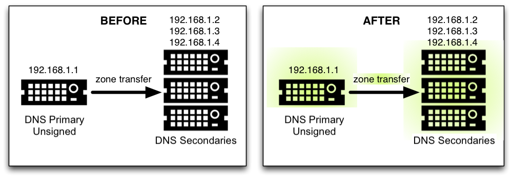
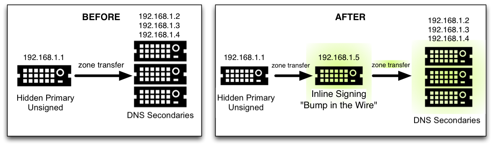

.. Copyright (C) Internet Systems Consortium, Inc. ("ISC")
..
.. SPDX-License-Identifier: MPL-2.0
..
.. This Source Code Form is subject to the terms of the Mozilla Public
.. License, v. 2.0.  If a copy of the MPL was not distributed with this
.. file, you can obtain one at https://mozilla.org/MPL/2.0/.
..
.. See the COPYRIGHT file distributed with this work for additional
.. information regarding copyright ownership.

.. _dnssec_recipes:

Recipes
-------

This chapter provides step-by-step "recipes" for some common
DNSSEC configurations.

.. _recipes_inline_signing:

DNSSEC Signing
~~~~~~~~~~~~~~

There are two recipes here: the first shows an example using DNSSEC
signing on the primary server, which has been covered in this
guide; the second shows how to setup a "bump in the
wire" between a hidden primary and the secondary servers to seamlessly
sign the zone "on the fly."

.. _recipes_inline_signing_primary:

Primary Server DNSSEC Signing
^^^^^^^^^^^^^^^^^^^^^^^^^^^^^

In this recipe, our servers are illustrated as shown in
:ref:`dnssec-signing-1`: we have a primary server
(192.168.1.1) and three secondary servers (192.168.1.2, 192.168.1.3, and
192.168.1.4) that receive zone transfers. To get the zone
signed, we need to reconfigure the primary server. Once reconfigured, a
signed version of the zone is generated on the fly;
zone transfers take care of synchronizing the signed zone data
to all secondary name servers, without configuration or software changes
on them.

.. _dnssec-signing-1:

   DNSSEC Signing Recipe #1

Using the method described in
:ref:`easy_start_guide_for_authoritative_servers`, we just need to
add a ``dnssec-policy`` statement to the relevant zone clause. This is
what the ``named.conf`` zone statement looks like on the primary server, 192.168.1.1:

::

   zone "example.com" IN {
       type primary;
       file "db/example.com.db";
       key-directory "keys/example.com";
       dnssec-policy default;
       inline-signing yes;
       allow-transfer { 192.168.1.2; 192.168.1.3; 192.168.1.4; };
   };

We have chosen to use the default policy, storing the keys generated for
the zone in the directory ``keys/example.com``. To use a
custom policy, define the policy in the configuration
file and select it in the zone statement (as described in
:ref:`signing_custom_policy`).

On the secondary servers, ``named.conf`` does not need to be updated,
and it looks like this:

::

   zone "example.com" IN {
       type secondary;
       file "db/example.com.db";
       primaries { 192.168.1.1; };
   };

In fact, the secondary servers do not even need to be running BIND; they
can run any DNS product that supports DNSSEC.

.. _recipes_inline_signing_bump_in_the_wire:

"Bump in the Wire" Signing
^^^^^^^^^^^^^^^^^^^^^^^^^^

In this recipe, we take advantage of the power of automated signing
by placing an additional name server (192.168.1.5) between the hidden
primary (192.168.1.1) and the DNS secondaries (192.168.1.2, 192.168.1.3,
and 192.168.1.4). The additional name server, 192.168.1.5, acts as a "bump
in the wire," taking an unsigned zone from the hidden primary,
and sending out signed data on the other end to the secondary name
servers. The steps described in this recipe may be used as part of a
DNSSEC deployment strategy, since it requires only minimal changes made to
the existing hidden DNS primary and DNS secondaries.

.. _dnssec-signing-2:

   DNSSEC Signing Recipe #2

It is important to remember that 192.168.1.1 in this case is a hidden
primary not exposed to the world, and it must not be listed in the NS RRset.
Otherwise the world will get conflicting answers: unsigned answers from
the hidden primary and signed answers from the other name servers.

The only configuration change needed on the hidden primary, 192.168.1.1,
is to make sure it allows our middle box to perform a zone transfer:

::

   zone "example.com" IN {
       ...
       allow-transfer { 192.168.1.5; };
       ...
   };

On the middle box, 192.168.1.5, all the tasks described in
:ref:`easy_start_guide_for_authoritative_servers` still need to be
performed, such as generating key pairs and uploading information to
the parent zone. This server is configured as secondary to the hidden
primary 192.168.1.1 to receive the unsigned data; then, using keys
accessible to this middle box, to sign data on the fly; and finally, to send out the
signed data via zone transfer to the other three DNS secondaries. Its
``named.conf`` zone statement looks like this:

::

   zone example.com {
       type secondary;
       primaries { 192.168.1.1; };
       file "db/example.com.db";
       key-directory "keys/example.com";
       dnssec-policy default;
       inline-signing yes;
       allow-transfer { 192.168.1.2; 192.168.1.3; 192.168.1.4; };
   };

(As before, the default policy has been selected here. See
:ref:`signing_custom_policy` for instructions on how to define
and use a custom policy.)

Finally, on the three secondary servers, the configuration should be updated
to receive a zone transfer from 192.168.1.5 (the middle box) instead of
from 192.168.1.1 (the hidden primary). If using BIND, the ``named.conf`` file looks
like this:

::

   zone "example.com" IN {
       type secondary;
       file "db/example.com.db";
       primaries { 192.168.1.5; };   # this was 192.168.1.1 before!
   };

.. _recipes_rollovers:

Rollovers
~~~~~~~~~

If you are signing your zone using a ``dnssec-policy`` statement, this
section is not really relevant to you. In the policy statement, you set how long
you want your keys to be valid for, the time
taken for information to propagate through your zone, the time it takes
for your parent zone to register a new DS record, etc., and that's more
or less it. ``named`` implements everything for you automatically, apart from
uploading the new DS records to your parent zone - which is covered in
:ref:`signing_easy_start_upload_to_parent_zone`. (Some
screenshots from a session where a KSK is uploaded to the parent zone
are presented here for convenience.) However, these recipes may be useful
in describing what happens
through the rollover process and what you should be monitoring.

.. _recipes_zsk_rollover:

ZSK Rollover
^^^^^^^^^^^^

This recipe covers how to perform a ZSK rollover using what is known as
the Pre-Publication method. For other ZSK rolling methods, please see
:ref:`zsk_rollover_methods` in :ref:`dnssec_advanced_discussions`.

Below is a sample timeline for a ZSK rollover to occur on January 1, 2021:

1. December 1, 2020 (one month before rollover)

   -  Generate new ZSK

   -  Add DNSKEY for new ZSK to zone

2. January 1, 2021 (day of rollover)

   -  New ZSK used to replace RRSIGs for the bulk of the zone

3. February 1, 2021 (one month after rollover)

   -  Remove old ZSK DNSKEY RRset from zone

   -  DNSKEY signatures made with KSK are changed

The current active ZSK has the ID 17694 in the example below. For more
information on key management and rollovers, please see
:ref:`advanced_discussions_key_management`.

One Month Before ZSK Rollover
+++++++++++++++++++++++++++++

On December 1, 2020, a month before the example rollover, you (as administrator)
should change the parameters on the current key (17694). Set it to become inactive on
January 1, 2021 and be deleted from the zone on February 1, 2021; also,
generate a successor key (51623):

::

   # cd /etc/bind/keys/example.com/
   # dnssec-settime -I 20210101 -D 20210201 Kexample.com.+008+17694
   ./Kexample.com.+008+17694.key/GoDaddy

   ./Kexample.com.+008+17694.private
   # dnssec-keygen -S Kexample.com.+008+17694
   Generating key pair..++++++ ...........++++++ 
   Kexample.com.+008+51623

The first command gets us into the key directory
``/etc/bind/keys/example.com/``, where keys for ``example.com`` are
stored.

The second, ``dnssec-settime``, sets an inactive (``-I``) date of January 1,
2021, and a deletion (``-D``) date of February 1, 2021, for the current ZSK
(``Kexample.com.+008+17694``).

The third command, ``dnssec-keygen``, creates a successor key, using
the exact same parameters (algorithms, key sizes, etc.) as the current
ZSK. The new ZSK created in our example is ``Kexample.com.+008+51623``.

Make sure the successor keys are readable by ``named``.

``named``'s logging messages indicate when the next
key checking event is scheduled to occur, the frequency of which can be
controlled by ``dnssec-loadkeys-interval``. The log message looks like
this:

::

   zone example.com/IN (signed): next key event: 01-Dec-2020 00:13:05.385

And you can check the publish date of the key by looking at the key
file:

::

   # cd /etc/bind/keys/example.com
   # cat Kexample.com.+008+51623.key 
   ; This is a zone-signing key, keyid 11623, for example.com.
   ; Created: 20201130160024 (Mon Dec  1 00:00:24 2020)
   ; Publish: 20201202000000 (Fri Dec  2 08:00:00 2020)
   ; Activate: 20210101000000 (Sun Jan  1 08:00:00 2021)
   ...

Since the publish date is set to the morning of December 2, and our example
scenario takes place on December 1, the next
morning you will notice that your zone has gained a new DNSKEY record,
but the new ZSK is not yet being used to generate signatures. Below is
the abbreviated output - with shortened DNSKEY and RRSIG - when querying the
authoritative name server, 192.168.1.13:

::

   $ dig @192.168.1.13 example.com. DNSKEY +dnssec +multiline

   ...
   ;; ANSWER SECTION:
   example.com.        600 IN DNSKEY 257 3 8 (
                   AwEAAcWDps...lM3NRn/G/R
                   ) ; KSK; alg = RSASHA256; key id = 6817
   example.com.        600 IN DNSKEY 256 3 8 (
                   AwEAAbi6Vo...qBW5+iAqNz
                   ) ; ZSK; alg = RSASHA256; key id = 51623
   example.com.        600 IN DNSKEY 256 3 8 (
                   AwEAAcjGaU...0rzuu55If5
                   ) ; ZSK; alg = RSASHA256; key id = 17694
   example.com.        600 IN RRSIG DNSKEY 8 2 600 (
                   20210101000000 20201201230000 6817 example.com.
                   LAiaJM26T7...FU9syh/TQ= )
   example.com.        600 IN RRSIG DNSKEY 8 2 600 (
                   20210101000000 20201201230000 17694 example.com.
                   HK4EBbbOpj...n5V6nvAkI= )
   ...

For good measure, let's take a look at the SOA record and its
signature for this zone. Notice the RRSIG is signed by the current ZSK,
17694. This will come in handy later when you want to verify whether
the new ZSK is in effect:

::

   $ dig @192.168.1.13 example.com. SOA +dnssec +multiline

   ...
   ;; ANSWER SECTION:
   example.com.        600 IN SOA ns1.example.com. admin.example.com. (
                   2020120102 ; serial
                   1800       ; refresh (30 minutes)
                   900        ; retry (15 minutes)
                   2419200    ; expire (4 weeks)
                   300        ; minimum (5 minutes)
                   )
   example.com.        600 IN RRSIG SOA 8 2 600 (
                   20201230160109 20201130150109 17694 example.com.
                   YUTC8rFULaWbW+nAHzbfGwNqzARHevpryzRIJMvZBYPo
                   NAeejNk9saNAoCYKWxGJ0YBc2k+r5fYq1Mg4ll2JkBF5
                   buAsAYLw8vEOIxVpXwlArY+oSp9T1w2wfTZ0vhVIxaYX
                   6dkcz4I3wbDx2xmG0yngtA6A8lAchERx2EGy0RM= )

These are all the manual tasks you need to perform for a ZSK rollover.
If you have followed the configuration examples in this guide of using
``inline-signing`` and ``auto-dnssec``, everything else is automated for
you by BIND.

Day of ZSK Rollover
+++++++++++++++++++

On the actual day of the rollover, although there is technically nothing
for you to do, you should still keep an eye on the zone to make sure new
signatures are being generated by the new ZSK (51623 in this example).
The easiest way is to query the authoritative name server 192.168.1.13
for the SOA record as you did a month ago:

::

   $ dig @192.168.1.13 example.com. SOA +dnssec +multiline

   ...
   ;; ANSWER SECTION:
   example.com.        600 IN SOA ns1.example.com. admin.example.com. (
                   2020112011 ; serial
                   1800       ; refresh (30 minutes)
                   900        ; retry (15 minutes)
                   2419200    ; expire (4 weeks)
                   300        ; minimum (5 minutes)
                   )
   example.com.        600 IN RRSIG SOA 8 2 600 (
                   20210131000000 20201231230000 51623 example.com.
                   J4RMNpJPOmMidElyBugJp0RLqXoNqfvo/2AT6yAAvx9X
                   zZRL1cuhkRcyCSLZ9Z+zZ2y4u2lvQGrNiondaKdQCor7
                   uTqH5WCPoqalOCBjqU7c7vlAM27O9RD11nzPNpVQ7xPs
                   y5nkGqf83OXTK26IfnjU1jqiUKSzg6QR7+XpLk0= )
   ...

As you can see, the signature generated by the old ZSK (17694) has
disappeared, replaced by a new signature generated from the new ZSK
(51623).

.. note::

   Not all signatures will disappear magically on the same day;
   it depends on when each one was generated. In the worst-case scenario,
   a new signature could have been signed by the old ZSK (17694) moments
   before it was deactivated, meaning that the signature could live for almost
   30 more days, until just before February 1.

   This is why it is important to keep the old ZSK in the
   zone and not delete it right away.

One Month After ZSK Rollover
++++++++++++++++++++++++++++

Again, technically there is nothing you need to do on this day,
but it doesn't hurt to verify that the old ZSK (17694) is now completely
gone from your zone. ``named`` will not touch
``Kexample.com.+008+17694.private`` and ``Kexample.com.+008+17694.key``
on your file system. Running the same ``dig`` command for DNSKEY should
suffice:

::

   $ dig @192.168.1.13 example.com. DNSKEY +multiline +dnssec

   ...
   ;; ANSWER SECTION:
   example.com.        600 IN DNSKEY 257 3 8 (
                   AwEAAcWDps...lM3NRn/G/R
                   ) ; KSK; alg = RSASHA256; key id = 6817
   example.com.        600 IN DNSKEY 256 3 8 (
                   AwEAAdeCGr...1DnEfX+Xzn
                   ) ; ZSK; alg = RSASHA256; key id = 51623
   example.com.        600 IN RRSIG DNSKEY 8 2 600 (
                   20170203000000 20170102230000 6817 example.com.
                   KHY8P0zE21...Y3szrmjAM= )
   example.com.        600 IN RRSIG DNSKEY 8 2 600 (
                   20170203000000 20170102230000 51623 example.com.
                   G2g3crN17h...Oe4gw6gH8= )
   ...

Congratulations, the ZSK rollover is complete! As for the actual key
files (the files ending in ``.key`` and ``.private``), they may be deleted at this
point, but they do not have to be.

.. _recipes_ksk_rollover:

KSK Rollover
^^^^^^^^^^^^

This recipe describes how to perform KSK rollover using the Double-DS
method. For other KSK rolling methods, please see
:ref:`ksk_rollover_methods` in
:ref:`dnssec_advanced_discussions`. The registrar used in this
recipe is `GoDaddy <https://www.godaddy.com>`__. Also for this recipe,
we are keeping the number of DS records down to just one per active set
using just SHA-1, for the sake of better clarity, although in practice
most zone operators choose to upload two DS records as shown in
:ref:`working_with_parent_zone`. For more information on key
management and rollovers,
please see :ref:`advanced_discussions_key_management`.

Below is a sample timeline for a KSK rollover to occur on January 1, 2021:

1. December 1, 2020 (one month before rollover)

   -  Change timer on the current KSK

   -  Generate new KSK and DS records

   -  Add DNSKEY for the new KSK to zone

   -  Upload new DS records to parent zone

2. January 1, 2021 (day of rollover)

   -  Use the new KSK to sign all DNSKEY RRsets, which generates new
      RRSIGs

   -  Add new RRSIGs to the zone

   -  Remove RRSIG for the old ZSK from zone

   -  Start using the new KSK to sign DNSKEY

3. February 1, 2021 (one month after rollover)

   -  Remove the old KSK DNSKEY from zone

   -  Remove old DS records from parent zone

The current active KSK has the ID 24828, and this is the DS record that
has already been published by the parent zone:

::

   # dnssec-dsfromkey -a SHA-1 Kexample.com.+007+24828.key
   example.com. IN DS 24828 7 1 D4A33E8DD550A9567B4C4971A34AD6C4B80A6AD3

.. _one_month_before_ksk_rollover:

One Month Before KSK Rollover
+++++++++++++++++++++++++++++

On December 1, 2020, a month before the planned rollover, you (as
administrator) should
change the parameters on the current key. Set it to become inactive on January
1, 2021, and be deleted from the zone on February 1st, 2021;
also generate a successor key (23550). Finally, generate a new
DS record based on the new key, 23550:

::

   # cd /etc/bind/keys/example.com/
   # dnssec-settime -I 20210101 -D 20210201 Kexample.com.+007+24828
   ./Kexample.com.+007+24848.key
   ./Kexample.com.+007+24848.private
   # dnssec-keygen -S Kexample.com.+007+24848
   Generating key pair.......................................................................................++ ...................................++ 
   Kexample.com.+007+23550
   # dnssec-dsfromkey -a SHA-1 Kexample.com.+007+23550.key
   example.com. IN DS 23550 7 1 54FCF030AA1C79C0088FDEC1BD1C37DAA2E70DFB

The first command gets us into the key directory
``/etc/bind/keys/example.com/``, where keys for ``example.com`` are
stored.

The second, ``dnssec-settime``, sets an inactive (``-I``) date of January 1,
2021, and a deletion (``-D``) date of February 1, 2021 for the current KSK
(``Kexample.com.+007+24848``).

The third command, ``dnssec-keygen``, creates a successor key, using
the exact same parameters (algorithms, key sizes, etc.) as the current
KSK. The new key pair created in our example is ``Kexample.com.+007+23550``.

The fourth and final command, ``dnssec-dsfromkey``, creates a DS record
from the new KSK (23550), using SHA-1 as the digest type. Again, in
practice most people generate two DS records for both supported digest
types (SHA-1 and SHA-256), but for our example here we are only using
one to keep the output small and hopefully clearer.

Make sure the successor keys are readable by ``named``.

The ``syslog`` message indicates when the next key
checking event is. The log message looks like this:

::

   zone example.com/IN (signed): next key event: 01-Dec-2020 00:13:05.385

You can check the publish date of the key by looking at the key
file:

::

   # cd /etc/bind/keys/example.com
   # cat Kexample.com.+007+23550.key
   ; This is a key-signing key, keyid 23550, for example.com.
   ; Created: 20201130160024 (Thu Dec  1 00:00:24 2020)
   ; Publish: 20201202000000 (Fri Dec  2 08:00:00 2020)
   ; Activate: 20210101000000 (Sun Jan  1 08:00:00 2021)
   ...

Since the publish date is set to the morning of December 2, and our example
scenario takes place on December 1, the next
morning you will notice that your zone has gained a new DNSKEY record
based on your new KSK, but with no corresponding RRSIG yet. Below is the
abbreviated output - with shortened DNSKEY and RRSIG - when querying the
authoritative name server, 192.168.1.13:

::

   $ dig @192.168.1.13 example.com. DNSKEY +dnssec +multiline

   ...
   ;; ANSWER SECTION:
   example.com.   300 IN DNSKEY 256 3 7 (
                   AwEAAdYqAc...TiSlrma6Ef
                   ) ; ZSK; alg = NSEC3RSASHA1; key id = 29747
   example.com.   300 IN DNSKEY 257 3 7 (
                   AwEAAeTJ+w...O+Zy9j0m63
                   ) ; KSK; alg = NSEC3RSASHA1; key id = 24828
   example.com.   300 IN DNSKEY 257 3 7 (
                   AwEAAc1BQN...Wdc0qoH21H
                   ) ; KSK; alg = NSEC3RSASHA1; key id = 23550
   example.com.   300 IN RRSIG DNSKEY 7 2 300 (
                   20201206125617 20201107115617 24828 example.com.
                   4y1iPVJOrK...aC3iF9vgc= )
   example.com.   300 IN RRSIG DNSKEY 7 2 300 (
                   20201206125617 20201107115617 29747 example.com.
                   g/gfmPjr+y...rt/S/xjPo= )

   ...

Anytime after generating the DS record, you can upload it;
it is not necessary to wait for the DNSKEY to be published in your zone,
since this new KSK is not active yet. You can do it
immediately after the new DS record has been generated on December 1,
or you can wait until the next day after you have verified that the
new DNSKEY record is added to the zone. Below are some screenshots from
GoDaddy's web-based interface, used to add a new DS record [#]_.

1. After logging in, click the green "Launch" button next to the domain
   name you want to manage.

   .. _add-ds-1:

   .. figure:: ../dnssec-guide/img/add-ds-1.png
      :alt: Upload DS Record Step #1
      :width: 70.0%

      Upload DS Record Step #1

2. Scroll down to the "DS Records" section and click "Manage."

   .. _add-ds-2:

   .. figure:: ../dnssec-guide/img/add-ds-2.png
      :alt: Upload DS Record Step #2
      :width: 40.0%

      Upload DS Record Step #2

3. A dialog appears, displaying the current key (24828). Click "Add DS
   Record."

   .. _add-ds-3:

   .. figure:: ../dnssec-guide/img/add-ds-3.png
      :alt: Upload DS Record Step #3
      :width: 80.0%

      Upload DS Record Step #3

4. Enter the Key ID, algorithm, digest type, and the digest, then click
   "Next."

   .. _add-ds-4:

   .. figure:: ../dnssec-guide/img/add-ds-4.png
      :alt: Upload DS Record Step #4
      :width: 80.0%

      Upload DS Record Step #4

5. Address any errors and click "Finish."

   .. _add-ds-5:

   .. figure:: ../dnssec-guide/img/add-ds-5.png
      :alt: Upload DS Record Step #5
      :width: 80.0%

      Upload DS Record Step #5

6. Both DS records are shown. Click "Save."

   .. _add-ds-6:

   .. figure:: ../dnssec-guide/img/add-ds-6.png
      :alt: Upload DS Record Step #6
      :width: 80.0%

      Upload DS Record Step #6

Finally, let's verify that the registrar has published the new DS
record. This may take anywhere from a few minutes to a few days,
depending on your parent zone. You can verify whether your
parent zone has published the new DS record by querying for the DS
record of your zone. In the example below, the Google public DNS server
8.8.8.8 is used:

::

   $ dig @8.8.8.8 example.com. DS

   ...
   ;; ANSWER SECTION:
   example.com.    21552   IN  DS  24828 7 1 D4A33E8DD550A9567B4C4971A34AD6C4B80A6AD3
   example.com.    21552   IN  DS  23550 7 1 54FCF030AA1C79C0088FDEC1BD1C37DAA2E70DFB

You can also query your parent zone's authoritative name servers
directly to see if these records have been published. DS records will
not show up on your own authoritative zone, so you cannot query your own
name servers for them. In this recipe, the parent zone is ``.com``, so
querying a few of the ``.com`` name servers is another appropriate
verification.

Day of KSK Rollover
+++++++++++++++++++

If you have followed the examples in this document, as described in
:ref:`easy_start_guide_for_authoritative_servers`, there is
technically nothing you need to do manually on the actual day of the
rollover. However, you should still keep an eye on the zone to make sure
new signature(s) are being generated by the new KSK (23550 in this
example). The easiest way is to query the authoritative name server
192.168.1.13 for the same DNSKEY and signatures, as you did a month
ago:

::

   $ dig @192.168.1.13 example.com. DNSKEY +dnssec +multiline

   ...
   ;; ANSWER SECTION:
   example.com.   300 IN DNSKEY 256 3 7 (
                   AwEAAdYqAc...TiSlrma6Ef
                   ) ; ZSK; alg = NSEC3RSASHA1; key id = 29747
   example.com.   300 IN DNSKEY 257 3 7 (
                   AwEAAeTJ+w...O+Zy9j0m63
                   ) ; KSK; alg = NSEC3RSASHA1; key id = 24828
   example.com.   300 IN DNSKEY 257 3 7 (
                   AwEAAc1BQN...Wdc0qoH21H
                   ) ; KSK; alg = NSEC3RSASHA1; key id = 23550
   example.com.    300 IN RRSIG DNSKEY 7 2 300 (
                   20210201074900 20210101064900 23550 mydnssecgood.org.
                   S6zTbBTfvU...Ib5eXkbtE= )
   example.com.    300 IN RRSIG DNSKEY 7 2 300 (
                   20210105074900 20201206064900 29747 mydnssecgood.org.
                   VY5URQA2/d...OVKr1+KX8= )
   ...

As you can see, the signature generated by the old KSK (24828) has
disappeared, replaced by a new signature generated from the new KSK
(23550).

One Month After KSK Rollover
++++++++++++++++++++++++++++

While the removal of the old DNSKEY from the zone should be automated by
``named``, the removal of the DS record is manual. You should make sure
the old DNSKEY record is gone from your zone first, by querying for the
DNSKEY records of the zone; this time we expect not to see
the key with an ID of 24828:

::

   $ dig @192.168.1.13 example.com. DNSKEY +dnssec +multiline

   ...
   ;; ANSWER SECTION:
   example.com.    300 IN DNSKEY 256 3 7 (
                   AwEAAdYqAc...TiSlrma6Ef
                   ) ; ZSK; alg = NSEC3RSASHA1; key id = 29747
   example.com.    300 IN DNSKEY 257 3 7 (
                   AwEAAc1BQN...Wdc0qoH21H
                   ) ; KSK; alg = NSEC3RSASHA1; key id = 23550
   example.com.    300 IN RRSIG DNSKEY 7 2 300 (
                   20210208000000 20210105230000 23550 mydnssecgood.org.
                   Qw9Em3dDok...bNCS7KISw= )
   example.com.    300 IN RRSIG DNSKEY 7 2 300 (
                   20210208000000 20210105230000 29747 mydnssecgood.org.
                   OuelpIlpY9...XfsKupQgc= )
   ...

Since the key with the ID 24828 is gone, you can now remove the old DS
record for that key from our parent zone.
Be careful to remove the correct DS record. If you accidentally remove
the new DS record(s) with key ID 23550, it could lead to a problem called
"security lameness," as discussed in
:ref:`troubleshooting_security_lameness`, and may cause users to be unable
to resolve any names in the zone.

1. After logging in (again, GoDaddy.com in our example) and launching the domain, scroll down to the "DS
   Records" section and click Manage.

   .. _remove-ds-1:

   .. figure:: ../dnssec-guide/img/remove-ds-1.png
      :alt: Remove DS Record Step #1
      :width: 40.0%

      Remove DS Record Step #1

2. A dialog appears, displaying both keys (24828 and 23550). Use the far
   right-hand X button to remove key 24828.

   .. _remove-ds-2:

   .. figure:: ../dnssec-guide/img/remove-ds-2.png
      :alt: Remove DS Record Step #2
      :width: 80.0%

      Remove DS Record Step #2

3. Key 24828 now appears crossed out; click "Save" to complete the
   removal.

   .. _remove-ds-3:

   .. figure:: ../dnssec-guide/img/remove-ds-3.png
      :alt: Remove DS Record Step #3
      :width: 80.0%

      Remove DS Record Step #3

Congratulations, the KSK rollover is complete! As for the actual key
files (ending in ``.key`` and ``.private``), they may be deleted at this
point, but they do not have to be.

.. [#]
   The screenshots were taken from GoDaddy's interface at the time the
   original version of this guide was published (2015). It may have
   changed since then.

.. _recipes_nsec3:

NSEC and NSEC3
~~~~~~~~~~~~~~

.. _recipes_nsec_to_nsec3:

Migrating from NSEC to NSEC3
^^^^^^^^^^^^^^^^^^^^^^^^^^^^

This recipe describes how to transition from using NSEC to NSEC3, as described
in :ref:`advanced_discussions_proof_of_nonexistence`. This recipe
assumes that the zones are already signed, and that ``named`` is configured
according to the steps described in
:ref:`easy_start_guide_for_authoritative_servers`.

.. warning::

   If your zone is signed with RSASHA1 (algorithm 5), you cannot migrate
   to NSEC3 without also performing an
   algorithm rollover
   to RSASHA1-NSEC3-SHA1 (algorithm 7), as described in
   :ref:`advanced_discussions_DNSKEY_algorithm_rollovers`. This
   ensures that older validating resolvers that do not understand
   NSEC3 will fall back to treating the zone as unsecured (rather than
   "bogus"), as described in Section 2 of :rfc:`5155`.

To enable NSEC3, update your ``dnssec-policy`` and add the desired NSEC3
parameters. The example below enables NSEC3 for zones with the ``standard``
DNSSEC policy, using 0 additional iterations, no opt-out, and a zero-length salt:

::

    dnssec-policy "standard" {
        nsec3param iterations 0 optout no salt-length 0;
    };

Then reconfigure the server with ``rndc``. You can tell that it worked if you
see the following debug log messages:

::

   Oct 21 13:47:21 received control channel command 'reconfig'
   Oct 21 13:47:21 zone example.com/IN (signed): zone_addnsec3chain(1,CREATE,0,-)

You can also verify that it worked by querying for a name that you know
does not exist, and checking for the presence of the NSEC3 record.
For example:

::

   $ dig @192.168.1.13 thereisnowaythisexists.example.com. A +dnssec +multiline

   ...
   5A03TL362CS8VSIH69CVA4MJIKRHFQH3.example.com. 300 IN NSEC3 1 0 0 - (
                   TQ9QBEGA6CROHEOC8KIH1A2C06IVQ5ER
                   NS SOA RRSIG DNSKEY NSEC3PARAM )
   ...

Our example used four parameters: 1, 0, 0, and -, in
order. 1 represents the algorithm, 0 represents the
opt-out flag, 0 represents the number of additional iterations, and
- denotes no salt is used. To learn more about each of these
parameters, please see :ref:`advanced_discussions_nsec3param`.

.. _recipes_nsec3_to_nsec:

Migrating from NSEC3 to NSEC
^^^^^^^^^^^^^^^^^^^^^^^^^^^^

Migrating from NSEC3 back to NSEC is easy; just remove the ``nsec3param``
configuration option from your ``dnssec-policy`` and reconfigure the name
server. You can tell that it worked if you see these messages in the log:

::

   named[14093]: received control channel command 'reconfig'
   named[14093]: zone example.com/IN: zone_addnsec3chain(1,REMOVE,0,-)

You can also query for a name that you know does not exist,
and you should no longer see any traces of NSEC3 records.

::

   $ dig @192.168.1.13 reieiergiuhewhiouwe.example.com. A +dnssec +multiline

   ...
   example.com.        300 IN NSEC aaa.example.com. NS SOA RRSIG NSEC DNSKEY
   ...
   ns1.example.com.    300 IN NSEC web.example.com. A RRSIG NSEC
   ...

.. _recipes_nsec3_optout:

NSEC3 Opt-Out
^^^^^^^^^^^^^

This recipe discusses how to enable and disable NSEC3 opt-out, and how to show
the results of each action. As discussed in
:ref:`advanced_discussions_nsec3_optout`, NSEC3 opt-out is a feature
that can help conserve resources on parent zones with many
delegations that have not yet been signed.

.. warning::
   NSEC3 Opt-Out feature brings benefit only to _extremely_ large zones with lots
   of insecure delegations. It's use is counterproductive in all other cases as
   it decreases tamper-resistance of the zone and also decreases efficiency of
   resolver cache (see :rfc:`8198`).

   In other words, don't enable Opt-Out unless you are serving an equivalent of
   ``com.`` zone.

Because the NSEC3PARAM record does not keep track of whether opt-out is used,
it is hard to check whether changes need to be made to the NSEC3 chain if the flag
is changed. Similar to changing the NSEC3 salt, your best option is to change
the value of ``optout`` together with another NSEC3 parameter, like
``iterations``, and in a following step restore the ``iterations`` value.

For this recipe we assume the zone ``example.com``
has the following four entries (for this example, it is not relevant what
record types these entries are):

-  ``ns1.example.com``

-  ``ftp.example.com``

-  ``www.example.com``

-  ``web.example.com``

And the zone ``example.com`` has five delegations to five subdomains, only one of
which is signed and has a valid DS RRset:

-  ``aaa.example.com``, not signed

-  ``bbb.example.com``, signed

-  ``ccc.example.com``, not signed

-  ``ddd.example.com``, not signed

-  ``eee.example.com``, not signed

Before enabling NSEC3 opt-out, the zone ``example.com`` contains ten
NSEC3 records; below is the list with the plain text name before the actual
NSEC3 record:

-  *aaa.example.com*: IFA1I3IE7EKCTPHM6R58URO3Q846I52M.example.com

-  *bbb.example.com*: ROJUF3VJSJO6LQ2LC1DNSJ5GBAUJPVHE.example.com

-  *ccc.example.com*: 0VPUT696LUVDPDS5NIHSHBH9KLV20V5K.example.com

-  *ddd.example.com*: UHPBD5U4HRGB84MLC2NQOVEFNAKJU0CA.example.com

-  *eee.example.com*: NF7I61FA4C2UEKPMEDSOC25FE0UJIMKT.example.com

-  *ftp.example.com*: 8P15KCUAT1RHCSDN46HBQVPI5T532IN1.example.com

-  *ns1.example.com*: GUFVRA2SFIO8RSFP7UO41E8AD1KR41FH.example.com

-  *web.example.com*: CVQ4LA4ALPQIAO2H3N2RB6IR8UHM91E7.example.com

-  *www.example.com*: MIFDNDT3NFF3OD53O7TLA1HRFF95JKUK.example.com

-  *example.com*: ONIB9MGUB9H0RML3CDF5BGRJ59DKJHVK.example.com

We can enable NSEC3 opt-out with the following configuration, changing
the ``optout`` configuration value from ``no`` to ``yes``:

::

   dnssec-policy "standard" {
       nsec3param iterations 0 optout yes salt-length 0;
   };

After NSEC3 opt-out is enabled, the number of NSEC3 records is reduced.
Notice that the unsigned delegations ``aaa``, ``ccc``, ``ddd``, and
``eee`` no longer have corresponding NSEC3 records.

-  *bbb.example.com*: ROJUF3VJSJO6LQ2LC1DNSJ5GBAUJPVHE.example.com

-  *ftp.example.com*: 8P15KCUAT1RHCSDN46HBQVPI5T532IN1.example.com

-  *ns1.example.com*: GUFVRA2SFIO8RSFP7UO41E8AD1KR41FH.example.com

-  *web.example.com*: CVQ4LA4ALPQIAO2H3N2RB6IR8UHM91E7.example.com

-  *www.example.com*: MIFDNDT3NFF3OD53O7TLA1HRFF95JKUK.example.com

-  *example.com*: ONIB9MGUB9H0RML3CDF5BGRJ59DKJHVK.example.com

To undo NSEC3 opt-out, change the configuration again:

::

   dnssec-policy "standard" {
       nsec3param iterations 0 optout no salt-length 0;
   };

.. note::

   NSEC3 hashes the plain text domain name, and we can compute our own
   hashes using the tool ``nsec3hash``. For example, to compute the
   hashed name for ``www.example.com`` using the parameters we listed
   above, we can execute this command:

   ::

      # nsec3hash - 1 0 www.example.com.
      MIFDNDT3NFF3OD53O7TLA1HRFF95JKUK (salt=-, hash=1, iterations=0)

.. _revert_to_unsigned:

Reverting to Unsigned
~~~~~~~~~~~~~~~~~~~~~

This recipe describes how to revert from a signed zone (DNSSEC) back to
an unsigned (DNS) zone.

Here is what :iscman:`named.conf` looks like when it is signed:

.. code-block:: none
  :emphasize-lines: 4

   zone "example.com" IN {
       type primary;
       file "db/example.com.db";
       dnssec-policy "default";
       inline-signing yes;
   };

To indicate the reversion to unsigned, change the ``dnssec-policy`` line:

.. code-block:: none
  :emphasize-lines: 4

   zone "example.com" IN {
       type primary;
       file "db/example.com.db";
       dnssec-policy "insecure";
       inline-signing yes;
   };

Then use :option:`rndc reload` to reload the zone.

The "insecure" policy is a built-in policy (like "default"). It makes sure
the zone is still DNSSEC-maintained, to allow for a graceful transition to
unsigned. It also publishes the CDS and CDNSKEY DELETE records automatically
at the appropriate time.

If the parent zone allows management of DS records via CDS/CDNSKEY, as described in
:rfc:`8078`, the DS record should be removed from the parent automatically.

Otherwise, DS records can be removed via the registrar. Below is an example
showing how to remove DS records using the
`GoDaddy <https://www.godaddy.com>`__ web-based interface:

1. After logging in, click the green "Launch" button next to the domain
   name you want to manage.

.. _unsign-1:

   .. figure:: ../dnssec-guide/img/unsign-1.png
      :alt: Revert to Unsigned Step #1
      :width: 60.0%

      Revert to Unsigned Step #1

2. Scroll down to the "DS Records" section and click Manage.

.. _unsign-2:

   .. figure:: ../dnssec-guide/img/unsign-2.png
      :alt: Revert to Unsigned Step #2
      :width: 40.0%

      Revert to Unsigned Step #2

3. A dialog appears, displaying all current keys. Use the far right-hand
   X button to remove each key.

.. _unsign-3:

   .. figure:: ../dnssec-guide/img/unsign-3.png
      :alt: Revert to Unsigned Step #3
      :width: 70.0%

      Revert to Unsigned Step #3

4. Click Save.

.. _unsign-4:

   .. figure:: ../dnssec-guide/img/unsign-4.png
      :alt: Revert to Unsigned Step #4
      :width: 70.0%

      Revert to Unsigned Step #4

When the DS records have been removed from the parent zone, use
``rndc dnssec -checkds -key <id> withdrawn example.com`` to tell ``named`` that
the DS is removed, and the remaining DNSSEC records will be removed in a timely
manner. Or, if parental agents are configured, the DNSSEC records will be
automatically removed after BIND has seen that the parental agents no longer
serve the DS RRset for this zone.

After a while, the zone is reverted back to the traditional, insecure DNS
format. This can be verified by checking that all DNSKEY and RRSIG records have been
removed from the zone.

The ``dnssec-policy`` line can then be removed from :iscman:`named.conf` and
the zone reloaded. The zone will no longer be subject to any DNSSEC
maintenance.
