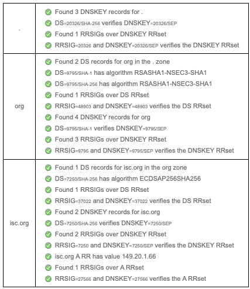
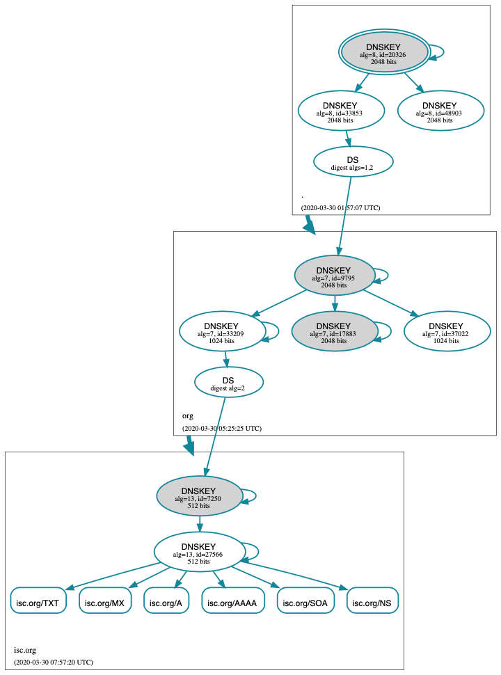

.. Copyright (C) Internet Systems Consortium, Inc. ("ISC")
..
.. SPDX-License-Identifier: MPL-2.0
..
.. This Source Code Form is subject to the terms of the Mozilla Public
.. License, v. 2.0.  If a copy of the MPL was not distributed with this
.. file, you can obtain one at https://mozilla.org/MPL/2.0/.
..
.. See the COPYRIGHT file distributed with this work for additional
.. information regarding copyright ownership.

.. _dnssec_signing:

Signing
-------

.. _easy_start_guide_for_authoritative_servers:

Easy-Start Guide for Signing Authoritative Zones
~~~~~~~~~~~~~~~~~~~~~~~~~~~~~~~~~~~~~~~~~~~~~~~~

This section provides the basic information needed to set up a
DNSSEC-enabled authoritative name server. A DNSSEC-enabled (or
"signed") zone contains additional resource records that are used to
verify the authenticity of its zone information.

To convert a traditional (insecure) DNS zone to a secure one, we need to
create some additional records (DNSKEY, RRSIG, and NSEC or NSEC3), and
upload verifiable information (such as a DS record) to the parent zone to
complete the chain of trust. For more information about DNSSEC resource
records, please see :ref:`what_does_dnssec_add_to_dns`.

.. note::

   In this chapter, we assume all configuration files, key files, and
   zone files are stored in ``/etc/bind``, and most examples show
   commands run as the root user. This may not be ideal, but the point is
   not to distract from what is important here: learning how to sign
   a zone. There are many best practices for deploying a more secure
   BIND installation, with techniques such as jailed process and
   restricted user privileges, but those are not covered
   in this document. We trust you, a responsible DNS
   administrator, to take the necessary precautions to secure your
   system.

For the examples below, we work with the assumption that
there is an existing insecure zone ``example.com`` that we are
converting to a secure zone.

.. _signing_easy_start_policy_enable:

Enabling Automated DNSSEC Zone Maintenance and Key Generation
^^^^^^^^^^^^^^^^^^^^^^^^^^^^^^^^^^^^^^^^^^^^^^^^^^^^^^^^^^^^^

To sign a zone, add the following statement to its
``zone`` clause in the BIND 9 configuration file:

::

   options {
       directory "/etc/bind";
       recursion no;
       ...
   };

   zone "example.com" in {
       ...
       dnssec-policy default;
       inline-signing yes;
       ...
   };

The ``dnssec-policy`` statement causes the zone to be signed and turns
on automatic maintenance for the zone. This includes re-signing the zone
as signatures expire and replacing keys on a periodic basis. The value
``default`` selects the default policy, which contains values suitable
for most situations. We cover the creation of a custom policy in
:ref:`signing_custom_policy`, but for the moment we are accepting the
default values.

Using ``dnssec-policy`` requires dynamic DNS or ``inline-signing``
to be enabled.

.. note::

   Previously, if a zone with a ``dnssec-policy`` did not have dynamic
   DNS set up and ``inline-signing`` was not explicity set, BIND 9 used
   inline-signing implicitly. But this caused a lot of problems when operators
   switched on or off dynamic DNS for their zones. Therefor, you now have to
   configure it explicitly.

When the configuration file is updated, tell ``named`` to
reload the configuration file by running ``rndc reconfig``:

::

   # rndc reconfig

And that's it - BIND signs your zone.

At this point, before you go away and merrily add ``dnssec-policy``
statements to all your zones, we should mention that, like a number of
other BIND configuration options, its scope depends on where it is placed. In
the example above, we placed it in a ``zone`` clause, so it applied only
to the zone in question. If we had placed it in a ``view`` clause, it
would have applied to all zones in the view; and if we had placed it in
the ``options`` clause, it would have applied to all zones served by
this instance of BIND.

.. _signing_verification:

Verification
^^^^^^^^^^^^

The BIND 9 reconfiguration starts the process of signing the zone.
First, it generates a key for the zone and includes it
in the published zone. The log file shows messages such as these:

::

   07-Apr-2020 16:02:55.045 zone example.com/IN (signed): reconfiguring zone keys
   07-Apr-2020 16:02:55.045 reloading configuration succeeded
   07-Apr-2020 16:02:55.046 keymgr: DNSKEY example.com/ECDSAP256SHA256/10376 (CSK) created for policy default
   07-Apr-2020 16:02:55.046 Fetching example.com/ECDSAP256SHA256/10376 (CSK) from key repository.
   07-Apr-2020 16:02:55.046 DNSKEY example.com/ECDSAP256SHA256/10376 (CSK) is now published
   07-Apr-2020 16:02:55.046 DNSKEY example.com/ECDSAP256SHA256/10376 (CSK) is now active
   07-Apr-2020 16:02:55.048 zone example.com/IN (signed): next key event: 07-Apr-2020 18:07:55.045

It then starts signing the zone. How long this process takes depends on the
size of the zone, the speed of the server, and how much activity is
taking place. We can check what is happening by using ``rndc``,
entering the command:

::

   # rndc signing -list example.com

While the signing is in progress, the output is something like:

::

   Signing with key 10376/ECDSAP256SHA256

and when it is finished:

::

   Done signing with key 10376/ECDSAP256SHA256

When the second message appears, the zone is signed.

Before moving on to the next step of coordinating with the parent zone,
let's make sure everything looks good using ``delv``. We want to
simulate what a validating resolver will check, by telling
``delv`` to use a specific trust anchor.

First, we need to make a copy of the key created by BIND. This
is in the directory you set with the ``directory`` statement in
your configuration file's ``options`` clause, and is named something
like ``Kexample.com.+013.10376.key``:

::

   # cp /etc/bind/Kexample.com.+013+10376.key /tmp/example.key

The original key file looks like this (with the actual key shortened for ease of display,
and comments omitted):

::

   # cat /etc/bind/Kexample.com.+013+10376.key

   ...
   example.com. 3600 IN DNSKEY 257 3 13 6saiq99qDB...dqp+o0dw==

We want to edit the copy to be in the ``trust-anchors`` format, so that
it looks like this:

::

   # cat /tmp/example.key
   trust-anchors {
       example.com. static-key 257 3 13 "6saiq99qDB...dqp+o0dw==";
   };

Now we can run the ``delv`` command and instruct it to use this
trusted-key file to validate the answer it receives from the
authoritative name server 192.168.1.13:

::

   $ delv @192.168.1.13 -a /tmp/example.key +root=example.com example.com. SOA +multiline
   ; fully validated
   example.com.        600 IN SOA ns1.example.com. admin.example.com. (
                   2020040703 ; serial
                   1800       ; refresh (30 minutes)
                   900        ; retry (15 minutes)
                   2419200    ; expire (4 weeks)
                   300        ; minimum (5 minutes)
                   )
   example.com.        600 IN RRSIG SOA 13 2 600 (
                   20200421150255 20200407140255 10376 example.com.
                   jBsz92zwAcGMNV/yu167aKQZvFyC7BiQe1WEnlogdLTF
                   oq4yBQumOhO5WX61LjA17l1DuLWcd/ASwlUZWFGCYQ== )

.. _signing_easy_start_upload_to_parent_zone:

Uploading Information to the Parent Zone
^^^^^^^^^^^^^^^^^^^^^^^^^^^^^^^^^^^^^^^^

Once everything is complete on our name server, we need to generate some
information to be uploaded to the parent zone to complete the chain of
trust. The format and the upload methods are actually dictated by your
parent zone's administrator, so contact your registrar or parent zone
administrator to find out what the actual format should be and how to
deliver or upload the information to the parent zone.

What about your zone between the time you signed it and the time your
parent zone accepts the upload? To the rest of the world, your
zone still appears to be insecure, because if a validating
resolver attempts to validate your domain name via
your parent zone, your parent zone will indicate that you are
not yet signed (as far as it knows). The validating resolver will then
give up attempting to validate your domain name, and will fall back to the
insecure DNS. Until you complete this final step with your
parent zone, your zone remains insecure.

.. note::

   Before uploading to your parent zone, verify that your newly signed
   zone has propagated to all of your name servers (usually via zone
   transfers). If some of your name servers still have unsigned zone
   data while the parent tells the world it should be signed, validating
   resolvers around the world cannot resolve your domain name.

Here are some examples of what you may upload to your parent zone, with
the DNSKEY/DS data shortened for display. Note that no matter what
format may be required, the end result is the parent zone
publishing DS record(s) based on the information you upload. Again,
contact your parent zone administrator(s) to find out the
correct format for their system.

1. DS record format:

   ::

      example.com. 3600 IN DS 10376 13 2 B92E22CAE0...33B8312EF0

2. DNSKEY format:

   ::

      example.com. 3600 IN DNSKEY 257 3 13 6saiq99qDB...dqp+o0dw==

The DS record format may be generated from the DNSKEY using the
``dnssec-dsfromkey`` tool, which is covered in
:ref:`parent_ds_record_format`. For more details and examples on how
to work with your parent zone, please see
:ref:`working_with_parent_zone`.

.. _signing_easy_start_so_what_now:

So... What Now?
^^^^^^^^^^^^^^^

Congratulations! Your zone is signed, your secondary servers have
received the new zone data, and the parent zone has accepted your upload
and published your DS record. Your zone is now officially
DNSSEC-enabled. What happens next? That is basically it - BIND
takes care of everything else. As for updating your zone file, you can
continue to update it the same way as prior to signing your
zone; the normal work flow of editing a zone file and using the ``rndc``
command to reload the zone still works as usual, and although you are
editing the unsigned version of the zone, BIND generates the signed
version automatically.

Curious as to what all these commands did to your zone file? Read on to
:ref:`your_zone_before_and_after_dnssec` and find out. If you are
interested in how to roll this out to your existing primary and
secondary name servers, check out :ref:`recipes_inline_signing` in
the :ref:`dnssec_recipes` chapter.

.. _your_zone_before_and_after_dnssec:

Your Zone, Before and After DNSSEC
~~~~~~~~~~~~~~~~~~~~~~~~~~~~~~~~~~

When we assigned the default DNSSEC policy to the zone, we provided the
minimal amount of information to convert a traditional DNS
zone into a DNSSEC-enabled zone. This is what the zone looked like
before we started:

::

   $ dig @192.168.1.13 example.com. AXFR +multiline +onesoa

   ; <<>> DiG 9.16.0 <<>> @192.168.1.13 example.com AXFR +multiline +onesoa
   ; (1 server found)
   ;; global options: +cmd
   example.com.        600 IN SOA ns1.example.com. admin.example.com. (
                   2020040700 ; serial
                   1800       ; refresh (30 minutes)
                   900        ; retry (15 minutes)
                   2419200    ; expire (4 weeks)
                   300        ; minimum (5 minutes)
                   )
   example.com.        600 IN NS ns1.example.com.
   ftp.example.com.    600 IN A 192.168.1.200
   ns1.example.com.    600 IN A 192.168.1.1
   web.example.com.    600 IN CNAME www.example.com.
   www.example.com.    600 IN A 192.168.1.100

Below shows the test zone ``example.com`` after reloading the
server configuration. Clearly, the zone grew in size, and the
number of records multiplied:

::

   # dig @192.168.1.13 example.com. AXFR +multiline +onesoa

   ; <<>> DiG 9.16.0 <<>> @192.168.1.13 example.com AXFR +multiline +onesoa
   ; (1 server found)
   ;; global options: +cmd
   example.com.        600 IN SOA ns1.example.com. admin.example.com. (
                   2020040703 ; serial
                   1800       ; refresh (30 minutes)
                   900        ; retry (15 minutes)
                   2419200    ; expire (4 weeks)
                   300        ; minimum (5 minutes)
                   )
   example.com.        300 IN RRSIG NSEC 13 2 300 (
                   20200413050536 20200407140255 10376 example.com.
                   drtV1rJbo5OMi65OJtu7Jmg/thgpdTWrzr6O3Pzt12+B
                   oCxMAv3orWWYjfP2n9w5wj0rx2Mt2ev7MOOG8IOUCA== )
   example.com.        300 IN NSEC ftp.example.com. NS SOA RRSIG NSEC DNSKEY TYPE65534
   example.com.        600 IN RRSIG NS 13 2 600 (
                   20200413130638 20200407140255 10376 example.com.
                   2ipmzm1Ei6vfE9OLowPMsxLBCbjrCpWPgWJ0ekwZBbux
                   MLffZOXn8clt0Ql2U9iCPdyoQryuJCiojHSE2d6nrw== )
   example.com.        600 IN RRSIG SOA 13 2 600 (
                   20200421150255 20200407140255 10376 example.com.
                   jBsz92zwAcGMNV/yu167aKQZvFyC7BiQe1WEnlogdLTF
                   oq4yBQumOhO5WX61LjA17l1DuLWcd/ASwlUZWFGCYQ== )
   example.com.        0 IN RRSIG TYPE65534 13 2 0 (
                   20200413050536 20200407140255 10376 example.com.
                   Xjkom24N6qeCJjg9BMUfuWf+euLeZB169DHvLYZPZNlm
                   GgM2czUDPio6VpQbUw6JE5DSNjuGjgpgXC5SipC42g== )
   example.com.        3600 IN RRSIG DNSKEY 13 2 3600 (
                   20200421150255 20200407140255 10376 example.com.
                   maK75+28oUyDtci3V7wjTsuhgkLUZW+Q++q46Lea6bKn
                   Xj77kXcLNogNdUOr5am/6O6cnPeJKJWsnmTLISm62g== )
   example.com.        0 IN TYPE65534 \# 5 ( 0D28880001 )
   example.com.        3600 IN DNSKEY 257 3 13 (
                   6saiq99qDBb5b4G4cx13cPjFTrIvUs3NW44SvbbHorHb
                   kXwOzeGAWyPORN+pwEV/LP9+FHAF/JzAJYdqp+o0dw==
                   ) ; KSK; alg = ECDSAP256SHA256 ; key id = 10376
   example.com.        600 IN NS ns1.example.com.
   ftp.example.com.    600 IN RRSIG A 13 3 600 (
                   20200413130638 20200407140255 10376 example.com.
                   UYo1njeUA49VhKnPSS3JO4G+/Xd2PD4m3Vaacnd191yz
                   BIoouEBAGPcrEM2BNrgR0op1EWSus9tG86SM1ZHGuQ== )
   ftp.example.com.    300 IN RRSIG NSEC 13 3 300 (
                   20200413130638 20200407140255 10376 example.com.
                   rPADrAMAPIPSF3S45OSY8kXBTYMS3nrZg4Awj7qRL+/b
                   sOKy6044MbIbjg+YWL69dBjKoTSeEGSCSt73uIxrYA== )
   ftp.example.com.    300 IN NSEC ns1.example.com. A RRSIG NSEC
   ftp.example.com.    600 IN A 192.168.1.200
   ns1.example.com.    600 IN RRSIG A 13 3 600 (
                   20200413130638 20200407140255 10376 example.com.
                   Yeojg7qrJmxL6uLTnALwKU5byNldZ9Ggj5XjcbpPvujQ
                   ocG/ovGBg6pdugXC9UxE39bCDl8dua1frjDcRCCZAA== )
   ns1.example.com.    300 IN RRSIG NSEC 13 3 300 (
                   20200413130638 20200407140255 10376 example.com.
                   vukgQme6k7JwCf/mJOOzHXbE3fKtSro+Kc10T6dHMdsc
                   oM1/oXioZvgBZ9cKrQhIAUt7r1KUnrUwM6Je36wWFA== )
   ns1.example.com.    300 IN NSEC web.example.com. A RRSIG NSEC
   ns1.example.com.    600 IN A 192.168.1.1
   web.example.com.    600 IN RRSIG CNAME 13 3 600 (
                   20200413130638 20200407140255 10376 example.com.
                   JXi4WYypofD5geUowVqlqJyHzvcRnsvU/ONhTBaUCw5Y
                   XtifKAXRHWrUL1HIwt37JYPLf5uYu90RfkWLj0GqTQ== )
   web.example.com.    300 IN RRSIG NSEC 13 3 300 (
                   20200413130638 20200407140255 10376 example.com.
                   XF4Hsd58dalL+s6Qu99bG80PQyMf7ZrHEzDiEflRuykP
                   DfBRuf34z27vj70LO1lp2ZiX4BB1ahcEK2ae9ASAmA== )
   web.example.com.    300 IN NSEC www.example.com. CNAME RRSIG NSEC
   web.example.com.    600 IN CNAME www.example.com.
   www.example.com.    600 IN RRSIG A 13 3 600 (
                   20200413050536 20200407140255 10376 example.com.
                   mACKXrDOF5JMWqncSiQ3pYWA6abyGDJ4wgGCumjLXhPy
                   0cMzJmKv2s7G6+tW3TsA6BK3UoMfv30oblY2Mnl4/A== )
   www.example.com.    300 IN RRSIG NSEC 13 3 300 (
                   20200413050536 20200407140255 10376 example.com.
                   1YQ22odVt0TeP5gbNJwkvS684ipDmx6sEOsF0eCizhCv
                   x8osuOATdlPjIEztt+rveaErZ2nsoLor5k1nQAHsbQ== )
   www.example.com.    300 IN NSEC example.com. A RRSIG NSEC
   www.example.com.    600 IN A 192.168.1.100

But this is a really messy way to tell if the zone is set up properly
with DNSSEC. Fortunately, there are tools to help us with that. Read on
to :ref:`how_to_test_authoritative_server` to learn more.

.. _how_to_test_authoritative_server:

How To Test Authoritative Zones
~~~~~~~~~~~~~~~~~~~~~~~~~~~~~~~

So we've activated DNSSEC and uploaded some data to our parent zone. How
do we know our zone is signed correctly? Here are a few ways to check.

.. _signing_verify_key_data:

Look for Key Data in Your Zone
^^^^^^^^^^^^^^^^^^^^^^^^^^^^^^

One way to see if your zone is signed is to check for the
presence of DNSKEY record types. In our example, we created a single
key, and we expect to see it returned when we query for it.

::

   $ dig @192.168.1.13 example.com. DNSKEY +multiline

   ; <<>> DiG 9.16.0 <<>> @10.53.0.6 example.com DNSKEY +multiline
   ; (1 server found)
   ;; global options: +cmd
   ;; Got answer:
   ;; ->>HEADER<<- opcode: QUERY, status: NOERROR, id: 18637
   ;; flags: qr aa rd; QUERY: 1, ANSWER: 1, AUTHORITY: 0, ADDITIONAL: 1
   ;; WARNING: recursion requested but not available

   ;; OPT PSEUDOSECTION:
   ; EDNS: version: 0, flags:; udp: 4096
   ; COOKIE: efe186423313fb66010000005e8c997e99864f7d69ed7c11 (good)
   ;; QUESTION SECTION:
   ;example.com.       IN DNSKEY

   ;; ANSWER SECTION:
   example.com.        3600 IN DNSKEY 257 3 13 (
                   6saiq99qDBb5b4G4cx13cPjFTrIvUs3NW44SvbbHorHb
                   kXwOzeGAWyPORN+pwEV/LP9+FHAF/JzAJYdqp+o0dw==
                   ) ; KSK; alg = ECDSAP256SHA256 ; key id = 10376
     

.. _signing_verify_signature:

Look for Signatures in Your Zone
^^^^^^^^^^^^^^^^^^^^^^^^^^^^^^^^

Another way to see if your zone data is signed is to check for the
presence of a signature. With DNSSEC, every record [#]_ now comes with at
least one corresponding signature, known as an RRSIG.

::

   $ dig @192.168.1.13 example.com. SOA +dnssec +multiline

   ; <<>> DiG 9.16.0 <<>> @10.53.0.6 example.com SOA +dnssec +multiline
   ; (1 server found)
   ;; global options: +cmd
   ;; Got answer:
   ;; ->>HEADER<<- opcode: QUERY, status: NOERROR, id: 45219
   ;; flags: qr aa rd; QUERY: 1, ANSWER: 2, AUTHORITY: 0, ADDITIONAL: 1
   ;; WARNING: recursion requested but not available

   ;; OPT PSEUDOSECTION:
   ; EDNS: version: 0, flags: do; udp: 4096
   ; COOKIE: 75adff4f4ce916b2010000005e8c99c0de47eabb7951b2f5 (good)
   ;; QUESTION SECTION:
   ;example.com.       IN SOA

   ;; ANSWER SECTION:
   example.com.        600 IN SOA ns1.example.com. admin.example.com. (
                   2020040703 ; serial
                   1800       ; refresh (30 minutes)
                   900        ; retry (15 minutes)
                   2419200    ; expire (4 weeks)
                   300        ; minimum (5 minutes)
                   )
   example.com.        600 IN RRSIG SOA 13 2 600 (
                   20200421150255 20200407140255 10376 example.com.
                   jBsz92zwAcGMNV/yu167aKQZvFyC7BiQe1WEnlogdLTF
                   oq4yBQumOhO5WX61LjA17l1DuLWcd/ASwlUZWFGCYQ== )

The serial number was automatically incremented from the old, unsigned
version. ``named`` keeps track of the serial number of the signed version of
the zone independently of the unsigned version. If the unsigned zone is
updated with a new serial number that is higher than the one in the
signed copy, then the signed copy is increased to match it;
otherwise, the two are kept separate.

.. _signing_verify_zone_file:

Examine the Zone File
^^^^^^^^^^^^^^^^^^^^^

Our original zone file ``example.com.db`` remains untouched, and ``named`` has
generated three additional files automatically for us (shown below). The
signed DNS data is stored in ``example.com.db.signed`` and in the
associated journal file.

::

   # cd /etc/bind
   # ls
   example.com.db  example.com.db.jbk  example.com.db.signed  example.com.db.signed.jnl

A quick description of each of the files:

-  ``.jbk``: a transient file used by ``named``

-  ``.signed``: the signed version of the zone in raw format

-  ``.signed.jnl``: a journal file for the signed version of the zone

These files are stored in raw (binary) format for faster loading. To
reveal the human-readable version, use ``named-compilezone``
as shown below. In the example below, we run the command on the
raw format zone ``example.com.db.signed`` to produce a text version of
the zone ``example.com.text``:

::

   # named-compilezone -f raw -F text -o example.com.text example.com example.com.db.signed
   zone example.com/IN: loaded serial 2014112008 (DNSSEC signed)
   dump zone to example.com.text...done
   OK

.. _signing_verify_check_parent:

Check the Parent
^^^^^^^^^^^^^^^^

Although this is not strictly related to whether the zone is
signed, a critical part of DNSSEC is the trust relationship between the
parent and the child. Just because we, the child, have all the correctly
signed records in our zone does not mean it can be fully validated by a
validating resolver, unless our parent's data agrees with ours. To check
if our upload to the parent was successful, ask the parent name server
for the DS record of our child zone; we should get back the DS record(s)
containing the information we uploaded in
:ref:`signing_easy_start_upload_to_parent_zone`:

::

   $ dig example.com. DS

   ; <<>> DiG 9.16.0 <<>> example.com DS
   ; (1 server found)
   ;; global options: +cmd
   ;; Got answer:
   ;; ->>HEADER<<- opcode: QUERY, status: NOERROR, id: 16954
   ;; flags: qr rd ra ad; QUERY: 1, ANSWER: 1, AUTHORITY: 0, ADDITIONAL: 1

   ;; OPT PSEUDOSECTION:
   ; EDNS: version: 0, flags:; udp: 4096
   ; COOKIE: db280d5b52576780010000005e8c9bf5b0d8de103d934e5d (good)
   ;; QUESTION SECTION:
   ;example.com.           IN  DS

   ;; ANSWER SECTION:
   example.com.  61179 IN  DS  10376 13 2 B92E22CAE0B41430EC38D3F7EDF1183C3A94F4D4748569250C15EE33B8312EF0

.. [#]
   Well, almost every record: NS records and glue records for
   delegations do not have RRSIG records. If there are
   no delegations, then every record in your zone is
   signed and comes with its own RRSIG.

.. _signing_verify_external_tools:

External Testing Tools
^^^^^^^^^^^^^^^^^^^^^^

We recommend two tools, below: Verisign DNSSEC Debugger and DNSViz. Others can
be found via a simple online search. These excellent online tools are an easy
way to verify that your domain name is fully secured.

.. _signing_verify_external_tools_dnssec_debugger:

Verisign DNSSEC Debugger
++++++++++++++++++++++++

URL: `<https://dnssec-debugger.verisignlabs.com/>`__

This tool shows a nice summary of checks performed on your domain name.
You can expand it to view more details for each of the items checked, to
get a detailed report.

   Verisign DNSSEC Debugger

.. _signing_verify_external_tools_dnsviz:

DNSViz
++++++

URL: `<https://dnsviz.net/>`__

DNSViz provides a visual analysis of the DNSSEC authentication chain for
a domain name and its resolution path in the DNS namespace.

   DNSViz

.. _signing_easy_start_explained:

Signing Easy Start Explained
~~~~~~~~~~~~~~~~~~~~~~~~~~~~

.. _enable_automatic_maintenance_explained:

Enable Automatic DNSSEC Maintenance Explained
^^^^^^^^^^^^^^^^^^^^^^^^^^^^^^^^^^^^^^^^^^^^^

Signing a zone requires a number of separate steps:

-  Generation of the keys to sign the zone.

-  Inclusion of the keys into the zone.

-  Signing of the records in the file (including the generation of the
   NSEC or NSEC3 records).

Maintaining a signed zone comprises a set of ongoing tasks:

-  Re-signing the zone as signatures approach expiration.

-  Generation of new keys as the time approaches for a key roll.

-  Inclusion of new keys into the zone when the rollover starts.

-  Transition from signing the zone with the old set of keys to signing
   the zone with the new set of keys.

-  Waiting the appropriate interval before removing the old keys from
   the zone.

-  Deleting the old keys.

That is quite complex, and it is all handled in BIND 9 with the single
``dnssec-policy default`` statement. We will see later on (in the
:ref:`signing_custom_policy` section) how these actions can be tuned, by
setting up our own DNSSEC policy with customized parameters. However, in many
cases the defaults are adequate.

At the time of this writing (mid-2020), ``dnssec-policy`` is still a
relatively new feature in BIND. Although it is the preferred
way to run DNSSEC in a zone, it is not yet able to automatically implement
all the features that are available
with a more "hands-on" approach to signing and key maintenance. For this
reason, we cover alternative signing techniques in
:ref:`signing_alternative_ways`.

.. _working_with_parent_zone:

Working With the Parent Zone
~~~~~~~~~~~~~~~~~~~~~~~~~~~~

As mentioned in :ref:`signing_easy_start_upload_to_parent_zone`,
the format of the information uploaded to your parent zone is dictated
by your parent zone administrator. The two main formats are:

1. DS record format

2. DNSKEY format

Check with your parent zone to see which format they require.

But how can you get each of the formats from your existing data?

When ``named`` turned on automatic
DNSSEC maintenance, essentially the first thing it did was to create
the DNSSEC keys and put them in the directory you specified in the
configuration file. If you look in that directory, you will see three
files with names like ``Kexample.com.+013+10376.key``,
``Kexample.com.+013+10376.private``, and
``Kexample.com.+013+10376.state``. The one we are interested in is the
one with the ``.key`` suffix, which contains the zone's public key. (The
other files contain the zone's private key and the DNSSEC state
associated with the key.) This public key is used to generate the information we
need to pass to the parent.

.. _parent_ds_record_format:

DS Record Format
^^^^^^^^^^^^^^^^

Below is an example of a DS record format generated from the KSK we
created earlier (``Kexample.com.+013+10376.key``):

::

   # cd /etc/bind
    dnssec-dsfromkey Kexample.com.+013+10376.key
   example.com. IN DS 10376 13 2 B92E22CAE0B41430EC38D3F7EDF1183C3A94F4D4748569250C15EE33B8312EF0

Some registrars ask their customers to manually specify the types of algorithm
and digest used. In this example, 13 represents the algorithm used, and
2 represents the digest type (SHA-256). The key tag or key ID is 10376.

.. _parent_dnskey_format:

DNSKEY Format
^^^^^^^^^^^^^

Below is an example of the same key ID (10376) using DNSKEY format
(with the actual key shortened for ease of display):

::

   example.com. 3600 IN DNSKEY 257 3 13 (6saiq99qDB...dqp+o0dw==) ; key id = 10376

The key itself is easy to find (it's difficult to miss that long
base64 string) in the file.

::

   # cd /etc/bind
   # cat Kexample.com.+013+10376.key
   ; This is a key-signing key, keyid 10376, for example.com.
   ; Created: 20200407150255 (Tue Apr  7 16:02:55 2020)
   ; Publish: 20200407150255 (Tue Apr  7 16:02:55 2020)
   ; Activate: 20200407150255 (Tue Apr  7 16:02:55 2020)
   example.com. 3600 IN DNSKEY 257 3 13 6saiq99qDB...dqp+o0dw==

.. _signing_custom_policy:

Creating a Custom DNSSEC Policy
~~~~~~~~~~~~~~~~~~~~~~~~~~~~~~~

The remainder of this section describes the contents of a custom DNSSEC
policy. :ref:`dnssec_advanced_discussions` describes the concepts
involved here and the pros and cons of choosing particular values. If
you are not already familiar with DNSSEC, it may be worth reading that chapter
first.

Setting up your own DNSSEC policy means that you must include a
``dnssec-policy`` clause in the zone file. This sets values for the
various parameters that affect the signing of zones and the rolling of
keys. The following is an example of such a clause:

::

   dnssec-policy standard {
       dnskey-ttl 600;
       keys {
           ksk lifetime 365d algorithm ecdsap256sha256;
           zsk lifetime 60d algorithm ecdsap256sha256;
       };
       max-zone-ttl 600;
       parent-ds-ttl 600;
       parent-propagation-delay 2h;
       publish-safety 7d;
       retire-safety 7d;
       signatures-refresh 5d;
       signatures-validity 15d;
       signatures-validity-dnskey 15d;
       zone-propagation-delay 2h;
   };

The policy has multiple parts:

-  The name must be specified. As each zone can use a different policy,
   ``named`` needs to be able to distinguish between policies. This is
   done by giving each policy a name, such as ``standard`` in the above
   example.

-  The ``keys`` clause lists all keys that should be in the zone, along
   with their associated parameters. In this example, we are using the
   conventional KSK/ZSK split, with the KSK changed every year and the
   ZSK changed every two months (the ``default`` DNSSEC policy sets a
   CSK that is never changed). Keys are created using the
   ECDSAPS256SHA256 algorithm; each KSK/ZSK pair must have the same
   algorithm. A CSK combines the functionality of a ZSK and a KSK.

-  The parameters ending in ``-ttl`` are, as expected, the TTLs of the
   associated records. Remember that during a key rollover,
   we have to wait for records to expire from caches? The values
   here tell BIND 9 the maximum amount of time it has to wait for this to
   happen. Values can be set for the DNSKEY records in your zone, the
   non-DNSKEY records in your zone, and the DS records in the parent
   zone.

-  Another set of time-related parameters are those ending in
   ``-propagation-delay``. These tell BIND how long it takes for a
   change in zone contents to become available on all secondary servers.
   (This may be non-negligible: for example, if a large zone is
   transferred over a slow link.)

-  The policy also sets values for the various signature parameters: how
   long the signatures on the DNSKEY and non-DNSKEY records are valid,
   and how often BIND should re-sign the zone.

-  The parameters ending in ``-safety`` are there to give
   you a bit of leeway in case a key roll doesn't go to plan. When
   introduced into the zone, the ``publish-safety`` time is the amount
   of additional time, over and above that calculated from the other
   parameters, during which the new key is in the zone but before BIND starts
   to sign records with it. Similarly, the ``retire-safety`` is the
   amount of additional time, over and above that calculated from the
   other parameters, during which the old key is retained in the zone before
   being removed.

-  Finally, the ``purge-keys`` option allows you to clean up key files
   automatically after a period of time. If a key has been removed from the
   zone, this option will determine how long its key files will be retained
   on disk.

(You do not have to specify all the items listed above in your policy
definition. Any that are not set simply take the default value.)

Usually, the exact timing of a key roll, or how long a signature remains
valid, is not critical. For this reason, err on the side of caution when
setting values for the parameters. It is better to have an operation
like a key roll take a few days longer than absolutely required, than it
is to have a quick key roll but have users get validation failures
during the process.

Having defined a new policy called "standard", we now need to tell
``named`` to use it. We do this by adding a ``dnssec-policy standard;``
statement to the configuration file. Like many other configuration
statements, it can be placed in the ``options`` statement (thus applying
to all zones on the server), a ``view`` statement (applying to all zones
in the view), or a ``zone`` statement (applying only to that zone). In
this example, we'll add it to the ``zone`` statement:

::

   zone "example.net" in {
       ...
       dnssec-policy standard;
       inline-signing yes;
       ...
   };

Finally, tell ``named`` to use the new policy:

::

   # rndc reconfig

... and that's it. ``named`` now applies the "standard" policy to
your zone.

.. _signing_maintenance_tasks:

Maintenance Tasks
~~~~~~~~~~~~~~~~~

Zone data is signed and the parent zone has published your DS records:
at this point your zone is officially secure. When other
validating resolvers look up information in your zone, they are able to
follow the 12-step process as described in
:ref:`how_does_dnssec_change_dns_lookup_revisited` and verify the
authenticity and integrity of the answers.

There is not that much left for you, as the DNS administrator, to do on
an ongoing basis. Whenever you update your zone, BIND automatically
re-signs your zone with new RRSIG and NSEC/NSEC3 records, and even
increments the serial number for you. If you choose to split your keys
into a KSK and ZSK, the rolling of the ZSK is completely automatic.
Rolling of a KSK or CSK may require some manual intervention, though,
so let's examine two more DNSSEC-related resource records, CDS and CDNSKEY.

.. _cds_cdnskey:

The CDS and CDNSKEY Resource Records
^^^^^^^^^^^^^^^^^^^^^^^^^^^^^^^^^^^^

Passing the DS record to the organization running the parent zone has
always been recognized as a bottleneck in the key rollover process. To
automate the process, the CDS and CDNSKEY resource records were
introduced.

The CDS and CDNSKEY records are identical to the DS and DNSKEY records,
except in the type code and the name. When such a record appears in the
child zone, it is a signal to the parent that it should update the DS it
has for that zone. In essence, when the parent notices
the presence of the CDS and/or CDNSKEY record(s) in the
child zone, it checks these records to verify that they are
signed by a valid key for the zone. If the record(s) successfully
validate, the parent zone's DS RRset for the child zone is changed to
correspond to the CDS (or CDNSKEY) records. (For more
information on how the signaling works and the issues surrounding it,
please refer to :rfc:`7344` and :rfc:`8078`.)

.. _working_with_the_parent_2:

Working with the Parent Zone (2)
^^^^^^^^^^^^^^^^^^^^^^^^^^^^^^^^

Once the zone is signed, the only required manual tasks are
to monitor KSK or CSK key rolls and pass the new DS record to the
parent zone. However, if the parent can process CDS or CDNSKEY records,
you may not even have to do that [#]_.

When the time approaches for the roll of a KSK or CSK, BIND adds a
CDS and a CDNSKEY record for the key in question to the apex of the
zone. If your parent zone supports polling for CDS/CDNSKEY records, they
are uploaded and the DS record published in the parent - at least ideally.

If BIND is configured with ``parental-agents``, it will check for the DS
presence. Let's look at the following configuration excerpt:

::

   parental-agents "net" {
       10.53.0.11; 10.53.0.12;
   };

   zone "example.net" in {
       ...
       dnssec-policy standard;
       inline-signing yes;
       parental-agents { "net"; };
       ...
   };

BIND will check for the presence of the DS record in the parent zone by querying
its parental agents (defined in :rfc:`7344` to be the entities that the child
zone has a relationship with to change its delegation information). In the
example above, The zone `example.net` is configured with two parental agents,
at the addresses 10.53.0.11 and 10.53.0.12. These addresses are used as an
example only. Both addresses will have to respond with a DS RRset that
includes the DS record identifying the key that is being rolled. If one or
both don't have the DS included yet the rollover is paused, and the check for
DS presence is retried after an hour. The same applies for DS withdrawal.

Alternatively, you can use the ``rndc`` tool to tell ``named`` that the DS
record has been published or withdrawn. For example:

::

   # rndc dnssec -checkds published example.net

If your parent zone doesn't support CDS/CDNSKEY, you will have to supply
the DNSKEY or DS record to the parent zone manually when a new KSK appears in
your zone, presumably using the same mechanism you used to upload the
records for the first time. Again, you need to use the ``rndc`` tool
to tell ``named`` that the DS record has been published.

.. [#]
   For security reasons, a parent zone that supports CDS/CDNSKEY may require
   the DS record to be manually uploaded when we first sign the zone.
   Until our zone is signed, the parent cannot be sure that a CDS or CDNSKEY
   record it finds by querying our zone really comes from our zone; thus, it
   needs to use some other form of secure transfer to obtain the information.

.. _signing_alternative_ways:

Alternate Ways of Signing a Zone
~~~~~~~~~~~~~~~~~~~~~~~~~~~~~~~~

Although use of the automatic ``dnssec-policy`` is the preferred way to sign zones in
BIND, there are occasions where a more manual approach may be
needed, such as when external hardware is used to
generate and sign the zone. ``dnssec-policy`` does not currently support
the use of external hardware, so if your security policy requires it, you
need to use one of the methods described here.

The idea of DNSSEC was first discussed in the 1990s and has been
extensively developed over the intervening years. BIND has tracked the
development of this technology, often being the first name server
implementation to introduce new features. However, for compatibility reasons, BIND
retained older ways of doing things even when new ways were added. This
particularly applies to signing and maintaining zones, where different
levels of automation are available.

The following is a list of the available methods of signing in BIND, in the
order that they were introduced - and in order of decreasing
complexity.

Manual
   "Manual" signing was the first method to be introduced into BIND and
   its name describes it perfectly: the user needs to do everything. In the
   more-automated methods, you load an unsigned zone file into
   ``named``, which takes care of signing it. With manual signing, you
   have to provide a signed zone for ``named`` to serve.

   In practice, this means creating an unsigned zone file as usual, then
   using the BIND-provided tools ``dnssec-keygen`` to create the keys
   and ``dnssec-signzone`` to sign the zone. The signed zone is stored
   in another file and is the one you tell BIND to load. To
   update the zone (for example, to add a resource record), you update the
   unsigned zone, re-sign it, and tell ``named`` to load the updated
   signed copy. The same goes for refreshing signatures or rolling keys;
   the user is responsible for providing the signed zone served by
   ``named``. (In the case of rolling keys, you are also responsible for
   ensuring that the keys are added and removed at the correct times.)

   Why would you want to sign your zone this way? You probably
   wouldn't in the normal course of events, but as there may be
   circumstances in which it is required, the scripts have been left in
   the BIND distribution.

Semi-Automatic
   The first step in DNSSEC automation came with BIND 9.7, when the
   ``auto-dnssec`` option was added. This causes ``named`` to
   periodically search the directory holding the key files (see
   :ref:`generate_keys` for a description) and to
   use the information in them to both add and remove keys and sign the
   zone.

   Use of ``auto-dnssec`` alone requires that the zone be dynamic,
   something not suitable for a number of situations, so BIND 9.9 added the
   ``inline-signing`` option. With this, ``named`` essentially keeps the
   signed and unsigned copies of the zone separate. The signed zone is
   created from the unsigned one using the key information; when the
   unsigned zone is updated and the zone reloaded, ``named`` detects the
   changes and updates the signed copy of the zone.

   This mode of signing has been termed "semi-automatic" in this
   document because keys still have to be manually created (and deleted
   when appropriate). Although not an onerous task, it is still
   additional work.

   Why would anyone want to use this
   method when fully automated ones are available? At the time of
   this writing (mid-2020), the fully automatic methods cannot handle all scenarios,
   particularly that of having a single key shared among multiple
   zones. They also do not handle keys stored in Hardware Security
   Modules (HSMs), which are briefly covered in
   :ref:`hardware_security_modules`.

Fully Automatic with ``dnssec-keymgr``
   The next step in the automation of DNSSEC operations came with BIND
   9.11, which introduced the ``dnssec-keymgr`` utility. This is a
   separate program and is expected to be run on a regular basis
   (probably via ``cron``). It reads a DNSSEC policy from its
   configuration file and reads timing information from the DNSSEC key
   files. With this information it creates new key files with timing
   information in them consistent with the policy. ``named`` is run as
   usual, picking up the timing information in the key files to
   determine when to add and remove keys, and when to sign with them.

   In BIND 9.17.0 and later, this method of handling DNSSEC
   policies has been replaced by the ``dnssec-policy`` statement in the
   configuration file.

Fully Automatic with ``dnssec-policy``
   Introduced a BIND 9.16, ``dnssec-policy`` replaces ``dnssec-keymgr`` from BIND
   9.17 onwards and avoids the need to run a separate program. It also
   handles the creation of keys if a zone is added (``dnssec-keymgr``
   requires an initial key) and deletes old key files as they are
   removed from the zone. This is the method described in
   :ref:`easy_start_guide_for_authoritative_servers`.

We now look at some of these methods in more detail. We cover
semi-automatic signing first, as that contains a lot of useful
information about keys and key timings. We then describe what
``dnssec-keymgr`` adds to semi-automatic signing. After that, we
touch on fully automatic signing with ``dnssec-policy``. Since this has
already been described in
:ref:`easy_start_guide_for_authoritative_servers`, we will just
mention a few additional points. Finally, we briefly describe manual signing.

.. _semi_automatic_signing:

Semi-Automatic Signing
^^^^^^^^^^^^^^^^^^^^^^

As noted above, the term semi-automatic signing has been used in this
document to indicate the mode of signing enabled by the ``auto-dnssec``
and ``inline-signing`` keywords. ``named`` signs the zone without any
manual intervention, based purely on the timing information in the
DNSSEC key files. The files, however, must be created manually.

By appropriately setting the key parameters and the timing information
in the key files, you can implement any DNSSEC policy you want for your
zones. But why manipulate the key information yourself rather than rely
on ``dnssec-keymgr`` or ``dnssec-policy`` to do it for you? The answer
is that semi-automatic signing allows you to do things that, at the time of this writing
(mid-2020), are currently not possible with one of the key managers: for
example, the ability to use an HSM to store keys, or the ability to use
the same key for multiple zones.

To convert a traditional
(insecure) DNS zone to a secure one, we need to create various
additional records (DNSKEY, RRSIG, NSEC/NSEC3) and, as with
fully automatic signing, to upload verifiable information (such as a DS
record) to the parent zone to complete the chain of trust.

.. note::

   Again, we assume all configuration files, key
   files, and zone files are stored in ``/etc/bind``, and most examples
   show commands run
   as the root user. This may not be ideal, but the point is not
   to distract from what is important here: learning how to sign
   a zone. There are many best practices for deploying a more secure
   BIND installation, with techniques such as jailed process and
   restricted user privileges, but those are not covered
   in this document. We trust you, a responsible DNS
   administrator, to take the necessary precautions to secure your
   system.
   
   For our examples below, we work with the assumption that
   there is an existing insecure zone ``example.com`` that we are
   converting to a secure version. The secure version uses both a KSK
   and a ZSK.

.. _generate_keys:

Generate Keys
+++++++++++++

Everything in DNSSEC centers around keys, so we begin by
generating our own keys.

.. code-block:: console

   # cd /etc/bind/keys
   # dnssec-keygen -a ECDSAP256SHA256 example.com
   Generating key pair...........................+++++ ......................+++++
   Kexample.com.+013+34371
   # dnssec-keygen -a ECDSAP256SHA256 -f KSK example.com
   Generating key pair........................+++ ..................................+++
   Kexample.com.+013+00472

This command generates four key files in ``/etc/bind/keys``:

-  Kexample.com.+013+34371.key

-  Kexample.com.+013+34371.private

-  Kexample.com.+013+00472.key

-  Kexample.com.+013+00472.private

The two files ending in ``.key`` are the public keys. These contain the
DNSKEY resource records that appear in the zone. The two files
ending in ``.private`` are the private keys, and contain the information
that ``named`` actually uses to sign the zone.

Of the two pairs, one is the zone-signing key (ZSK), and one is the
key-signing key (KSK). We can tell which is which by looking at the file
contents (the actual keys are shortened here for ease of display):

.. code-block:: console

   # cat Kexample.com.+013+34371.key
   ; This is a zone-signing key, keyid 34371, for example.com.
   ; Created: 20200616104249 (Tue Jun 16 11:42:49 2020)
   ; Publish: 20200616104249 (Tue Jun 16 11:42:49 2020)
   ; Activate: 20200616104249 (Tue Jun 16 11:42:49 2020)
   example.com. IN DNSKEY 256 3 13 AwEAAfel66...LqkA7cvn8=
   # cat Kexample.com.+013+00472.key
   ; This is a key-signing key, keyid 472, for example.com.
   ; Created: 20200616104254 (Tue Jun 16 11:42:54 2020)
   ; Publish: 20200616104254 (Tue Jun 16 11:42:54 2020)
   ; Activate: 20200616104254 (Tue Jun 16 11:42:54 2020)
   example.com. IN DNSKEY 257 3 13 AwEAAbCR6U...l8xPjokVU=

The first line of each file tells us what type of key it is. Also, by
looking at the actual DNSKEY record, we can tell them apart: 256 is
ZSK, and 257 is KSK.

The name of the file also tells us something
about the contents. See chapter :ref:`zone_keys` for more details.

Make sure that these files are readable by ``named`` and that the
``.private`` files are not readable by anyone else.

Alternativelly, the ``dnssec-keyfromlabel`` program is used to get a key
pair from a crypto hardware device and build the key files. Its usage is
similar to ``dnssec-keygen``.

Setting Key Timing Information
++++++++++++++++++++++++++++++

You may remember that in the above description of this method, we said
that time information related to rolling keys is stored in the key
files. This is placed there by ``dnssec-keygen`` when the file is
created, and it can be modified using ``dnssec-settime``. By default,
only a limited amount of timing information is included in the file, as
illustrated in the examples in the previous section.

All the dates are the same, and are the date and time that
``dnssec-keygen`` created the key. We can use ``dnssec-settime`` to
modify the dates [#]_. For example, to publish this key in
the zone on 1 July 2020, use it to sign records for a year starting on
15 July 2020, and remove it from the zone at the end of July 2021, we
can use the following command:

.. code-block:: console

   # dnssec-settime -P 20200701 -A 20200715 -I 20210715 -D 20210731 Kexample.com.+013+34371.key
   ./Kexample.com.+013+34371.key
   ./Kexample.com.+013+34371.private

which would set the contents of the key file to:

.. code-block:: none

   ; This is a zone-signing key, keyid 34371, for example.com.
   ; Created: 20200616104249 (Tue Jun 16 11:42:49 2020)
   ; Publish: 20200701000000 (Wed Jul  1 01:00:00 2020)
   ; Activate: 20200715000000 (Wed Jul 15 01:00:00 2020)
   ; Inactive: 20210715000000 (Thu Jul 15 01:00:00 2021)
   ; Delete: 20210731000000 (Sat Jul 31 01:00:00 2021)
   example.com. IN DNSKEY 256 3 13 AwEAAfel66...LqkA7cvn8=

(The actual key is truncated here to improve readability.)

Below is a complete list of each of the metadata fields, and how each
one affects the signing of your zone:

1. *Created*: This records the date on which the key was created. It is
   not used in calculations; it is useful simply for documentation
   purposes.

2. *Publish*: This sets the date on which a key is to be published to the
   zone. After that date, the key is included in the zone but is
   not used to sign it. This allows validating resolvers to get a
   copy of the new key in their cache before there are any resource
   records signed with it. By default, if not specified at creation
   time, this is set to the current time, meaning the key is
   published as soon as ``named`` picks it up.

3. *Activate*: This sets the date on which the key is to be activated. After
   that date, resource records are signed with the key. By default,
   if not specified during creation time, this is set to the current
   time, meaning the key is used to sign data as soon as ``named``
   picks it up.

4. *Revoke:* This sets the date on which the key is to be revoked. After that
   date, the key is flagged as revoked, although it is still included in the
   zone and used to sign it. This is used to notify validating
   resolvers that this key is about to be removed or retired from the
   zone. (This state is not used in normal day-to-day operations. See
   :rfc:`5011` to understand the circumstances where it may be used.)

5. *Inactive*: This sets the date on which the key is to become inactive.
   After that date, the key is still included in the zone, but it
   is no longer used to sign it. This sets the "expiration" or "retire"
   date for a key.

6. *Delete*: This sets the date on which the key is to be deleted. After that
   date, the key is no longer included in the zone, but it
   continues to exist on the file system or key repository.

This can be summarized as follows:

.. table:: Key Metadata Comparison

   +----------+------------------+------------------+------------------+
   | Metadata | Included in Zone | Used to Sign     | Purpose          |
   |          | File?            | Data?            |                  |
   +==========+==================+==================+==================+
   | Created  | No               | No               | Recording of     |
   |          |                  |                  | key creation     |
   +----------+------------------+------------------+------------------+
   | Publish  | Yes              | No               | Introduction of  |
   |          |                  |                  | a key soon to be |
   |          |                  |                  | active           |
   +----------+------------------+------------------+------------------+
   | Activate | Yes              | Yes              | Activation date  |
   |          |                  |                  | for new key      |
   +----------+------------------+------------------+------------------+
   | Revoke   | Yes              | Yes              | Notification of  |
   |          |                  |                  | a key soon to be |
   |          |                  |                  | retired          |
   +----------+------------------+------------------+------------------+
   | Inactive | Yes              | No               | Inactivation or  |
   |          |                  |                  | retirement of a  |
   |          |                  |                  | key              |
   +----------+------------------+------------------+------------------+
   | Delete   | No               | No               | Deletion or      |
   |          |                  |                  | removal of a key |
   |          |                  |                  | from a zone      |
   +----------+------------------+------------------+------------------+

The publication date is the date the key is introduced into the zone.
Sometime later it is activated and is used to sign resource records.
After a specified period, BIND stops using it to sign records, and at some
other specified later time it is removed from the zone.

Finally, we should note that the ``dnssec-keygen`` command supports the
same set of switches so we could have set the dates
when we created the key.

.. _semi_automatic_signing_reconfigure_bind:

Reconfiguring BIND
++++++++++++++++++

Having created the keys with the appropriate timing information, the
next step is to turn on DNSSEC signing. Below is a very simple
``named.conf``; in our example environment, this file is
``/etc/bind/named.conf``.

::

   options {
       directory "/etc/bind";
       recursion no;
       minimal-responses yes;
   };

   zone "example.com" IN {
       type primary;
       file "example.com.db";
       auto-dnssec maintain;
       inline-signing yes;
   };

Once the configuration file is updated, tell ``named`` to
reload:

::

   # rndc reload
   server reload successful

.. _semi_automated_signing_verification:

Verifying That the Zone Is Signed Correctly
+++++++++++++++++++++++++++++++++++++++++++

You should now check that the zone is signed. Follow the steps in
:ref:`signing_verification`.

.. _semi_automatic_signing_upload_ds:

Uploading the DS Record to the Parent
+++++++++++++++++++++++++++++++++++++

As described in :ref:`signing_easy_start_upload_to_parent_zone`, we
must now upload the new information to the parent zone. The format of the
information and how to generate it is described in
:ref:`working_with_parent_zone`, although it is important to remember that you must
use the contents of the KSK file that you generated above as part of the
process.

When the DS record is published in the parent zone, your zone is fully
signed.

Checking That Your Zone Can Be Validated
++++++++++++++++++++++++++++++++++++++++

Finally, follow the steps in :ref:`how_to_test_authoritative_server`
to confirm that a query recognizes the zone as properly signed and
vouched for by the parent zone.

So... What Now?
+++++++++++++++

Once the zone is signed, it must be monitored as described
in :ref:`signing_maintenance_tasks`. However,
as the time approaches for a key roll, you must create the new key. Of
course, it is possible to create keys for the next fifty
years all at once and set the key times appropriately. Whether the
increased risk in having the private key files for future keys available
on disk offsets the overhead of having to remember to create a new key
before a rollover depends on your organization's security policy.

.. _advanced_discussions_automatic_dnssec-keymgr:

Fully Automatic Signing With ``dnssec-keymgr``
^^^^^^^^^^^^^^^^^^^^^^^^^^^^^^^^^^^^^^^^^^^^^^

``dnssec-keymgr`` is a program supplied with BIND (versions 9.11 to
9.16) to help with key rollovers. When run, it compares the timing
information for existing keys with the defined policy, and adjusts it if
necessary. It also creates additional keys as required.

``dnssec-keymgr`` is completely separate from ``named``. As we will see,
the policy states a coverage period; ``dnssec-keymgr`` generates
enough key files to handle all rollovers in that period. However, it is
a good idea to schedule it to run on a regular basis; that way there is
no chance of forgetting to run it when the coverage period ends.

BIND should be set up exactly the same way as described in
:ref:`semi_automatic_signing`, i.e.,
with ``auto-dnssec`` set to ``maintain`` and ``inline-signing`` set to
``true``. Then a policy file must be created. The following is an
example of such a file:

::

   # cat policy.conf
   policy standard {
       coverage 1y;
       algorithm RSASHA256;
       directory "/etc/bind";
       keyttl 2h;

       key-size ksk 4096;
       roll-period ksk 1y;
       pre-publish ksk 30d;
       post-publish ksk 30d;

       key-size zsk 2048;
       roll-period zsk 90d;
       pre-publish zsk 30d;
       post-publish zsk 30d;
   };

   zone example.com {
       policy standard;
   };

   zone example.net {
       policy standard;
       keyttl 300;
   };

As can be seen, the syntax is similar to that of the ``named``
configuration file.

In the example above, we define a DNSSEC policy called "standard". Keys
are created using the RSASHA256 algorithm, assigned a TTL of two hours,
and placed in the directory ``/etc/bind``. KSKs have a key size of
4096 bits and are expected to roll once a year; the new key is added to the
zone 30 days before it becomes active, and is retained in the zone for
30 days after it is rolled. ZSKs have a key size of 2048 bits and roll
every 90 days; like the KSKs, the are added to the zone 30 days before
they are used for signing, and retained for 30 days after ``named``
ceases signing with them.

The policy is applied to two zones, ``example.com`` and ``example.net``.
The policy is applied unaltered to the former, but for the latter the
setting for the DNSKEY TTL has been overridden and set to 300 seconds.

To apply the policy, we need to run ``dnssec-keymgr``. Since this does
not read the ``named`` configuration file, it relies on the presence of
at least one key file for a zone to tell it that the zone is
DNSSEC-enabled. If a key file does not already exist, we first need to create
one for each zone. We can do that either by running
``dnssec-keygen`` to create a key file for each zone [#]_, or by
specifying the zones in question on the command line. Here, we do the
latter:

::

   # dnssec-keymgr -c policy.conf example.com example.net
   # /usr/local/sbin/dnssec-keygen -q -K /etc/bind -L 7200 -a RSASHA256 -b 2048 example.net
   # /usr/local/sbin/dnssec-keygen -q -K /etc/bind -L 7200 -fk -a RSASHA256 -b 4096 example.net
   # /usr/local/sbin/dnssec-settime -K /etc/bind -I 20200915110318 -D 20201015110318 Kexample.net.+008+31339
   # /usr/local/sbin/dnssec-keygen -q -K /etc/bind -S Kexample.net.+008+31339 -L 7200 -i 2592000
   # /usr/local/sbin/dnssec-settime -K /etc/bind -I 20201214110318 -D 20210113110318 Kexample.net.+008+14526
   # /usr/local/sbin/dnssec-keygen -q -K /etc/bind -S Kexample.net.+008+14526 -L 7200 -i 2592000
   # /usr/local/sbin/dnssec-settime -K /etc/bind -I 20210314110318 -D 20210413110318 Kexample.net.+008+46069
   # /usr/local/sbin/dnssec-keygen -q -K /etc/bind -S Kexample.net.+008+46069 -L 7200 -i 2592000
   # /usr/local/sbin/dnssec-settime -K /etc/bind -I 20210612110318 -D 20210712110318 Kexample.net.+008+13018
   # /usr/local/sbin/dnssec-keygen -q -K /etc/bind -S Kexample.net.+008+13018 -L 7200 -i 2592000
   # /usr/local/sbin/dnssec-settime -K /etc/bind -I 20210617110318 -D 20210717110318 Kexample.net.+008+55237
   # /usr/local/sbin/dnssec-keygen -q -K /etc/bind -S Kexample.net.+008+55237 -L 7200 -i 2592000
   # /usr/local/sbin/dnssec-keygen -q -K /etc/bind -L 7200 -a RSASHA256 -b 2048 example.com
   # /usr/local/sbin/dnssec-keygen -q -K /etc/bind -L 7200 -fk -a RSASHA256 -b 4096 example.com
   # /usr/local/sbin/dnssec-settime -K /etc/bind -P 20200617110318 -A 20200617110318 -I 20200915110318 -D 20201015110318 Kexample.com.+008+31168
   # /usr/local/sbin/dnssec-keygen -q -K /etc/bind -S Kexample.com.+008+31168 -L 7200 -i 2592000
   # /usr/local/sbin/dnssec-settime -K /etc/bind -I 20201214110318 -D 20210113110318 Kexample.com.+008+24199
   # /usr/local/sbin/dnssec-keygen -q -K /etc/bind -S Kexample.com.+008+24199 -L 7200 -i 2592000
   # /usr/local/sbin/dnssec-settime -K /etc/bind -I 20210314110318 -D 20210413110318 Kexample.com.+008+08728
   # /usr/local/sbin/dnssec-keygen -q -K /etc/bind -S Kexample.com.+008+08728 -L 7200 -i 2592000
   # /usr/local/sbin/dnssec-settime -K /etc/bind -I 20210612110318 -D 20210712110318 Kexample.com.+008+12874
   # /usr/local/sbin/dnssec-keygen -q -K /etc/bind -S Kexample.com.+008+12874 -L 7200 -i 2592000
   # /usr/local/sbin/dnssec-settime -K /etc/bind -P 20200617110318 -A 20200617110318 Kexample.com.+008+26186

This creates enough key files to last for the coverage period, set in
the policy file to be one year. The script should be run on a regular
basis (probably via ``cron``) to keep the reserve of key files topped
up. With the shortest roll period set to 90 days, every 30 days is
more than adequate.

At any time, you can check what key changes are coming up and whether
the keys and timings are correct by using ``dnssec-coverage``. For
example, to check coverage for the next 60 days:

::

    # dnssec-coverage -d 2h -m 1d -l 60d -K /etc/bind/keys
   PHASE 1--Loading keys to check for internal timing problems
   PHASE 2--Scanning future key events for coverage failures
   Checking scheduled KSK events for zone example.net, algorithm RSASHA256...
     Wed Jun 17 11:03:18 UTC 2020:
       Publish: example.net/RSASHA256/55237 (KSK)
       Activate: example.net/RSASHA256/55237 (KSK)

   Ignoring events after Sun Aug 16 11:47:24 UTC 2020

   No errors found

   Checking scheduled ZSK events for zone example.net, algorithm RSASHA256...
     Wed Jun 17 11:03:18 UTC 2020:
       Publish: example.net/RSASHA256/31339 (ZSK)
       Activate: example.net/RSASHA256/31339 (ZSK)
     Sun Aug 16 11:03:18 UTC 2020:
       Publish: example.net/RSASHA256/14526 (ZSK)

   Ignoring events after Sun Aug 16 11:47:24 UTC 2020

   No errors found

   Checking scheduled KSK events for zone example.com, algorithm RSASHA256...
     Wed Jun 17 11:03:18 UTC 2020:
       Publish: example.com/RSASHA256/26186 (KSK)
       Activate: example.com/RSASHA256/26186 (KSK)

   No errors found

   Checking scheduled ZSK events for zone example.com, algorithm RSASHA256...
     Wed Jun 17 11:03:18 UTC 2020:
       Publish: example.com/RSASHA256/31168 (ZSK)
       Activate: example.com/RSASHA256/31168 (ZSK)
     Sun Aug 16 11:03:18 UTC 2020:
       Publish: example.com/RSASHA256/24199 (ZSK)

   Ignoring events after Sun Aug 16 11:47:24 UTC 2020

   No errors found

The ``-d 2h`` and ``-m 1d`` on the command line specify the maximum TTL
for the DNSKEYs and other resource records in the zone: in this example
two hours and one day, respectively. ``dnssec-coverage`` needs this
information when it checks that the zones will remain secure through key
rolls.

.. _advanced_discussions_automatic_dnssec-policy:

Fully Automatic Signing With ``dnssec-policy``
^^^^^^^^^^^^^^^^^^^^^^^^^^^^^^^^^^^^^^^^^^^^^^

The latest development in DNSSEC key management appeared with BIND 9.16,
and is the full integration of key management into ``named``. Managing
the signing process and rolling of these keys has been described in
:ref:`easy_start_guide_for_authoritative_servers` and is not
repeated here. A few points are worth noting, though:

-  The ``dnssec-policy`` statement in the ``named`` configuration file
   describes all aspects of the DNSSEC policy, including the signing.
   With ``dnssec-keymgr``, this is split between two configuration files
   and two programs.

-  The ``dnssec-policy`` statement requires to zone to use dynamic DNS,
   or that ``inline-signing`` is enabled.

-  It is possible to manage some zones served by an instance of BIND
   through ``dnssec-policy`` and others through ``dnssec-keymgr``, but
   this is not recommended. Although it should work, if you
   modify the configuration files and inadvertently specify a zone to be
   managed by both systems, BIND will not operate properly.

.. _advanced_discussions_manual_key_management_and_signing:

Manual Signing
^^^^^^^^^^^^^^

Manual signing of a zone was the first method of signing introduced into
BIND and offers, as the name suggests, no automation. The user must
handle everything: create the keys, sign the zone file with them, load
the signed zone, periodically re-sign the zone, and manage key rolls,
including interaction with the parent. A user certainly can do all this,
but why not use one of the automated methods? Nevertheless, it may
be useful for test purposes, so we cover it briefly here.

BIND 9 ships with several tools that are used in
this process, which are explained in more detail below. In all cases,
the ``-h`` option prints a full list of parameters. Note that the DNSSEC
tools require the keyset files to be in the working directory or the
directory specified by the ``-d`` option.

The first step is to create the keys as described in :ref:`generate_keys`.

Then, edit the zone file to make sure the proper DNSKEY entries are included.
The public keys should be inserted into the zone file by
including the ``.key`` files using ``$INCLUDE`` statements.

Finally, use the command ``dnssec-signzone``.
Any ``keyset`` files corresponding to secure sub-zones should be
present. The zone signer generates ``NSEC``, ``NSEC3``, and ``RRSIG``
records for the zone, as well as ``DS`` for the child zones if
``-g`` is specified. If
``-g`` is not specified, then DS RRsets for the
secure child zones need to be added manually.

By default, all zone keys which have an available private key are used
to generate signatures. The following command signs the zone, assuming
it is in a file called ``zone.child.example``, using manually specified keys:

.. code-block:: console

   # cd /etc/bind/keys/example.com/
   # dnssec-signzone -t -N INCREMENT -o example.com -f /etc/bind/db/example.com.signed.db \
       /etc/bind/db/example.com.db Kexample.com.+013+17694.key Kexample.com.+013+06817.key
   Verifying the zone using the following algorithms: ECDSAP256SHA256.
   Zone fully signed:
   Algorithm: ECDSAP256SHA256: KSKs: 1 active, 0 stand-by, 0 revoked
                               ZSKs: 1 active, 0 stand-by, 0 revoked
   /etc/bind/db/example.com.signed.db
   Signatures generated:                       17
   Signatures retained:                         0
   Signatures dropped:                          0
   Signatures successfully verified:            0
   Signatures unsuccessfully verified:          0
   Signing time in seconds:                 0.046
   Signatures per second:                 364.634
   Runtime in seconds:                      0.055

The -o switch explicitly defines the domain name (``example.com`` in
this case), while the -f switch specifies the output file name. The second line
has three parameters: the unsigned zone name
(``/etc/bind/db/example.com.db``), the ZSK file name, and the KSK file name. This
also generates a plain text file ``/etc/bind/db/example.com.signed.db``,
which can be manually verified for correctness.

``dnssec-signzone`` also produces keyset and dsset files. These are used
to provide the parent zone administrators with the ``DNSKEY`` records (or their
corresponding ``DS`` records) that are the secure entry point to the zone.

Finally, you'll need to update ``named.conf`` to load the signed version
of the zone, which looks something like this:

.. code-block:: none

   zone "example.com" IN {
       type primary;
       file "db/example.com.signed.db";
   };

Once the ``rndc reconfig`` command is issued, BIND serves a signed
zone. The file ``dsset-example.com`` (created by ``dnssec-signzone``
when it signed the ``example.com`` zone) contains the DS record for the
zone's KSK. You will need to pass that to the administrator of the parent
zone, to be placed in the zone.

Since this is a manual process, you will need to re-sign periodically,
as well as every time the zone
data changes. You will also need to manually roll the keys by adding and
removing DNSKEY records (and interacting with the parent) at the
appropriate times.

.. [#]
   The dates can also be modified using an editor, but that is likely to
   be more error-prone than using ``dnssec-settime``.

.. [#]
   Only one key file - for either a KSK or ZSK - is needed to signal the
   presence of the zone. ``dnssec-keygen`` creates files of both
   types as needed.
