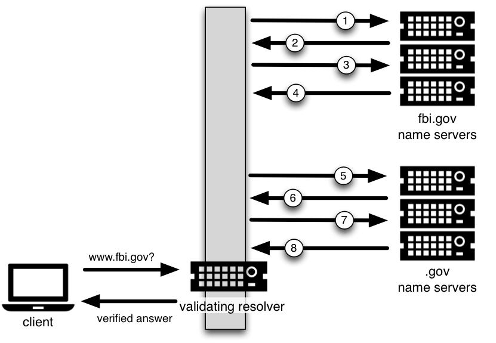

.. Copyright (C) Internet Systems Consortium, Inc. ("ISC")
..
.. SPDX-License-Identifier: MPL-2.0
..
.. This Source Code Form is subject to the terms of the Mozilla Public
.. License, v. 2.0.  If a copy of the MPL was not distributed with this
.. file, you can obtain one at https://mozilla.org/MPL/2.0/.
..
.. See the COPYRIGHT file distributed with this work for additional
.. information regarding copyright ownership.

.. _DNSSEC_validation:

Validation
----------

.. _easy_start_guide_for_recursive_servers:

Easy-Start Guide for Recursive Servers
~~~~~~~~~~~~~~~~~~~~~~~~~~~~~~~~~~~~~~

This section provides the basic information needed to set up a
working DNSSEC-aware recursive server, also known as a validating
resolver. A validating resolver performs validation for each remote
response received, following the chain of trust to verify that the answers it
receives are legitimate, through the use of public key cryptography and
hashing functions.

.. _enabling_validation:

Enabling DNSSEC Validation
^^^^^^^^^^^^^^^^^^^^^^^^^^

So how do we turn on DNSSEC validation? It turns out that you may not need
to reconfigure your name server at all, since the most recent versions of BIND 9 -
including packages and distributions - have shipped with DNSSEC validation
enabled by default. Before making any configuration changes, check
whether you already have DNSSEC validation enabled by following the steps
described in :ref:`how_to_test_recursive_server`.

In earlier versions of BIND, including 9.11-ESV, DNSSEC
validation must be explicitly enabled. To do this, you only need to
add one line to the ``options`` section of your configuration file:

::

   options {
        ...
        dnssec-validation auto;
        ...
    };

Restart ``named`` or run ``rndc reconfig``, and your recursive server is
now happily validating each DNS response. If this does not work for you,
you may have some other network-related configurations that need to be
adjusted. Take a look at :ref:`network_requirements` to make sure your network
is ready for DNSSEC.

.. _effect_of_enabling_validation:

Effects of Enabling DNSSEC Validation
^^^^^^^^^^^^^^^^^^^^^^^^^^^^^^^^^^^^^

Once DNSSEC validation is enabled, any DNS response that does not pass
the validation checks results in a failure to resolve the domain name
(often a SERVFAIL status seen by the client). If everything has
been configured properly, this is the correct result; it means that an end user has
been protected against a malicious attack.

However, if there is a DNSSEC configuration issue (sometimes outside of
the administrator's control), a specific name or sometimes entire
domains may "disappear" from the DNS, and become unreachable
through that resolver. For the end user, the issue may manifest itself
as name resolution being slow or failing altogether; some parts of a URL
not loading; or the web browser returning an error message indicating
that the page cannot be displayed. For example, if root name
servers were misconfigured with the wrong information about ``.org``, it
could cause all validation for ``.org`` domains to fail. To end
users, it would appear that all ``.org`` web
sites were out of service [#]_. Should you encounter DNSSEC-related problems, don't be
tempted to disable validation; there is almost certainly a solution that
leaves validation enabled. A basic troubleshooting guide can be found in
:ref:`dnssec_troubleshooting`.

.. [#]
   Of course, something like this could happen for reasons other than
   DNSSEC: for example, the root publishing the wrong addresses for the
   ``.org`` nameservers.

.. _how_to_test_recursive_server:

So You Think You Are Validating (How To Test A Recursive Server)
~~~~~~~~~~~~~~~~~~~~~~~~~~~~~~~~~~~~~~~~~~~~~~~~~~~~~~~~~~~~~~~~

Now that you have reconfigured your recursive server and
restarted it, how do you know that your recursive name server is
actually verifying each DNS query? There are several ways to check, and
we've listed a few of them below.

.. _using_web_based_tests_to_verify:

Using Web-Based Tools to Verify
^^^^^^^^^^^^^^^^^^^^^^^^^^^^^^^

For most people, the simplest way to check if a recursive name server
is indeed validating DNS queries is to use one of the many web-based
tools available.

Configure your client computer to use the newly reconfigured recursive
server for DNS resolution; then use one of these web-based tests to
confirm that it is in fact validating DNS responses.

-  `Internet.nl <https://en.conn.internet.nl/connection/>`__

-  `DNSSEC or Not (VeriSign) <https://www.dnssec-or-not.com/>`__

.. _using_dig_to_verify:

Using ``dig`` to Verify
^^^^^^^^^^^^^^^^^^^^^^^

Web-based DNSSEC-verification tools often employ JavaScript. If you don't trust the
JavaScript magic that the web-based tools rely on, you can take matters
into your own hands and use a command-line DNS tool to check your
validating resolver yourself.

While ``nslookup`` is popular, partly because it comes pre-installed on
most systems, it is not DNSSEC-aware. ``dig``, on the other hand, fully
supports the DNSSEC standard and comes as a part of BIND. If you do not
have ``dig`` already installed on your system, install it by downloading
it from ISC's `website <https://www.isc.org/download>`__. ISC provides pre-compiled
Windows versions on its website.

``dig`` is a flexible tool for interrogating DNS name servers. It
performs DNS lookups and displays the answers that are returned from the
name servers that were queried. Most seasoned DNS administrators use
``dig`` to troubleshoot DNS problems because of its flexibility, ease of
use, and clarity of output.

The example below shows how to use ``dig`` to query the name server 10.53.0.1
for the A record for ``ftp.isc.org`` when DNSSEC validation is enabled
(i.e. the default). The address 10.53.0.1 is only used as an example;
replace it with the actual address or host name of your
recursive name server.

::

   $ dig @10.53.0.1 ftp.isc.org. A +dnssec +multiline

   ; <<>> DiG 9.16.0 <<>> @10.53.0.1 ftp.isc.org a +dnssec +multiline
   ; (1 server found)
   ;; global options: +cmd
   ;; Got answer:
   ;; ->>HEADER<<- opcode: QUERY, status: NOERROR, id: 48742
   ;; flags: qr rd ra ad; QUERY: 1, ANSWER: 2, AUTHORITY: 0, ADDITIONAL: 1

   ;; OPT PSEUDOSECTION:
   ; EDNS: version: 0, flags: do; udp: 4096
   ; COOKIE: 29a9705c2160b08c010000005e67a4a102b9ae079c1b24c8 (good)
   ;; QUESTION SECTION:
   ;ftp.isc.org.       IN A

   ;; ANSWER SECTION:
   ftp.isc.org.        300 IN A 149.20.1.49
   ftp.isc.org.        300 IN RRSIG A 13 3 300 (
                   20200401191851 20200302184340 27566 isc.org.
                   e9Vkb6/6aHMQk/t23Im71ioiDUhB06sncsduoW9+Asl4
                   L3TZtpLvZ5+zudTJC2coI4D/D9AXte1cD6FV6iS6PQ== )

   ;; Query time: 452 msec
   ;; SERVER: 10.53.0.1#53(10.53.0.1)
   ;; WHEN: Tue Mar 10 14:30:57 GMT 2020
   ;; MSG SIZE  rcvd: 187

The important detail in this output is the presence of the ``ad`` flag
in the header. This signifies that BIND has retrieved all related DNSSEC
information related to the target of the query (``ftp.isc.org``) and that
the answer received has passed the validation process described in
:ref:`how_are_answers_verified`. We can have confidence in the
authenticity and integrity of the answer, that ``ftp.isc.org`` really
points to the IP address 149.20.1.49, and that it was not a spoofed answer
from a clever attacker.

Unlike earlier versions of BIND, the current versions of BIND always
request DNSSEC records (by setting the ``do`` bit in the query they make
to upstream servers), regardless of DNSSEC settings. However, with
validation disabled, the returned signature is not checked. This can be
seen by explicitly disabling DNSSEC validation. To do this, add the line
``dnssec-validation no;`` to the "options" section of the configuration
file, i.e.:

::

   options {
       ...
       dnssec-validation no;
       ...
   };

If the server is restarted (to ensure a clean cache) and the same
``dig`` command executed, the result is very similar:

::

   $ dig @10.53.0.1 ftp.isc.org. A +dnssec +multiline

   ; <<>> DiG 9.16.0 <<>> @10.53.0.1 ftp.isc.org a +dnssec +multiline
   ; (1 server found)
   ;; global options: +cmd
   ;; Got answer:
   ;; ->>HEADER<<- opcode: QUERY, status: NOERROR, id: 39050
   ;; flags: qr rd ra; QUERY: 1, ANSWER: 2, AUTHORITY: 0, ADDITIONAL: 1

   ;; OPT PSEUDOSECTION:
   ; EDNS: version: 0, flags: do; udp: 4096
   ; COOKIE: a8dc9d1b9ec45e75010000005e67a8a69399741fdbe126f2 (good)
   ;; QUESTION SECTION:
   ;ftp.isc.org.       IN A

   ;; ANSWER SECTION:
   ftp.isc.org.        300 IN A 149.20.1.49
   ftp.isc.org.        300 IN RRSIG A 13 3 300 (
                   20200401191851 20200302184340 27566 isc.org.
                   e9Vkb6/6aHMQk/t23Im71ioiDUhB06sncsduoW9+Asl4
                   L3TZtpLvZ5+zudTJC2coI4D/D9AXte1cD6FV6iS6PQ== )

   ;; Query time: 261 msec
   ;; SERVER: 10.53.0.1#53(10.53.0.1)
   ;; WHEN: Tue Mar 10 14:48:06 GMT 2020
   ;; MSG SIZE  rcvd: 187

However, this time there is no ``ad`` flag in the header. Although
``dig`` is still returning the DNSSEC-related resource records, it is
not checking them, and thus cannot vouch for the authenticity of the answer.
If you do carry out this test, remember to re-enable DNSSEC validation
(by removing the ``dnssec-validation no;`` line from the configuration
file) before continuing.

.. _verifying_protection_from_bad_domains:

Verifying Protection From Bad Domain Names
~~~~~~~~~~~~~~~~~~~~~~~~~~~~~~~~~~~~~~~~~~

It is also important to make sure that DNSSEC is protecting your network from
domain names that fail to validate; such failures could be caused by
attacks on your system, attempting to get it to accept false DNS
information. Validation could fail for a number of reasons: maybe the
answer doesn't verify because it's a spoofed response; maybe the
signature was a replayed network attack that has expired; or maybe the
child zone has been compromised along with its keys, and the parent
zone's information tells us that things don't add up. There is a
domain name specifically set up to fail DNSSEC validation,
``www.dnssec-failed.org``.

With DNSSEC validation enabled (the default), an attempt to look up that
name fails:

::

   $ dig @10.53.0.1 www.dnssec-failed.org. A

   ; <<>> DiG 9.16.0 <<>> @10.53.0.1 www.dnssec-failed.org. A
   ; (1 server found)
   ;; global options: +cmd
   ;; Got answer:
   ;; ->>HEADER<<- opcode: QUERY, status: SERVFAIL, id: 22667
   ;; flags: qr rd ra; QUERY: 1, ANSWER: 0, AUTHORITY: 0, ADDITIONAL: 1

   ;; OPT PSEUDOSECTION:
   ; EDNS: version: 0, flags:; udp: 4096
   ; COOKIE: 69c3083144854587010000005e67bb57f5f90ff2688e455d (good)
   ;; QUESTION SECTION:
   ;www.dnssec-failed.org.     IN  A

   ;; Query time: 2763 msec
   ;; SERVER: 10.53.0.1#53(10.53.0.1)
   ;; WHEN: Tue Mar 10 16:07:51 GMT 2020
   ;; MSG SIZE  rcvd: 78

On the other hand, if DNSSEC validation is disabled (by adding the
statement ``dnssec-validation no;`` to the ``options`` clause in the
configuration file), the lookup succeeds:

::

   $ dig @10.53.0.1 www.dnssec-failed.org. A

   ; <<>> DiG 9.16.0 <<>> @10.53.0.1 www.dnssec-failed.org. A
   ; (1 server found)
   ;; global options: +cmd
   ;; Got answer:
   ;; ->>HEADER<<- opcode: QUERY, status: NOERROR, id: 54704
   ;; flags: qr rd ra; QUERY: 1, ANSWER: 2, AUTHORITY: 0, ADDITIONAL: 1

   ;; OPT PSEUDOSECTION:
   ; EDNS: version: 0, flags:; udp: 4096
   ; COOKIE: 251eee58208917f9010000005e67bb6829f6dabc5ae6b7b9 (good)
   ;; QUESTION SECTION:
   ;www.dnssec-failed.org.     IN  A

   ;; ANSWER SECTION:
   www.dnssec-failed.org.  7200    IN  A   68.87.109.242
   www.dnssec-failed.org.  7200    IN  A   69.252.193.191

   ;; Query time: 439 msec
   ;; SERVER: 10.53.0.1#53(10.53.0.1)
   ;; WHEN: Tue Mar 10 16:08:08 GMT 2020
   ;; MSG SIZE  rcvd: 110

Do not be tempted to disable DNSSEC validation just because some names
are failing to resolve. Remember, DNSSEC protects your DNS lookup from
hacking. The next section describes how to quickly check whether
the failure to successfully look up a name is due to a validation
failure.

.. _how_do_i_know_validation_problem:

How Do I Know I Have a Validation Problem?
^^^^^^^^^^^^^^^^^^^^^^^^^^^^^^^^^^^^^^^^^^

Since all DNSSEC validation failures result in a general ``SERVFAIL``
message, how do we know if it was really a validation error?
Fortunately, there is a flag in ``dig``, (``+cd``, for "checking
disabled") which tells the server to disable DNSSEC validation. If
you receive a ``SERVFAIL`` message, re-run the query a second time
and set the ``+cd`` flag. If the query succeeds with ``+cd``, but
ends in ``SERVFAIL`` without it, you know you are dealing with a
validation problem. So using the previous example of
``www.dnssec-failed.org`` and with DNSSEC validation enabled in the
resolver:

::

   $ dig @10.53.0.1 www.dnssec-failed.org A +cd

   ; <<>> DiG 9.16.0 <<>> @10.53.0.1 www.dnssec-failed.org. A +cd
   ; (1 server found)
   ;; global options: +cmd
   ;; Got answer:
   ;; ->>HEADER<<- opcode: QUERY, status: NOERROR, id: 62313
   ;; flags: qr rd ra cd; QUERY: 1, ANSWER: 2, AUTHORITY: 0, ADDITIONAL: 1

   ;; OPT PSEUDOSECTION:
   ; EDNS: version: 0, flags:; udp: 4096
   ; COOKIE: 73ca1be3a74dd2cf010000005e67c8c8e6df64b519cd87fd (good)
   ;; QUESTION SECTION:
   ;www.dnssec-failed.org.     IN  A

   ;; ANSWER SECTION:
   www.dnssec-failed.org.  7197    IN  A   68.87.109.242
   www.dnssec-failed.org.  7197    IN  A   69.252.193.191

   ;; Query time: 0 msec
   ;; SERVER: 10.53.0.1#53(10.53.0.1)
   ;; WHEN: Tue Mar 10 17:05:12 GMT 2020
   ;; MSG SIZE  rcvd: 110

For more information on troubleshooting, please see
:ref:`dnssec_troubleshooting`.

.. _validation_easy_start_explained:

Validation Easy Start Explained
~~~~~~~~~~~~~~~~~~~~~~~~~~~~~~~

In :ref:`easy_start_guide_for_recursive_servers`, we used one line
of configuration to turn on DNSSEC validation: the act of chasing down
signatures and keys, making sure they are authentic. Now we are going to
take a closer look at what DNSSEC validation actually does, and some other options.

.. _dnssec_validation_explained:

``dnssec-validation``
^^^^^^^^^^^^^^^^^^^^^

::

   options {
       dnssec-validation auto;
   };

This “auto” line enables automatic DNSSEC trust anchor configuration
using the ``managed-keys`` feature. In this case, no manual key
configuration is needed. There are three possible choices for the
``dnssec-validation`` option:

-  *yes*: DNSSEC validation is enabled, but a trust anchor must be
   manually configured. No validation actually takes place until
   at least one trusted key has been manually configured.

-  *no*: DNSSEC validation is disabled, and the recursive server behaves
   in the "old-fashioned" way of performing insecure DNS lookups.

-  *auto*: DNSSEC validation is enabled, and a default trust anchor
   (included as part of BIND 9) for the DNS root zone is used. This is the
   default; BIND automatically does this if there is no
   ``dnssec-validation`` line in the configuration file.

Let's discuss the difference between *yes* and *auto*. If set to
*yes*, the trust anchor must be manually defined and maintained
using the ``trust-anchors`` statement (with either the ``static-key`` or
``static-ds`` modifier) in the configuration file; if set to
*auto* (the default, and as shown in the example), then no further
action should be required as BIND includes a copy [#]_ of the root key.
When set to *auto*, BIND automatically keeps the keys (also known as
trust anchors, discussed in :ref:`trust_anchors_description`)
up-to-date without intervention from the DNS administrator.

We recommend using the default *auto* unless there is a good reason to
require a manual trust anchor. To learn more about trust anchors,
please refer to :ref:`trusted_keys_and_managed_keys`.

.. _how_does_dnssec_change_dns_lookup_revisited:

How Does DNSSEC Change DNS Lookup (Revisited)?
^^^^^^^^^^^^^^^^^^^^^^^^^^^^^^^^^^^^^^^^^^^^^^

Now you've enabled validation on your recursive name server and
verified that it works. What exactly changed? In
:ref:`how_does_dnssec_change_dns_lookup` we looked at a very
high-level, simplified version of the 12 steps of the DNSSEC validation process. Let's revisit
that process now and see what your validating resolver is doing in more
detail. Again, as an example we are looking up the A record for the
domain name ``www.isc.org`` (see :ref:`dnssec_12_steps`):

1.  The validating resolver queries the ``isc.org`` name servers for the
    A record of ``www.isc.org``. This query has the ``DNSSEC
    OK`` (``do``) bit set to 1, notifying the remote authoritative
    server that DNSSEC answers are desired.

2.  Since the zone ``isc.org`` is signed, and its name servers are
    DNSSEC-aware, it responds with the answer to the A record query plus
    the RRSIG for the A record.

3.  The validating resolver queries for the DNSKEY for ``isc.org``.

4.  The ``isc.org`` name server responds with the DNSKEY and RRSIG
    records. The DNSKEY is used to verify the answers received in #2.

5.  The validating resolver queries the parent (``.org``) for the DS
    record for ``isc.org``.

6.  The ``.org`` name server is also DNSSEC-aware, so it responds with the
    DS and RRSIG records. The DS record is used to verify the answers
    received in #4.

7.  The validating resolver queries for the DNSKEY for ``.org``.

8.  The ``.org`` name server responds with its DNSKEY and RRSIG. The DNSKEY
    is used to verify the answers received in #6.

9.  The validating resolver queries the parent (root) for the DS record
    for ``.org``.

10. The root name server, being DNSSEC-aware, responds with DS and RRSIG
    records. The DS record is used to verify the answers received in #8.

11. The validating resolver queries for the DNSKEY for root.

12. The root name server responds with its DNSKEY and RRSIG. The DNSKEY is
    used to verify the answers received in #10.

After step #12, the validating resolver takes the DNSKEY received and
compares it to the key or keys it has configured, to decide whether
the received key can be trusted. We talk about these locally
configured keys, or trust anchors, in :ref:`trust_anchors_description`.

With DNSSEC, every response includes not just the
answer, but a digital signature (RRSIG) as well, so the
validating resolver can verify the answer received. That is what we
look at in the next section, :ref:`how_are_answers_verified`.

.. _how_are_answers_verified:

How Are Answers Verified?
^^^^^^^^^^^^^^^^^^^^^^^^^

.. note::

   Keep in mind, as you read this section, that although words like
   "encryption" and "decryption"
   are used here from time to time, DNSSEC does not provide privacy.
   Public key cryptography is used to verify data *authenticity* (who
   sent it) and data *integrity* (it did not change during transit), but
   any eavesdropper can still see DNS requests and responses in
   clear text, even when DNSSEC is enabled.

So how exactly are DNSSEC answers verified? Let's first see how verifiable information is
generated. On the authoritative server, each DNS record (or message) is
run through a hash function, and this hashed value is then encrypted by a
private key. This encrypted hash value is the digital signature.

   Signature Generation

When the validating resolver queries for the resource record, it
receives both the plain-text message and the digital signature(s). The
validating resolver knows the hash function used (it is listed in the digital
signature record itself), so it can take the plain-text message and run
it through the same hash function to produce a hashed value, which we'll call
hash value X. The validating resolver can also obtain the public key
(published as DNSKEY records), decrypt the digital signature, and get
back the original hashed value produced by the authoritative server,
which we'll call hash value Y. If hash values X and Y are identical, and
the time is correct (more on what this means below), the answer is
verified, meaning this answer came from the authoritative server
(authenticity), and the content remained intact during transit
(integrity).

   Signature Verification

Take the A record ``ftp.isc.org``, for example. The plain text is:

::

   ftp.isc.org.     4 IN A  149.20.1.49

The digital signature portion is:

::

   ftp.isc.org.      300 IN RRSIG A 13 3 300 (
                   20200401191851 20200302184340 27566 isc.org.
                   e9Vkb6/6aHMQk/t23Im71ioiDUhB06sncsduoW9+Asl4
                   L3TZtpLvZ5+zudTJC2coI4D/D9AXte1cD6FV6iS6PQ== )

When a validating resolver queries for the A record ``ftp.isc.org``, it
receives both the A record and the RRSIG record. It runs the A record
through a hash function (in this example, SHA256 as
indicated by the number 13, signifying ECDSAP256SHA256) and produces
hash value X. The resolver also fetches the appropriate DNSKEY record to
decrypt the signature, and the result of the decryption is hash value Y.

But wait, there's more! Just because X equals Y doesn't mean everything
is good. We still have to look at the time. Remember we mentioned a
little earlier that we need to check if the time is correct? Look
at the two timestamps in our example above:

-  Signature Expiration: 20200401191851

-  Signature Inception: 20200302184340

This tells us that this signature was generated UTC March 2nd, 2020, at
6:43:40 PM (20200302184340), and it is good until UTC April 1st, 2020,
7:18:51 PM (20200401191851). The validating resolver's current
system time needs to fall between these two timestamps. If it does not, the
validation fails, because it could be an attacker replaying an old
captured answer set from the past, or feeding us a crafted one with
incorrect future timestamps.

If the answer passes both the hash value check and the timestamp check, it is
validated and the authenticated data (``ad``) bit is set, and the response
is sent to the client; if it does not verify, a SERVFAIL is returned to
the client.

.. [#]
   BIND technically includes two copies of the root key: one is in
   ``bind.keys.h`` and is built into the executable, and one is in
   ``bind.keys`` as a ``trust-anchors`` statement. The two copies of the
   key are identical.

.. _trust_anchors_description:

Trust Anchors
~~~~~~~~~~~~~

A trust anchor is a key that is placed into a validating resolver, so
that the validator can verify the results of a given request with a
known or trusted public key (the trust anchor). A validating resolver
must have at least one trust anchor installed to perform DNSSEC
validation.

.. _how_trust_anchors_are_used:

How Trust Anchors are Used
~~~~~~~~~~~~~~~~~~~~~~~~~~

In the section :ref:`how_does_dnssec_change_dns_lookup_revisited`,
we walked through the 12 steps of the DNSSEC lookup process. At the end
of the 12 steps, a critical comparison happens: the key received from
the remote server and the key we have on file are compared to see if we
trust it. The key we have on file is called a trust anchor, sometimes
also known as a trust key, trust point, or secure entry point.

The 12-step lookup process describes the DNSSEC lookup in the ideal
world, where every single domain name is signed and properly delegated,
and where each validating resolver only needs to have one trust anchor - that
is, the root's public key. But there is no restriction that the
validating resolver must only have one trust anchor. In fact, in the
early stages of DNSSEC adoption, it was not unusual for a validating
resolver to have more than one trust anchor.

For instance, before the root zone was signed (in July 2010), some
validating resolvers that wished to validate domain names in the ``.gov``
zone needed to obtain and install the key for ``.gov``. A sample lookup
process for ``www.fbi.gov`` at that time would have been eight steps rather
than 12:

1. The validating resolver queried ``fbi.gov`` name server for the A
   record of ``www.fbi.gov``.

2. The FBI's name server responded with the answer and its RRSIG.

3. The validating resolver queried the FBI's name server for its DNSKEY.

4. The FBI's name server responded with the DNSKEY and its RRSIG.

5. The validating resolver queried a ``.gov`` name server for the DS
   record of ``fbi.gov``.

6. The ``.gov`` name server responded with the DS record and the
   associated RRSIG for ``fbi.gov``.

7. The validating resolver queried the ``.gov`` name server for its DNSKEY.

8. The ``.gov`` name server responded with its DNSKEY and the associated
   RRSIG.

This all looks very similar, except it's shorter than the 12 steps that
we saw earlier. Once the validating resolver receives the DNSKEY file in
#8, it recognizes that this is the manually configured trusted key
(trust anchor), and never goes to the root name servers to ask for the
DS record for ``.gov``, or ask the root name servers for their DNSKEY.

In fact, whenever the validating resolver receives a DNSKEY, it checks
to see if this is a configured trusted key to decide whether it
needs to continue chasing down the validation chain.

.. _trusted_keys_and_managed_keys:

Trusted Keys and Managed Keys
^^^^^^^^^^^^^^^^^^^^^^^^^^^^^

Since the resolver is validating, we must have at least one key (trust
anchor) configured. How did it get here, and how do we maintain it?

If you followed the recommendation in
:ref:`easy_start_guide_for_recursive_servers`, by setting
``dnssec-validation`` to *auto*, there is nothing left to do.
BIND already includes a copy of the root key (in the file
``bind.keys``), and automatically updates it when the root key
changes. [#]_ It looks something like this:

::

   trust-anchors {
           # This key (20326) was published in the root zone in 2017.
           . initial-key 257 3 8 "AwEAAaz/tAm8yTn4Mfeh5eyI96WSVexTBAvkMgJzkKTOiW1vkIbzxeF3
                   +/4RgWOq7HrxRixHlFlExOLAJr5emLvN7SWXgnLh4+B5xQlNVz8Og8kv
                   ArMtNROxVQuCaSnIDdD5LKyWbRd2n9WGe2R8PzgCmr3EgVLrjyBxWezF
                   0jLHwVN8efS3rCj/EWgvIWgb9tarpVUDK/b58Da+sqqls3eNbuv7pr+e
                   oZG+SrDK6nWeL3c6H5Apxz7LjVc1uTIdsIXxuOLYA4/ilBmSVIzuDWfd
                   RUfhHdY6+cn8HFRm+2hM8AnXGXws9555KrUB5qihylGa8subX2Nn6UwN
                   R1AkUTV74bU=";
   };

You can, of course, decide to manage this key manually yourself.
First, you need to make sure that ``dnssec-validation`` is set
to *yes* rather than *auto*:

::

   options {
       dnssec-validation yes;
   };

Then, download the root key manually from a trustworthy source, such as
`<https://www.isc.org/bind-keys>`__. Finally, take the root key you
manually downloaded and put it into a ``trust-anchors`` statement as
shown below:

::

   trust-anchors {
           # This key (20326) was published in the root zone in 2017.
           . static-key 257 3 8 "AwEAAaz/tAm8yTn4Mfeh5eyI96WSVexTBAvkMgJzkKTOiW1vkIbzxeF3
                   +/4RgWOq7HrxRixHlFlExOLAJr5emLvN7SWXgnLh4+B5xQlNVz8Og8kv
                   ArMtNROxVQuCaSnIDdD5LKyWbRd2n9WGe2R8PzgCmr3EgVLrjyBxWezF
                   0jLHwVN8efS3rCj/EWgvIWgb9tarpVUDK/b58Da+sqqls3eNbuv7pr+e
                   oZG+SrDK6nWeL3c6H5Apxz7LjVc1uTIdsIXxuOLYA4/ilBmSVIzuDWfd
                   RUfhHdY6+cn8HFRm+2hM8AnXGXws9555KrUB5qihylGa8subX2Nn6UwN
                   R1AkUTV74bU=";
   };

While this ``trust-anchors`` statement and the one in the ``bind.keys``
file appear similar, the definition of the key in ``bind.keys`` has the
``initial-key`` modifier, whereas in the statement in the configuration
file, that is replaced by ``static-key``. There is an important
difference between the two: a key defined with ``static-key`` is always
trusted until it is deleted from the configuration file. With the
``initial-key`` modified, keys are only trusted once: for as long as it
takes to load the managed key database and start the key maintenance
process. Thereafter, BIND uses the managed keys database
(``managed-keys.bind.jnl``) as the source of key information.

.. warning::

   Remember, if you choose to manage the keys on your own, whenever the
   key changes (which, for most zones, happens on a periodic basis),
   the configuration needs to be updated manually. Failure to do so will
   result in breaking nearly all DNS queries for the subdomain of the
   key. So if you are manually managing ``.gov``, all domain names in
   the ``.gov`` space may become unresolvable; if you are manually
   managing the root key, you could break all DNS requests made to your
   recursive name server.

Explicit management of keys was common in the early days of DNSSEC, when
neither the root zone nor many top-level domains were signed. Since
then, `over 90% <https://stats.research.icann.org/dns/tld_report/>`__ of
the top-level domains have been signed, including all the largest ones.
Unless you have a particular need to manage keys yourself, it is best to
use the BIND defaults and let the software manage the root key.

.. [#]
   The root zone was signed in July 2010 and, as at the time of this writing
   (mid-2020), the key has been changed once, in October 2018. The intention going
   forward is to roll the key once every five years.

.. _whats_edns0_all_about:

What's EDNS All About (And Why Should I Care)?
~~~~~~~~~~~~~~~~~~~~~~~~~~~~~~~~~~~~~~~~~~~~~~

.. _whats-edns0-all-about-overview:

EDNS Overview
^^^^^^^^^^^^^

Traditional DNS responses are typically small in size (less than 512
bytes) and fit nicely into a small UDP packet. The Extension mechanism
for DNS (EDNS, or EDNS(0)) offers a mechanism to send DNS data in
larger packets over UDP. To support EDNS, both the DNS server
and the network need to be properly prepared to support the larger
packet sizes and multiple fragments.

This is important for DNSSEC, since the ``+do`` bit that signals
DNSSEC-awareness is carried within EDNS, and DNSSEC responses are larger
than traditional DNS ones. If DNS servers and the network environment cannot
support large UDP packets, it will cause retransmission over TCP, or the
larger UDP responses will be discarded. Users will likely experience
slow DNS resolution or be unable to resolve certain names at all.

Note that EDNS applies regardless of whether you are validating DNSSEC, because
BIND has DNSSEC enabled by default.

Please see :ref:`network_requirements` for more information on what
DNSSEC expects from the network environment.

.. _edns_on_dns_servers:

EDNS on DNS Servers
^^^^^^^^^^^^^^^^^^^

For many years, BIND has had EDNS enabled by default,
and the UDP packet size is set to a maximum of 4096 bytes. The DNS
administrator should not need to perform any reconfiguration. You can
use ``dig`` to verify that your server supports EDNS and see the UDP packet
size it allows with this ``dig`` command:

::

   $ dig @10.53.0.1 www.isc.org. A +dnssec +multiline

   ; <<>> DiG 9.16.0 <<>> @10.53.0.1 ftp.isc.org a +dnssec +multiline
   ; (1 server found)
   ;; global options: +cmd
   ;; Got answer:
   ;; ->>HEADER<<- opcode: QUERY, status: NOERROR, id: 48742
   ;; flags: qr rd ra ad; QUERY: 1, ANSWER: 2, AUTHORITY: 0, ADDITIONAL: 1

   ;; OPT PSEUDOSECTION:
   ; EDNS: version: 0, flags: do; udp: 4096
   ; COOKIE: 29a9705c2160b08c010000005e67a4a102b9ae079c1b24c8 (good)
   ;; QUESTION SECTION:
   ;ftp.isc.org.       IN A

   ;; ANSWER SECTION:
   ftp.isc.org.        300 IN A 149.20.1.49
   ftp.isc.org.        300 IN RRSIG A 13 3 300 (
                   20200401191851 20200302184340 27566 isc.org.
                   e9Vkb6/6aHMQk/t23Im71ioiDUhB06sncsduoW9+Asl4
                   L3TZtpLvZ5+zudTJC2coI4D/D9AXte1cD6FV6iS6PQ== )

   ;; Query time: 452 msec
   ;; SERVER: 10.53.0.1#53(10.53.0.1)
   ;; WHEN: Tue Mar 10 14:30:57 GMT 2020
   ;; MSG SIZE  rcvd: 187

There is a helpful testing tool available (provided by DNS-OARC) that
you can use to verify resolver behavior regarding EDNS support:
`<https://www.dns-oarc.net/oarc/services/replysizetest/>`__ .

Once you've verified that your name servers have EDNS enabled, that should be the
end of the story, right? Unfortunately, EDNS is a hop-by-hop extension
to DNS. This means the use of EDNS is negotiated between each pair of
hosts in a DNS resolution process, which in turn means if one of your
upstream name servers (for instance, your ISP's recursive name server
that your name server forwards to) does not support EDNS, you may experience DNS
lookup failures or be unable to perform DNSSEC validation.

.. _support_for_large_packets_network_equipment:

Support for Large Packets on Network Equipment
^^^^^^^^^^^^^^^^^^^^^^^^^^^^^^^^^^^^^^^^^^^^^^

If both your recursive name server and your ISP's name servers
support EDNS, we are all good here, right? Not so fast. Since these large
packets have to traverse the network, the network infrastructure
itself must allow them to pass.

When data is physically transmitted over a network, it has to be broken
down into chunks. The size of the data chunk is known as the Maximum
Transmission Unit (MTU), and it can differ from network to
network. IP fragmentation occurs when a large data packet needs to be
broken down into chunks smaller than the
MTU; these smaller chunks then need to be reassembled back into the large
data packet at their destination. IP fragmentation is not necessarily a bad thing, and it most
likely occurs on your network today.

Some network equipment, such as a firewall, may make assumptions about
DNS traffic. One of these assumptions may be how large each DNS packet
is. When a firewall sees a larger DNS packet than it expects, it may either
reject the large packet or drop its fragments because the firewall
thinks it's an attack. This configuration probably didn't cause problems
in the past, since traditional DNS packets are usually pretty small in
size. However, with DNSSEC, these configurations need to be updated,
since DNSSEC traffic regularly exceeds 1500 bytes (a common MTU value).
If the configuration is not updated to support a larger DNS packet size,
it often results in the larger packets being rejected, and to the
end user it looks like the queries go unanswered. Or in the case of
fragmentation, only a part of the answer makes it to the validating
resolver, and your validating resolver may need to re-ask the question
again and again, creating the appearance for end users that the DNS/network is slow.

While you are updating the configuration on your network equipment, make
sure TCP port 53 is also allowed for DNS traffic.

.. _dns_uses_tcp:

Wait... DNS Uses TCP?
^^^^^^^^^^^^^^^^^^^^^

Yes. DNS uses TCP port 53 as a fallback mechanism, when it cannot use
UDP to transmit data. This has always been the case, even long before
the arrival of DNSSEC. Traditional DNS relies on TCP port 53 for
operations such as zone transfer. The use of DNSSEC, or DNS with IPv6
records such as AAAA, increases the chance that DNS data will be
transmitted via TCP.

Due to the increased packet size, DNSSEC may fall back to TCP more often
than traditional (insecure) DNS. If your network blocks or
filters TCP port 53 today, you may already experience instability with
DNS resolution, before even deploying DNSSEC.
